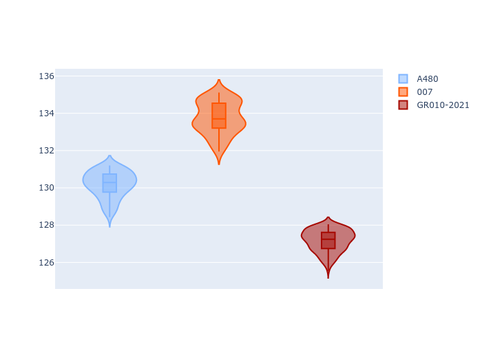
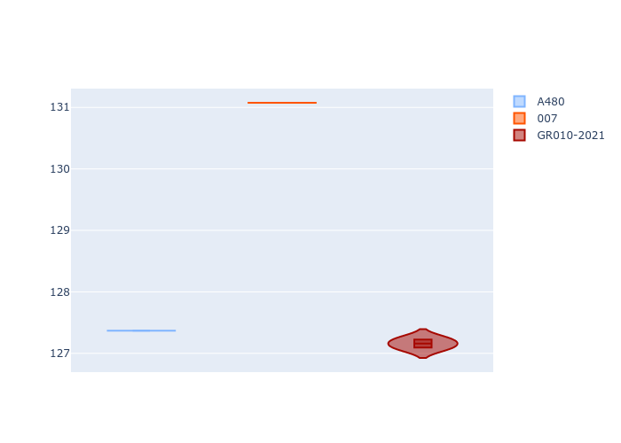
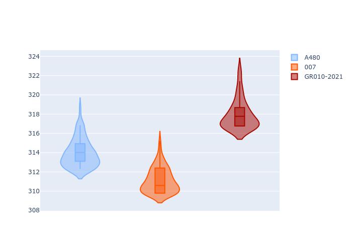
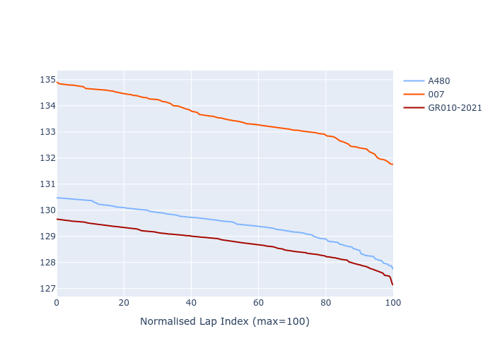

# Combined Plots

## Metadata

- BoP Accuracy: 51.22%
- Overall BoP Grade: E2
- Track: REFERENCETRACK
- Threshhold: 0.0kph
- Average Laptime: 2:11.17
- Average Quali Laptime: 2:08.54
- Laptime Std Dev: 1.80 seconds
- Filtered Average Topspeed: 313.98kph

## BoP Table
| Manufacturer   | Car        | Weight   | Power   | PINC   | E/Stint   | FDS   | RDP    | QDP     | TDP    |
|:---------------|:-----------|:---------|:--------|:-------|:----------|:------|:-------|:--------|:-------|
| Alpine         | A480       | 930kg    | 454.0kw | -      | 919MJ     | -     | 57.00% | 100.00% | 56.04% |
| Glickenhaus    | 007        | 1030kg   | 520.0kw | -      | 965MJ     | -     | 52.03% | 33.33%  | 59.43% |
| Toyota         | GR010-2021 | 1030kg   | 520.0kw | -      | 963MJ     | -     | 58.83% | 66.67%  | 8.53%  |

## Performance Table
| Manufacturer   | Car        | RP      | QP      | Vavg      |   RDLC | BOP-Grade   | Match   |
|:---------------|:-----------|:--------|:--------|:----------|-------:|:------------|:--------|
| Alpine         | A480       | 2:10.14 | 2:07.37 | 313.59kph |   1.02 | -B2         | 82.46%  |
| Glickenhaus    | 007        | 2:13.71 | 2:11.08 | 310.77kph |   1.02 | +Ω1         | 5.47%   |
| Toyota         | GR010-2021 | 2:09.67 | 2:07.16 | 317.58kph |   1.02 | -D1         | 65.72%  |

## Race Laptimes

## Quali Laptimes

## Topspeeds

## Laptimes Lineplot

