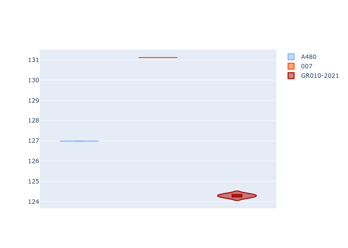
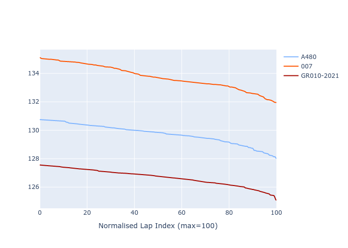

# Combined Plots

## Metadata

- BoP Accuracy: 32.16%
- Overall BoP Grade: Ω1
- Track: REFERENCETRACK
- Threshhold: 0.0kph
- Average Laptime: 2:10.06
- Average Quali Laptime: 2:07.47
- Average Topspeed: 313.97kph

## BoP Table
| Manufacturer   | Car        | Weight   | Power   | PINC   | E/Stint   | FDS   | RDP    | QDP     | TDP    |
|:---------------|:-----------|:---------|:--------|:-------|:----------|:------|:-------|:--------|:-------|
| Alpine         | A480       | 930kg    | 454.0kw | -      | 919MJ     | -     | 57.00% | 100.00% | 56.04% |
| Glickenhaus    | 007        | 1030kg   | 520.0kw | -      | 965MJ     | -     | 52.03% | 33.33%  | 59.43% |
| Toyota         | GR010-2021 | 1030kg   | 520.0kw | -      | 963MJ     | -     | 58.83% | 66.67%  | 8.53%  |

## Performance Table
| Manufacturer   | Car        | RP      | QP      | Vavg      |   RDLC | BOP-Grade   | Match   |
|:---------------|:-----------|:--------|:--------|:----------|-------:|:------------|:--------|
| Alpine         | A480       | 2:09.74 | 2:06.99 | 313.58kph |   1.02 | ~A1         | 96.49%  |
| Glickenhaus    | 007        | 2:13.76 | 2:11.12 | 310.76kph |   1.02 | +Ω2         | 0.00%   |
| Toyota         | GR010-2021 | 2:06.68 | 2:04.29 | 317.57kph |   1.02 | -Ω2         | 0.00%   |

## Race Laptimes

## Quali Laptimes

## Topspeeds

## Laptimes Lineplot

