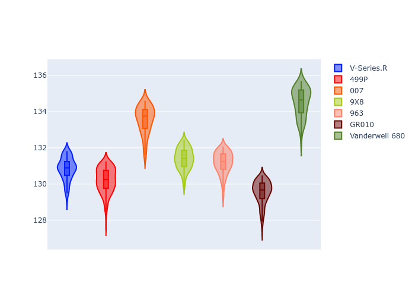
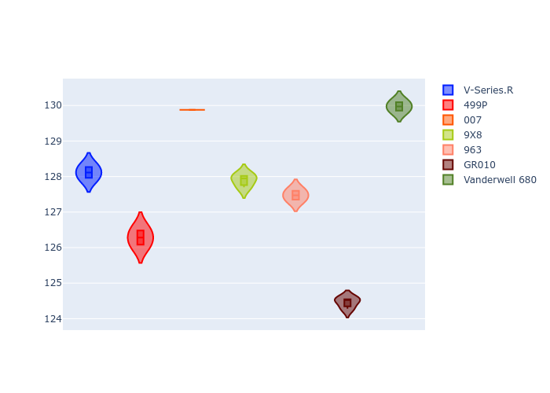
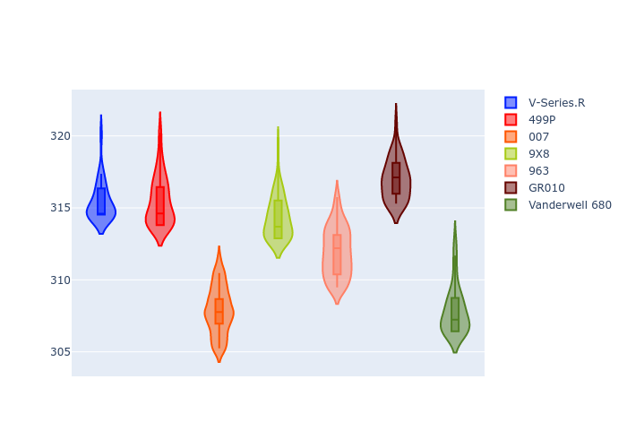
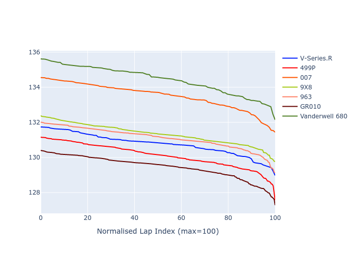

# Combined Plots

## Metadata

- BoP Accuracy: 64.19%
- Overall BoP Grade: D2
- Track: REFERENCETRACK
- Threshhold: 0.0kph
- Average Laptime: 2:11.60
- Average Quali Laptime: 2:08.05
- Laptime Std Dev: 1.66 seconds
- Filtered Average Topspeed: 312.46kph

## BoP Table
| Manufacturer   | Car            | Weight   | Power   | PINC   | E/Stint   | FDS   | RDP    | QDP    | TDP    |
|:---------------|:---------------|:---------|:--------|:-------|:----------|:------|:-------|:-------|:-------|
| Cadillac       | V-Series.R     | 1030kg   | 520.0kw | -      | 909MJ     | -     | 54.09% | 66.67% | 14.80% |
| Ferrari        | 499P           | 1030kg   | 520.0kw | -      | 908MJ     | -     | 56.14% | 50.00% | 21.06% |
| Glickenhaus    | 007            | 1030kg   | 520.0kw | -      | 911MJ     | -     | 55.30% | 33.33% | 80.97% |
| Peugeot        | 9X8            | 1030kg   | 520.0kw | -      | 910MJ     | -     | 55.81% | 60.00% | 13.51% |
| Porsche        | 963            | 1030kg   | 520.0kw | -      | 912MJ     | -     | 59.02% | 40.00% | 76.50% |
| Toyota         | GR010          | 1030kg   | 520.0kw | -      | 910MJ     | -     | 55.38% | 75.00% | 10.23% |
| Vanwall        | Vanderwell 680 | 1030kg   | 520.0kw | -      | 908MJ     | -     | 62.64% | 66.67% | 35.00% |

## Performance Table
| Manufacturer   | Car            | RP      | QP      | Vavg      |   RDLC | BOP-Grade   | Match   |
|:---------------|:---------------|:--------|:--------|:----------|-------:|:------------|:--------|
| Cadillac       | V-Series.R     | 2:10.84 | 2:08.39 | 315.04kph |   1.02 | ~A1         | 96.64%  |
| Ferrari        | 499P           | 2:10.21 | 2:06.65 | 315.09kph |   1.03 | -B2         | 83.40%  |
| Glickenhaus    | 007            | 2:13.55 | 2:10.03 | 307.54kph |   1.03 | +Ω1         | 11.67%  |
| Peugeot        | 9X8            | 2:11.40 | 2:08.30 | 313.93kph |   1.02 | ~A1         | 100.00% |
| Porsche        | 963            | 2:11.17 | 2:07.94 | 311.59kph |   1.03 | ~A1         | 97.93%  |
| Toyota         | GR010          | 2:09.54 | 2:04.86 | 316.58kph |   1.04 | -E1         | 57.85%  |
| Vanwall        | Vanderwell 680 | 2:14.51 | 2:10.15 | 307.48kph |   1.03 | +Ω1         | 1.83%   |

## Race Laptimes

## Quali Laptimes

## Topspeeds

## Laptimes Lineplot

