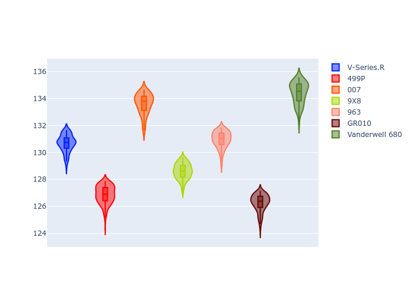

# Combined Plots

## Metadata

- BoP Accuracy: 29.71%
- Overall BoP Grade: Ω1
- Track: REFERENCETRACK
- Threshhold: 0.0kph

## BoP Table
| Manufacturer   | Car            | Weight   | Power   | PINC   | E/Stint   | FDS   | RDP    | QDP    | TDP    |
|:---------------|:---------------|:---------|:--------|:-------|:----------|:------|:-------|:-------|:-------|
| Cadillac       | V-Series.R     | 1030kg   | 520.0kw | -      | 909MJ     | -     | 54.09% | 66.67% | 14.80% |
| Ferrari        | 499P           | 1030kg   | 520.0kw | -      | 908MJ     | -     | 56.14% | 50.00% | 21.06% |
| Glickenhaus    | 007            | 1030kg   | 520.0kw | -      | 911MJ     | -     | 55.30% | 33.33% | 80.97% |
| Peugeot        | 9X8            | 1030kg   | 520.0kw | -      | 910MJ     | -     | 55.81% | 60.00% | 13.51% |
| Porsche        | 963            | 1030kg   | 520.0kw | -      | 912MJ     | -     | 58.78% | 40.00% | 76.50% |
| Toyota         | GR010          | 1030kg   | 520.0kw | -      | 910MJ     | -     | 56.06% | 75.00% | 10.23% |
| Vanwall        | Vanderwell 680 | 1030kg   | 520.0kw | -      | 908MJ     | -     | 61.49% | 66.67% | 35.00% |

## Performance Table
| Manufacturer   | Car            | RP      | QP      | Vavg      |   RDLC | BOP-Grade   | Match   |
|:---------------|:---------------|:--------|:--------|:----------|-------:|:------------|:--------|
| Cadillac       | V-Series.R     | 2:09.95 | 2:07.72 | 311.94kph |   1.02 | +C1         | 77.31%  |
| Ferrari        | 499P           | 2:06.23 | 2:03.05 | 312.00kph |   1.03 | -Ω2         | 0.00%   |
| Glickenhaus    | 007            | 2:12.65 | 2:09.35 | 304.52kph |   1.03 | +Ω2         | 0.00%   |
| Peugeot        | 9X8            | 2:07.87 | 2:05.11 | 310.85kph |   1.02 | -C1         | 76.73%  |
| Porsche        | 963            | 2:10.29 | 2:07.28 | 308.53kph |   1.02 | +E2         | 53.94%  |
| Toyota         | GR010          | 2:05.61 | 2:01.36 | 313.47kph |   1.04 | -Ω2         | 0.00%   |
| Vanwall        | Vanderwell 680 | 2:13.58 | 2:09.47 | 304.46kph |   1.03 | +Ω2         | 0.00%   |

## Race Laptimes

## Quali Laptimes

## Topspeeds

## Laptimes Lineplot

