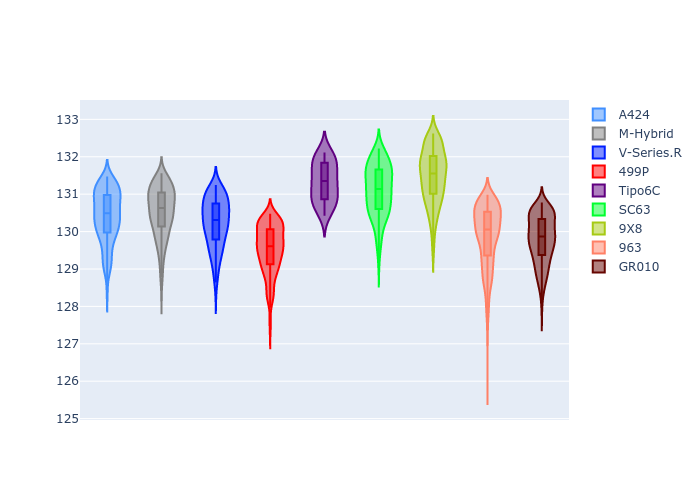
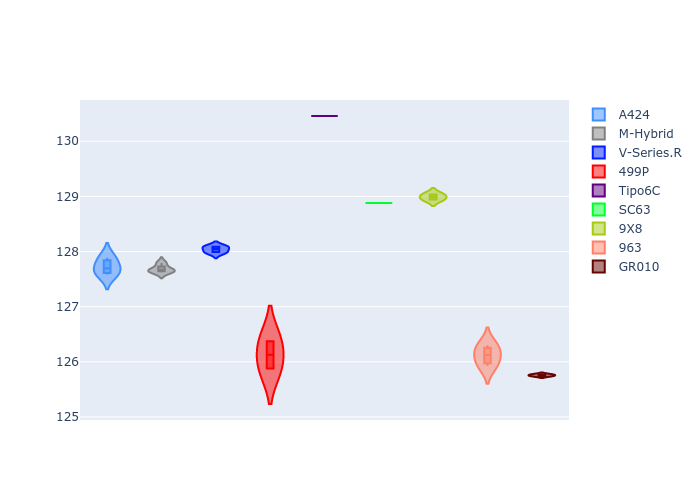
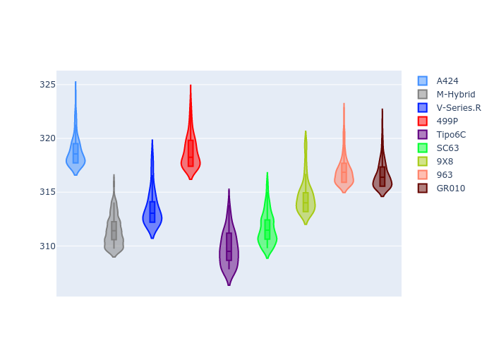
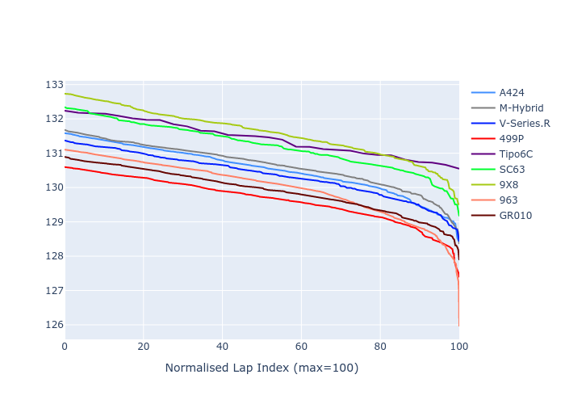

# Combined Plots

## Metadata

- BoP Accuracy: 84.56%
- Overall BoP Grade: B2
- Track: REFERENCETRACK
- Threshhold: 0.0kph
- Average Laptime: 2:10.60
- Average Quali Laptime: 2:08.08
- Laptime Std Dev: 0.65 seconds
- Filtered Average Topspeed: 314.38kph

## BoP Table
| Manufacturer     | Car        | Weight   | Power   | PINC   | E/Stint   | FDS   | RDP    | QDP     | TDP    |
|:-----------------|:-----------|:---------|:--------|:-------|:----------|:------|:-------|:--------|:-------|
| Alpine           | A424       | 1030kg   | 520.0kw | -      | 914MJ     | -     | 59.85% | 75.00%  | 8.48%  |
| BMW              | M-Hybrid   | 1030kg   | 520.0kw | -      | 913MJ     | -     | 59.03% | 100.00% | 45.81% |
| Cadillac         | V-Series.R | 1030kg   | 520.0kw | -      | 908MJ     | -     | 58.08% | 80.00%  | 6.60%  |
| Ferrari          | 499P       | 1030kg   | 520.0kw | -      | 912MJ     | -     | 58.46% | 40.00%  | 7.62%  |
| Isotta Fraschini | Tipo6C     | 1030kg   | 520.0kw | -      | 916MJ     | -     | 52.63% | 33.33%  | 41.30% |
| Lamborghini      | SC63       | 1030kg   | 520.0kw | -      | 910MJ     | -     | 57.58% | 25.00%  | 44.67% |
| Peugeot          | 9X8        | 1030kg   | 520.0kw | -      | 904MJ     | -     | 55.69% | 40.00%  | 7.37%  |
| Porsche          | 963        | 1030kg   | 520.0kw | -      | 911MJ     | -     | 53.07% | 100.00% | 7.76%  |
| Toyota           | GR010      | 1030kg   | 520.0kw | -      | 917MJ     | -     | 59.22% | 66.67%  | 14.83% |

## Performance Table
| Manufacturer     | Car        | RP      | QP      | Vavg      |   RDLC | BOP-Grade   | Match   |
|:-----------------|:-----------|:--------|:--------|:----------|-------:|:------------|:--------|
| Alpine           | A424       | 2:10.52 | 2:08.08 | 318.44kph |   1.02 | ~A1         | 100.00% |
| BMW              | M-Hybrid   | 2:10.65 | 2:08.05 | 311.09kph |   1.02 | ~A1         | 97.69%  |
| Cadillac         | V-Series.R | 2:10.37 | 2:08.35 | 313.24kph |   1.02 | ~A1         | 100.00% |
| Ferrari          | 499P       | 2:09.65 | 2:06.62 | 318.50kph |   1.02 | ~A1         | 95.38%  |
| Isotta Fraschini | Tipo6C     | 2:11.44 | 2:10.87 | 309.47kph |   1    | +E1         | 60.00%  |
| Lamborghini      | SC63       | 2:11.22 | 2:09.22 | 311.36kph |   1.02 | +D1         | 65.79%  |
| Peugeot          | 9X8        | 2:11.59 | 2:08.94 | 314.38kph |   1.02 | +Ω1         | 48.07%  |
| Porsche          | 963        | 2:10.01 | 2:06.41 | 316.67kph |   1.03 | ~A1         | 95.42%  |
| Toyota           | GR010      | 2:09.91 | 2:06.22 | 316.29kph |   1.03 | ~A1         | 98.73%  |

## Race Laptimes

## Quali Laptimes

## Topspeeds

## Laptimes Lineplot

