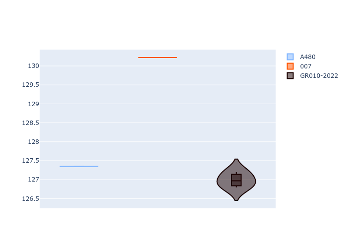

# Combined Plots

## Metadata

- BoP Accuracy: 47.04%
- Overall BoP Grade: Ω1
- Track: REFERENCETRACK
- Threshhold: 0.0kph
- Average Laptime: 2:10.34
- Average Quali Laptime: 2:08.19
- Average Topspeed: 312.23kph

## BoP Table
| Manufacturer   | Car        | Weight   | Power   | PINC   | E/Stint   | FDS   | RDP    | QDP    | TDP    |
|:---------------|:-----------|:---------|:--------|:-------|:----------|:------|:-------|:-------|:-------|
| Alpine         | A480       | 930kg    | 454.0kw | -      | 817MJ     | -     | 51.55% | 50.00% | 70.50% |
| Glickenhaus    | 007        | 1030kg   | 520.0kw | -      | 910MJ     | -     | 45.60% | 50.00% | 69.65% |
| Toyota         | GR010-2022 | 1030kg   | 520.0kw | -      | 906MJ     | -     | 51.64% | 50.00% | 10.34% |

## Performance Table
| Manufacturer   | Car        | RP      | QP      | Vavg      |   RDLC | BOP-Grade   | Match   |
|:---------------|:-----------|:--------|:--------|:----------|-------:|:------------|:--------|
| Alpine         | A480       | 2:10.13 | 2:07.35 | 305.46kph |   1.02 | ~A1         | 98.00%  |
| Glickenhaus    | 007        | 2:12.30 | 2:10.22 | 312.06kph |   1.02 | +Ω1         | 6.82%   |
| Toyota         | GR010-2022 | 2:08.60 | 2:06.99 | 319.17kph |   1.01 | -Ω1         | 36.31%  |

## Race Laptimes

## Quali Laptimes

## Topspeeds

## Laptimes Lineplot

