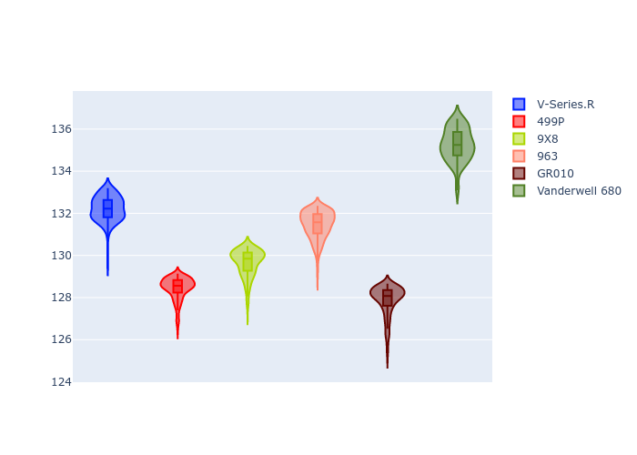

# Combined Plots

## Metadata

- BoP Accuracy: 38.44%
- Overall BoP Grade: Ω1
- Track: REFERENCETRACK
- Threshhold: 0.0kph

## BoP Table
| Manufacturer   | Car            | Weight   | Power   | PINC   | E/Stint   | FDS   | RDP    | QDP    | TDP    |
|:---------------|:---------------|:---------|:--------|:-------|:----------|:------|:-------|:-------|:-------|
| Cadillac       | V-Series.R     | 1030kg   | 520.0kw | -      | 910MJ     | -     | 60.57% | 33.33% | 10.98% |
| Ferrari        | 499P           | 1030kg   | 520.0kw | -      | 909MJ     | -     | 57.14% | 33.33% | 1.36%  |
| Peugeot        | 9X8            | 1030kg   | 520.0kw | -      | 909MJ     | -     | 58.70% | 25.00% | 7.66%  |
| Porsche        | 963            | 1030kg   | 520.0kw | -      | 913MJ     | -     | 55.60% | 40.00% | 0.77%  |
| Toyota         | GR010          | 1030kg   | 520.0kw | -      | 912MJ     | -     | 49.40% | 25.00% | 0.99%  |
| Vanwall        | Vanderwell 680 | 1030kg   | 520.0kw | -      | 908MJ     | -     | 55.76% | 50.00% | 1.74%  |

## Performance Table
| Manufacturer   | Car            | RP      | QP      | Vavg      |   RDLC | BOP-Grade   | Match   |
|:---------------|:---------------|:--------|:--------|:----------|-------:|:------------|:--------|
| Cadillac       | V-Series.R     | 2:10.90 | 2:03.52 | 287.36kph |   1.06 | +Ω1         | 13.42%  |
| Ferrari        | 499P           | 2:06.90 | 2:00.93 | 305.36kph |   1.05 | -E2         | 54.58%  |
| Peugeot        | 9X8            | 2:08.35 | 2:03.16 | 290.92kph |   1.04 | ~A1         | 96.21%  |
| Porsche        | 963            | 2:10.11 | 2:03.97 | 305.62kph |   1.05 | +E2         | 54.63%  |
| Toyota         | GR010          | 2:06.31 | 1:59.80 | 313.83kph |   1.05 | -Ω1         | 11.79%  |
| Vanwall        | Vanderwell 680 | 2:13.98 | 2:07.32 | 291.85kph |   1.05 | +Ω2         | 0.00%   |

## Race Laptimes

## Quali Laptimes

## Topspeeds

## Laptimes Lineplot

