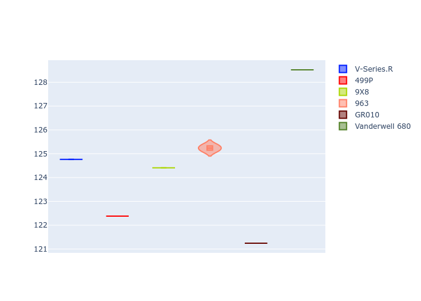

# Combined Plots

## Metadata

- BoP Accuracy: 45.27%
- Overall BoP Grade: Ω1
- Track: REFERENCETRACK
- Threshhold: 0.0kph
- Average Laptime: 2:10.81
- Average Quali Laptime: 2:04.42
- Average Topspeed: 309.39kph

## BoP Table
| Manufacturer   | Car            | Weight   | Power   | PINC   | E/Stint   | FDS   | RDP    | QDP    | TDP    |
|:---------------|:---------------|:---------|:--------|:-------|:----------|:------|:-------|:-------|:-------|
| Cadillac       | V-Series.R     | 1030kg   | 520.0kw | -      | 910MJ     | -     | 60.57% | 33.33% | 10.98% |
| Ferrari        | 499P           | 1030kg   | 520.0kw | -      | 909MJ     | -     | 57.14% | 33.33% | 1.36%  |
| Peugeot        | 9X8            | 1030kg   | 520.0kw | -      | 909MJ     | -     | 58.50% | 25.00% | 7.66%  |
| Porsche        | 963            | 1030kg   | 520.0kw | -      | 913MJ     | -     | 55.80% | 40.00% | 0.77%  |
| Toyota         | GR010          | 1030kg   | 520.0kw | -      | 912MJ     | -     | 49.80% | 25.00% | 0.99%  |
| Vanwall        | Vanderwell 680 | 1030kg   | 520.0kw | -      | 908MJ     | -     | 55.76% | 50.00% | 1.74%  |

## Performance Table
| Manufacturer   | Car            | RP      | QP      | Vavg      |   RDLC | BOP-Grade   | Match   |
|:---------------|:---------------|:--------|:--------|:----------|-------:|:------------|:--------|
| Cadillac       | V-Series.R     | 2:12.21 | 2:04.76 | 297.19kph |   1.06 | +Ω1         | 18.79%  |
| Ferrari        | 499P           | 2:08.44 | 2:02.38 | 315.80kph |   1.05 | -D1         | 69.72%  |
| Peugeot        | 9X8            | 2:09.64 | 2:04.41 | 300.87kph |   1.04 | ~A1         | 95.16%  |
| Porsche        | 963            | 2:11.45 | 2:05.24 | 316.07kph |   1.05 | +E1         | 59.31%  |
| Toyota         | GR010          | 2:07.86 | 2:01.24 | 324.56kph |   1.05 | -Ω1         | 28.63%  |
| Vanwall        | Vanderwell 680 | 2:15.25 | 2:08.52 | 301.83kph |   1.05 | +Ω2         | 0.00%   |

## Race Laptimes

## Quali Laptimes

## Topspeeds

## Laptimes Lineplot

