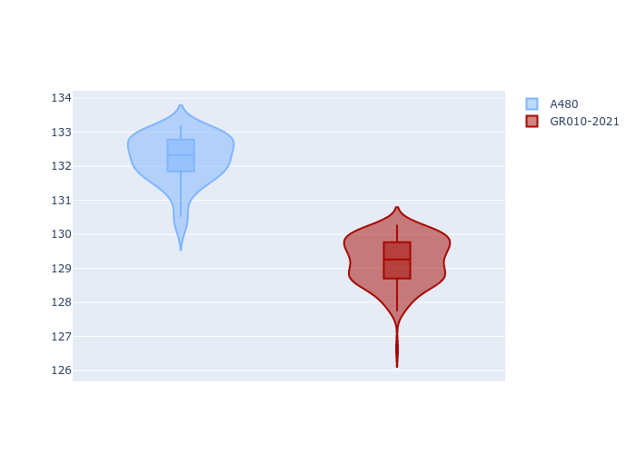
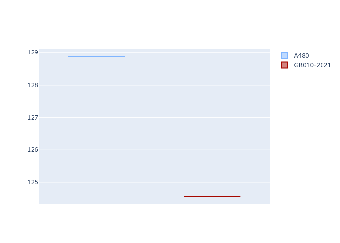
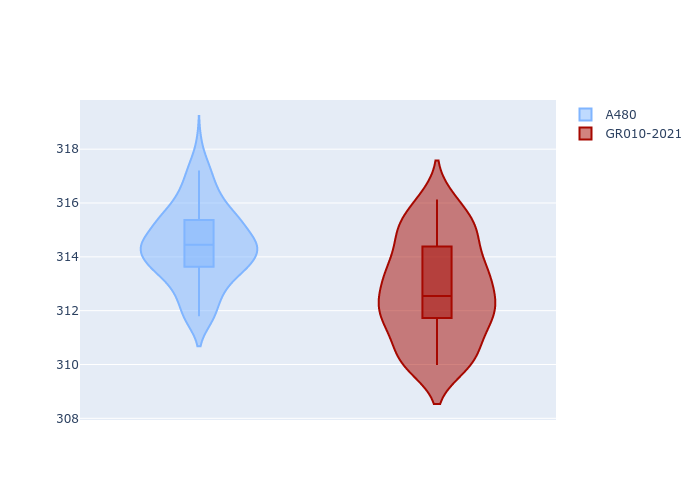
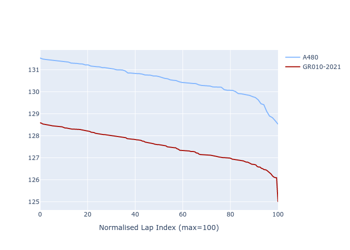

# Combined Plots

## Metadata

- BoP Accuracy: 53.93%
- Overall BoP Grade: E2
- Track: REFERENCETRACK
- Threshhold: 0.0kph

## BoP Table
| Manufacturer   | Car        | Weight   | Power   | PINC   | E/Stint   | FDS   | RDP    | QDP     | TDP    |
|:---------------|:-----------|:---------|:--------|:-------|:----------|:------|:-------|:--------|:-------|
| Alpine         | A480       | 930kg    | 454.0kw | -      | 920MJ     | -     | 52.47% | 100.00% | 52.94% |
| Toyota         | GR010-2021 | 1030kg   | 520.0kw | -      | 963MJ     | -     | 53.56% | 33.33%  | 40.30% |

## Performance Table
| Manufacturer   | Car        | RP      | QP      | Vavg      |   RDLC | BOP-Grade   | Match   |
|:---------------|:-----------|:--------|:--------|:----------|-------:|:------------|:--------|
| Alpine         | A480       | 2:10.57 | 2:06.94 | 295.33kph |   1.03 | +Ω1         | 20.00%  |
| Toyota         | GR010-2021 | 2:07.54 | 2:02.63 | 293.78kph |   1.04 | -B1         | 87.86%  |

## Race Laptimes

## Quali Laptimes

## Topspeeds

## Laptimes Lineplot

