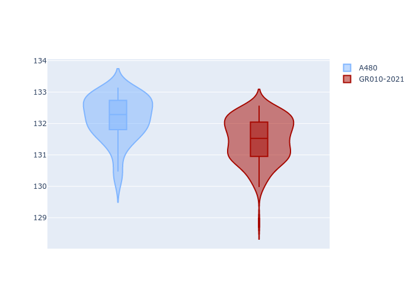
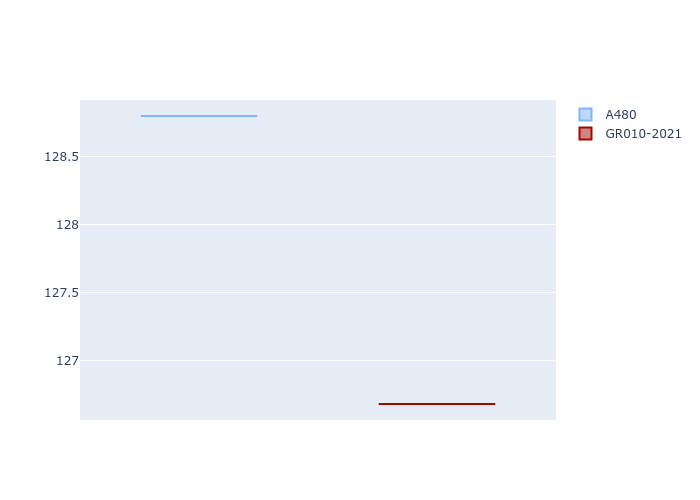
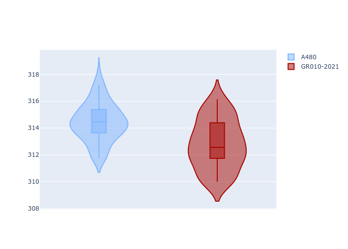
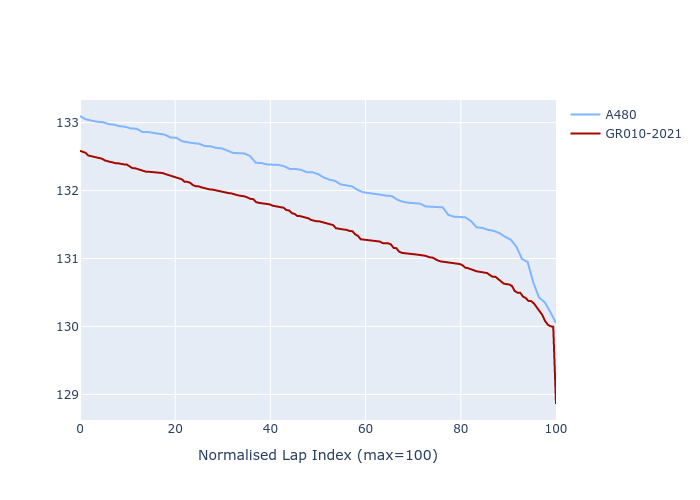

# Combined Plots

## Metadata

- BoP Accuracy: 91.48%
- Overall BoP Grade: A2
- Track: REFERENCETRACK
- Threshhold: 0.0kph
- Average Laptime: 2:11.70
- Average Quali Laptime: 2:07.63
- Laptime Std Dev: 0.31 seconds
- Filtered Average Topspeed: 313.98kph

## BoP Table
| Manufacturer   | Car        | Weight   | Power   | PINC   | E/Stint   | FDS   | RDP    | QDP     | TDP    |
|:---------------|:-----------|:---------|:--------|:-------|:----------|:------|:-------|:--------|:-------|
| Alpine         | A480       | 930kg    | 454.0kw | -      | 920MJ     | -     | 52.47% | 100.00% | 52.94% |
| Toyota         | GR010-2021 | 1030kg   | 520.0kw | -      | 963MJ     | -     | 53.87% | 33.33%  | 40.30% |

## Performance Table
| Manufacturer   | Car        | RP      | QP      | Vavg      |   RDLC | BOP-Grade   | Match   |
|:---------------|:-----------|:--------|:--------|:----------|-------:|:------------|:--------|
| Alpine         | A480       | 2:12.01 | 2:08.69 | 314.80kph |   1.03 | +B2         | 83.53%  |
| Toyota         | GR010-2021 | 2:11.39 | 2:06.58 | 313.15kph |   1.04 | ~A1         | 99.43%  |

## Race Laptimes

## Quali Laptimes

## Topspeeds

## Laptimes Lineplot

