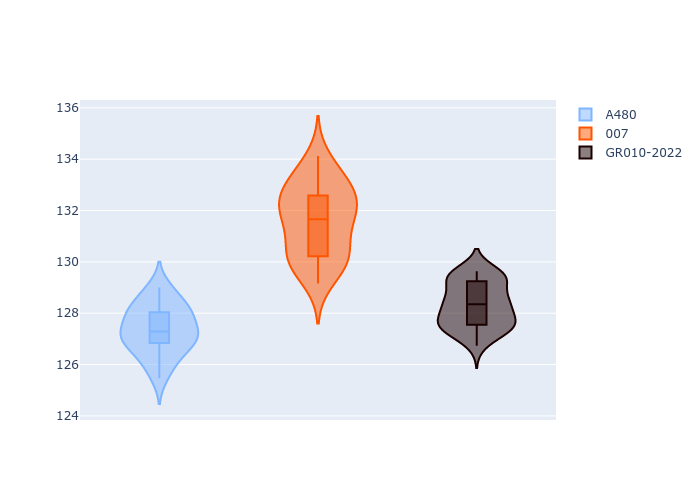
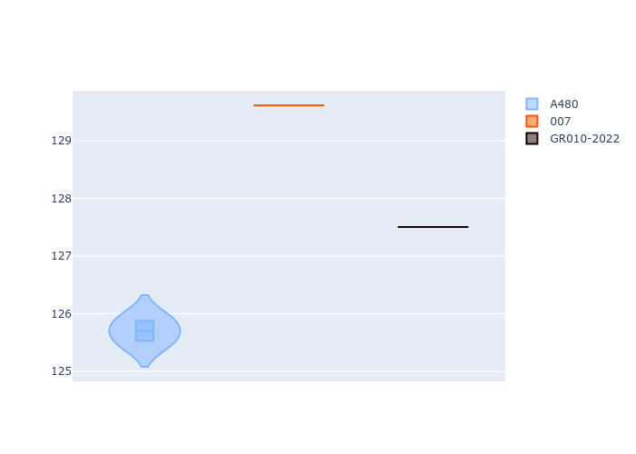
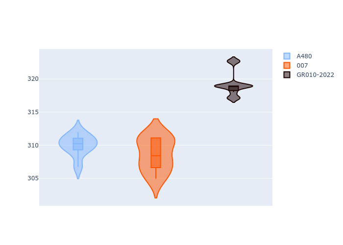
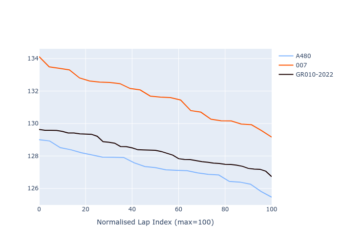

# Combined Plots

## Metadata

- BoP Accuracy: 75.73%
- Overall BoP Grade: C1
- Track: REFERENCETRACK
- Threshhold: 0.0kph
- Average Laptime: 2:09.68
- Average Quali Laptime: 2:08.18
- Laptime Std Dev: 1.25 seconds
- Filtered Average Topspeed: 312.87kph

## BoP Table
| Manufacturer   | Car        | Weight   | Power   | PINC   | E/Stint   | FDS   | RDP    | QDP    | TDP    |
|:---------------|:-----------|:---------|:--------|:-------|:----------|:------|:-------|:-------|:-------|
| Alpine         | A480       | 930kg    | 454.0kw | -      | 836MJ     | -     | 22.33% | 66.67% | 7.21%  |
| Glickenhaus    | 007        | 1030kg   | 520.0kw | -      | 910MJ     | -     | 23.53% | 33.33% | 14.55% |
| Toyota         | GR010-2022 | 1030kg   | 520.0kw | -      | 906MJ     | -     | 31.06% | 25.00% | 7.43%  |

## Performance Table
| Manufacturer   | Car        | RP      | QP      | Vavg      |   RDLC | BOP-Grade   | Match   |
|:---------------|:-----------|:--------|:--------|:----------|-------:|:------------|:--------|
| Alpine         | A480       | 2:08.78 | 2:07.07 | 310.26kph |   1.01 | -B1         | 86.96%  |
| Glickenhaus    | 007        | 2:11.45 | 2:09.47 | 308.86kph |   1.02 | +Ω1         | 50.00%  |
| Toyota         | GR010-2022 | 2:08.81 | 2:07.99 | 319.49kph |   1.01 | -A2         | 90.24%  |

## Race Laptimes

## Quali Laptimes

## Topspeeds

## Laptimes Lineplot

