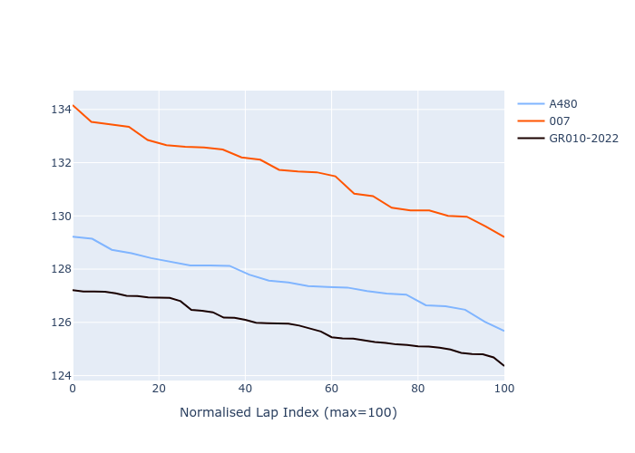

# Combined Plots

## Metadata

- BoP Accuracy: 44.93%
- Overall BoP Grade: Ω1
- Track: REFERENCETRACK
- Threshhold: 0.0kph

## BoP Table
| Manufacturer   | Car        | Weight   | Power   | PINC   | E/Stint   | FDS   | RDP    | QDP    | TDP    |
|:---------------|:-----------|:---------|:--------|:-------|:----------|:------|:-------|:-------|:-------|
| Alpine         | A480       | 930kg    | 454.0kw | -      | 836MJ     | -     | 22.33% | 66.67% | 7.21%  |
| Glickenhaus    | 007        | 1030kg   | 520.0kw | -      | 910MJ     | -     | 23.53% | 33.33% | 14.55% |
| Toyota         | GR010-2022 | 1030kg   | 520.0kw | -      | 906MJ     | -     | 31.06% | 25.00% | 7.43%  |

## Performance Table
| Manufacturer   | Car        | RP      | QP      | Vavg      |   RDLC | BOP-Grade   | Match   |
|:---------------|:-----------|:--------|:--------|:----------|-------:|:------------|:--------|
| Alpine         | A480       | 2:06.59 | 2:04.06 | 308.10kph |   1.02 | -A2         | 91.30%  |
| Glickenhaus    | 007        | 2:10.81 | 2:07.91 | 306.71kph |   1.02 | +Ω1         | 16.67%  |
| Toyota         | GR010-2022 | 2:04.85 | 2:03.22 | 317.27kph |   1.01 | -Ω1         | 26.83%  |

## Race Laptimes

## Quali Laptimes

## Topspeeds

## Laptimes Lineplot

