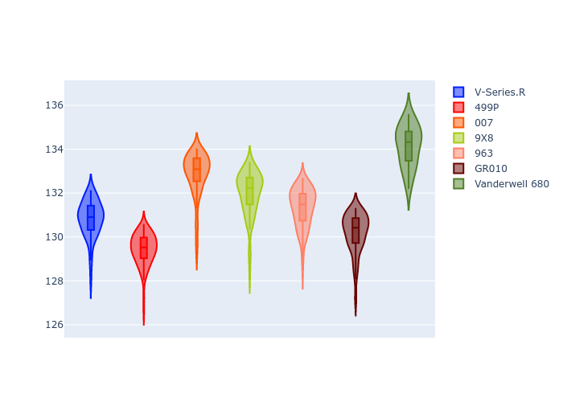
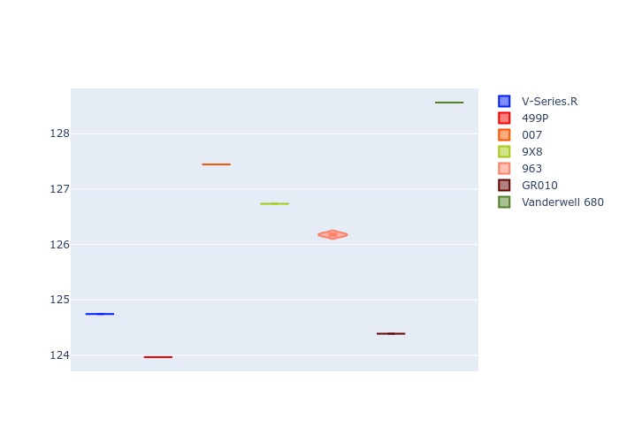
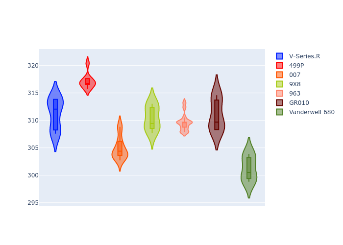
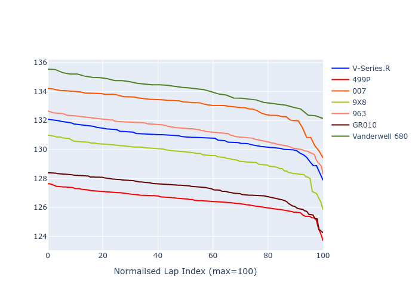

# Combined Plots

## Metadata

- BoP Accuracy: 72.52%
- Overall BoP Grade: C2
- Track: REFERENCETRACK
- Threshhold: 0.0kph
- Average Laptime: 2:11.53
- Average Quali Laptime: 2:06.06
- Laptime Std Dev: 1.49 seconds
- Filtered Average Topspeed: 309.73kph

## BoP Table
| Manufacturer   | Car            | Weight   | Power   | PINC   | E/Stint   | FDS   | RDP    | QDP     | TDP    |
|:---------------|:---------------|:---------|:--------|:-------|:----------|:------|:-------|:--------|:-------|
| Cadillac       | V-Series.R     | 1030kg   | 520.0kw | -      | 910MJ     | -     | 45.45% | 25.00%  | 7.98%  |
| Ferrari        | 499P           | 1030kg   | 520.0kw | -      | 907MJ     | -     | 48.43% | 25.00%  | 3.21%  |
| Glickenhaus    | 007            | 1030kg   | 520.0kw | -      | 913MJ     | -     | 46.58% | 50.00%  | 23.12% |
| Peugeot        | 9X8            | 1030kg   | 520.0kw | -      | 910MJ     | -     | 44.18% | 33.33%  | 2.85%  |
| Porsche        | 963            | 1030kg   | 520.0kw | -      | 912MJ     | -     | 46.26% | 50.00%  | 7.18%  |
| Toyota         | GR010          | 1030kg   | 520.0kw | -      | 910MJ     | -     | 46.44% | 50.00%  | 3.26%  |
| Vanwall        | Vanderwell 680 | 1030kg   | 520.0kw | -      | 908MJ     | -     | 47.50% | 100.00% | 10.00% |

## Performance Table
| Manufacturer   | Car            | RP      | QP      | Vavg      |   RDLC | BOP-Grade   | Match   |
|:---------------|:---------------|:--------|:--------|:----------|-------:|:------------|:--------|
| Cadillac       | V-Series.R     | 2:10.82 | 2:04.83 | 311.58kph |   1.05 | ~A1         | 97.65%  |
| Ferrari        | 499P           | 2:09.44 | 2:04.16 | 317.49kph |   1.04 | -A2         | 91.87%  |
| Glickenhaus    | 007            | 2:12.85 | 2:07.34 | 305.30kph |   1.04 | +Ω1         | 35.29%  |
| Peugeot        | 9X8            | 2:11.98 | 2:06.74 | 310.80kph |   1.04 | -B2         | 81.40%  |
| Porsche        | 963            | 2:11.33 | 2:06.18 | 310.00kph |   1.04 | ~A1         | 99.38%  |
| Toyota         | GR010          | 2:10.18 | 2:04.50 | 311.38kph |   1.05 | -A2         | 94.16%  |
| Vanwall        | Vanderwell 680 | 2:14.13 | 2:08.68 | 301.59kph |   1.04 | +Ω1         | 7.89%   |

## Race Laptimes

## Quali Laptimes

## Topspeeds

## Laptimes Lineplot

