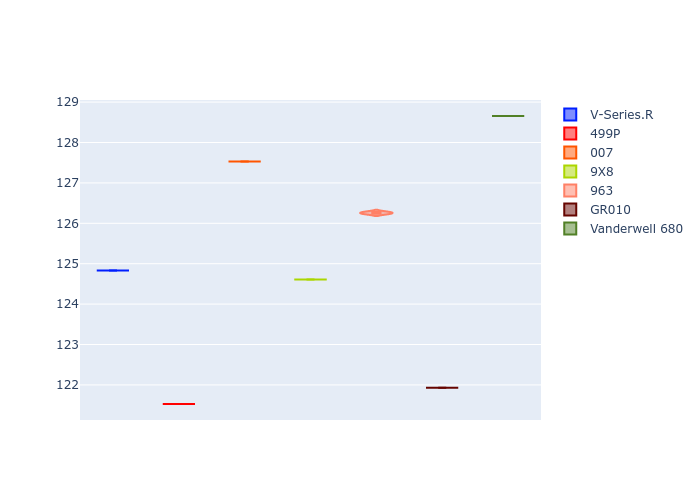
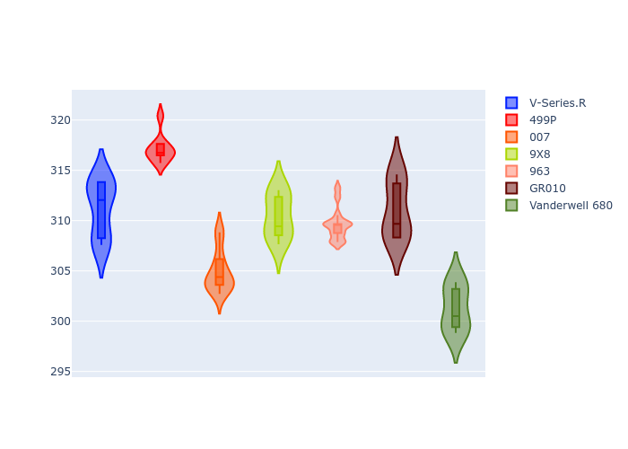

# Combined Plots

## Metadata

- BoP Accuracy: 44.96%
- Overall BoP Grade: Ω1
- Track: REFERENCETRACK
- Threshhold: 0.0kph
- Average Laptime: 2:10.42
- Average Quali Laptime: 2:05.05
- Average Topspeed: 309.37kph

## BoP Table
| Manufacturer   | Car            | Weight   | Power   | PINC   | E/Stint   | FDS   | RDP    | QDP     | TDP    |
|:---------------|:---------------|:---------|:--------|:-------|:----------|:------|:-------|:--------|:-------|
| Cadillac       | V-Series.R     | 1030kg   | 520.0kw | -      | 910MJ     | -     | 45.45% | 25.00%  | 7.98%  |
| Ferrari        | 499P           | 1030kg   | 520.0kw | -      | 907MJ     | -     | 48.43% | 25.00%  | 3.21%  |
| Glickenhaus    | 007            | 1030kg   | 520.0kw | -      | 913MJ     | -     | 46.58% | 50.00%  | 23.12% |
| Peugeot        | 9X8            | 1030kg   | 520.0kw | -      | 910MJ     | -     | 44.18% | 33.33%  | 2.85%  |
| Porsche        | 963            | 1030kg   | 520.0kw | -      | 912MJ     | -     | 46.26% | 50.00%  | 7.18%  |
| Toyota         | GR010          | 1030kg   | 520.0kw | -      | 910MJ     | -     | 46.44% | 50.00%  | 3.26%  |
| Vanwall        | Vanderwell 680 | 1030kg   | 520.0kw | -      | 908MJ     | -     | 47.50% | 100.00% | 10.00% |

## Performance Table
| Manufacturer   | Car            | RP      | QP      | Vavg      |   RDLC | BOP-Grade   | Match   |
|:---------------|:---------------|:--------|:--------|:----------|-------:|:------------|:--------|
| Cadillac       | V-Series.R     | 2:10.82 | 2:04.83 | 311.21kph |   1.05 | +B1         | 85.88%  |
| Ferrari        | 499P           | 2:06.57 | 2:01.53 | 317.12kph |   1.04 | -Ω1         | 9.76%   |
| Glickenhaus    | 007            | 2:13.04 | 2:07.53 | 304.94kph |   1.04 | +Ω1         | 8.82%   |
| Peugeot        | 9X8            | 2:09.67 | 2:04.61 | 310.44kph |   1.04 | ~A1         | 95.35%  |
| Porsche        | 963            | 2:11.40 | 2:06.26 | 309.63kph |   1.04 | +E1         | 56.52%  |
| Toyota         | GR010          | 2:07.37 | 2:01.93 | 311.01kph |   1.04 | -E1         | 58.39%  |
| Vanwall        | Vanderwell 680 | 2:14.10 | 2:08.66 | 301.24kph |   1.04 | +Ω2         | 0.00%   |

## Race Laptimes

## Quali Laptimes

## Topspeeds

## Laptimes Lineplot

