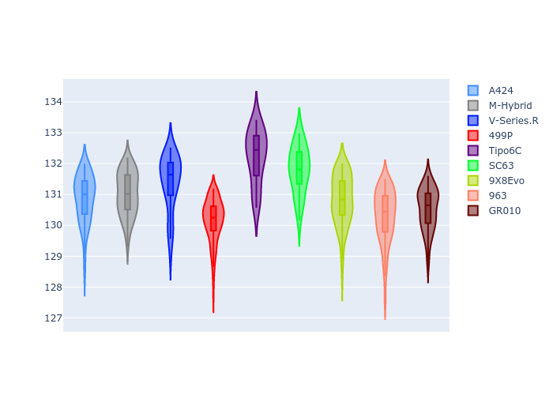
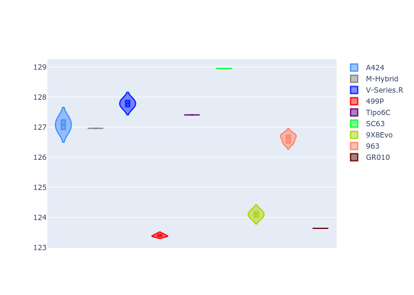
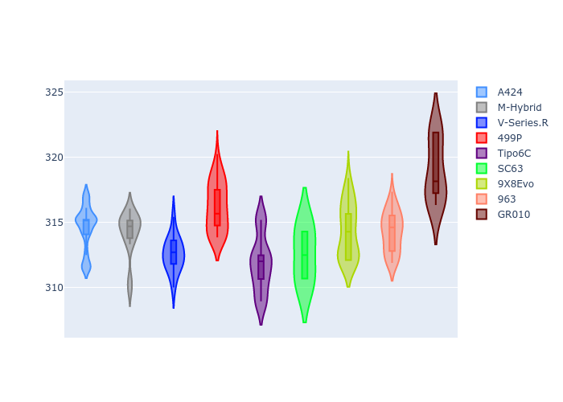
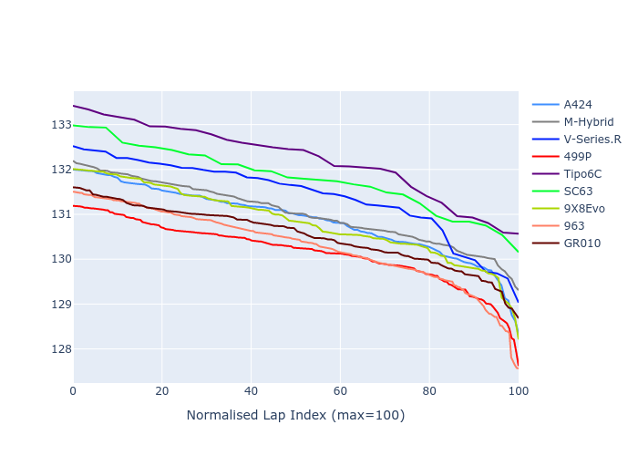

# Combined Plots

## Metadata

- BoP Accuracy: 48.81%
- Overall BoP Grade: Ω1
- Track: REFERENCETRACK
- Threshhold: 0.0kph
- Average Laptime: 2:09.62
- Average Quali Laptime: 2:06.21
- Average Topspeed: 314.36kph

## BoP Table
| Manufacturer     | Car        | Weight   | Power   | PINC   | E/Stint   | FDS   | RDP    | QDP    | TDP    |
|:-----------------|:-----------|:---------|:--------|:-------|:----------|:------|:-------|:-------|:-------|
| Alpine           | A424       | 1030kg   | 520.0kw | -      | 918MJ     | -     | 46.62% | 33.33% | 11.90% |
| BMW              | M-Hybrid   | 1030kg   | 520.0kw | -      | 915MJ     | -     | 46.79% | 16.67% | 5.10%  |
| Cadillac         | V-Series.R | 1030kg   | 520.0kw | -      | 913MJ     | -     | 44.21% | 33.33% | 13.45% |
| Ferrari          | 499P       | 1030kg   | 520.0kw | -      | 910MJ     | -     | 45.63% | 33.33% | 11.42% |
| Isotta Fraschini | Tipo6C     | 1030kg   | 520.0kw | -      | 914MJ     | -     | 60.00% | 50.00% | 16.13% |
| Lamborghini      | SC63       | 1030kg   | 520.0kw | -      | 913MJ     | -     | 47.46% | 50.00% | 5.63%  |
| Peugeot          | 9X8Evo     | 1030kg   | 520.0kw | -      | 917MJ     | -     | 47.67% | 50.00% | 13.86% |
| Porsche          | 963        | 1030kg   | 520.0kw | -      | 915MJ     | -     | 46.37% | 75.00% | 11.50% |
| Toyota           | GR010      | 1030kg   | 520.0kw | -      | 918MJ     | -     | 47.52% | 16.67% | 3.83%  |

## Performance Table
| Manufacturer     | Car        | RP      | QP      | Vavg      |   RDLC | BOP-Grade   | Match   |
|:-----------------|:-----------|:--------|:--------|:----------|-------:|:------------|:--------|
| Alpine           | A424       | 2:10.76 | 2:07.08 | 314.56kph |   1.03 | +Ω1         | 42.75%  |
| BMW              | M-Hybrid   | 2:10.87 | 2:06.96 | 314.17kph |   1.03 | +Ω1         | 44.27%  |
| Cadillac         | V-Series.R | 2:11.47 | 2:07.78 | 312.53kph |   1.03 | +Ω1         | 19.05%  |
| Ferrari          | 499P       | 2:07.09 | 2:03.39 | 316.20kph |   1.03 | -Ω1         | 32.64%  |
| Isotta Fraschini | Tipo6C     | 2:09.35 | 2:07.40 | 311.83kph |   1.02 | ~A1         | 100.00% |
| Lamborghini      | SC63       | 2:11.78 | 2:08.95 | 312.47kph |   1.02 | +Ω1         | 10.71%  |
| Peugeot          | 9X8Evo     | 2:07.65 | 2:04.10 | 314.30kph |   1.03 | -E1         | 55.64%  |
| Porsche          | 963        | 2:10.06 | 2:06.62 | 314.25kph |   1.03 | -C1         | 75.31%  |
| Toyota           | GR010      | 2:07.57 | 2:03.63 | 318.93kph |   1.03 | -E1         | 58.96%  |

## Race Laptimes

## Quali Laptimes

## Topspeeds

## Laptimes Lineplot

