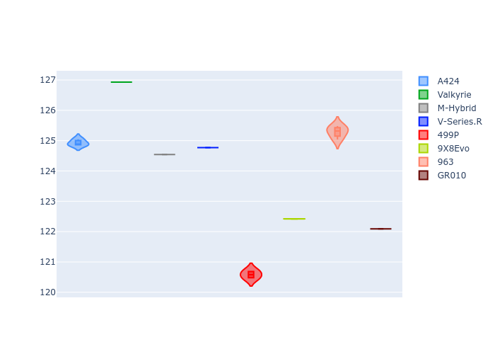

# Combined Plots

## Metadata

- BoP Accuracy: 35.07%
- Overall BoP Grade: Ω1
- Track: REFERENCETRACK
- Threshhold: 0.0kph

## BoP Table
| Manufacturer   | Car        | Weight   | Power   | PINC   | E/Stint   | FDS   | RDP    | QDP    | TDP    |
|:---------------|:-----------|:---------|:--------|:-------|:----------|:------|:-------|:-------|:-------|
| Alpine         | A424       | 1030kg   | 520.0kw | -      | 911MJ     | -     | 56.00% | 37.50% | 12.72% |
| Aston Martin   | Valkyrie   | 1030kg   | 520.0kw | -      | 914MJ     | -     | 55.18% | 33.33% | 1.23%  |
| BMW            | M-Hybrid   | 1030kg   | 520.0kw | -      | 917MJ     | -     | 50.35% | 33.33% | 11.01% |
| Cadillac       | V-Series.R | 1030kg   | 520.0kw | -      | 913MJ     | -     | 54.00% | 16.67% | 4.94%  |
| Ferrari        | 499P       | 1030kg   | 520.0kw | -      | 913MJ     | -     | 53.04% | 50.00% | 8.49%  |
| Peugeot        | 9X8Evo     | 1030kg   | 520.0kw | -      | 911MJ     | -     | 57.43% | 66.67% | 4.15%  |
| Porsche        | 963        | 1030kg   | 520.0kw | -      | 918MJ     | -     | 50.93% | 50.00% | 18.51% |
| Toyota         | GR010      | 1030kg   | 520.0kw | -      | 918MJ     | -     | 55.67% | 33.33% | 1.54%  |

## Performance Table
| Manufacturer   | Car        | RP      | QP      | Vavg      |   RDLC | BOP-Grade   | Match   |
|:---------------|:-----------|:--------|:--------|:----------|-------:|:------------|:--------|
| Alpine         | A424       | 2:09.19 | 2:03.72 | 307.87kph |   1.04 | +Ω1         | 48.81%  |
| Aston Martin   | Valkyrie   | 2:10.92 | 2:05.73 | 310.28kph |   1.04 | +Ω2         | 0.00%   |
| BMW            | M-Hybrid   | 2:09.06 | 2:03.25 | 310.14kph |   1.05 | +E2         | 52.82%  |
| Cadillac       | V-Series.R | 2:09.61 | 2:03.49 | 310.75kph |   1.05 | +Ω1         | 24.07%  |
| Ferrari        | 499P       | 2:05.09 | 1:59.24 | 314.12kph |   1.05 | -Ω2         | 0.00%   |
| Peugeot        | 9X8Evo     | 2:07.22 | 2:01.25 | 311.97kph |   1.05 | -A2         | 90.21%  |
| Porsche        | 963        | 2:08.86 | 2:03.94 | 311.22kph |   1.04 | +D2         | 64.63%  |
| Toyota         | GR010      | 2:05.35 | 2:00.64 | 313.32kph |   1.04 | -Ω2         | 0.00%   |

## Race Laptimes

## Quali Laptimes

## Topspeeds

## Laptimes Lineplot

