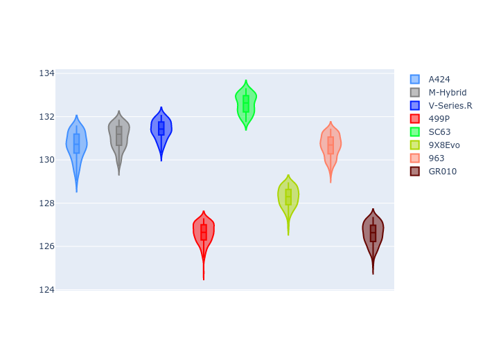
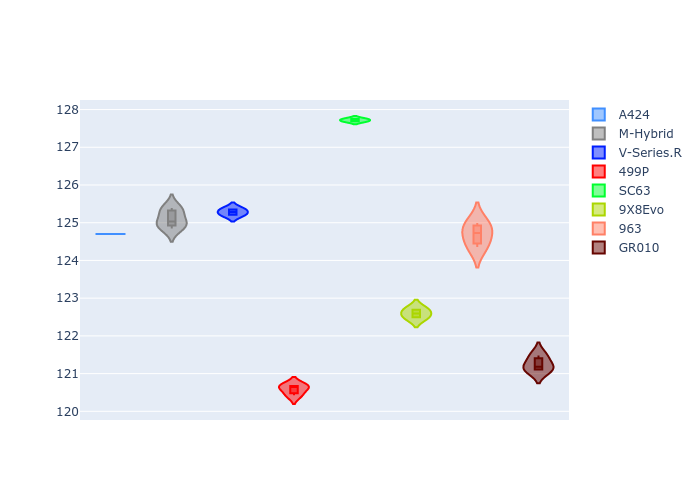
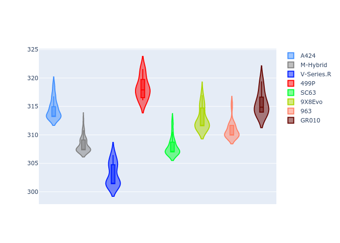
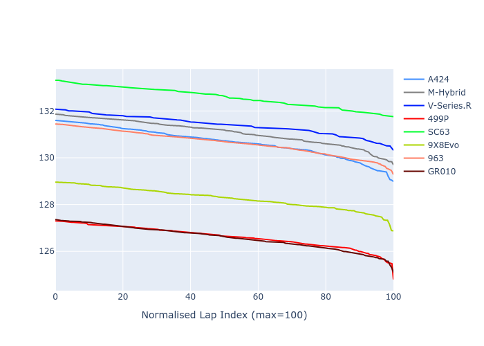

# Combined Plots

## Metadata

- BoP Accuracy: 16.85%
- Overall BoP Grade: Ω1
- Track: REFERENCETRACK
- Threshhold: 0.0kph
- Average Laptime: 2:09.73
- Average Quali Laptime: 2:06.32
- Average Topspeed: 311.39kph

## BoP Table
| Manufacturer   | Car        | Weight   | Power   | PINC   | E/Stint   | FDS   | RDP    | QDP    | TDP    |
|:---------------|:-----------|:---------|:--------|:-------|:----------|:------|:-------|:-------|:-------|
| Alpine         | A424       | 1030kg   | 520.0kw | -      | 915MJ     | -     | 53.15% | 33.33% | 3.76%  |
| BMW            | M-Hybrid   | 1030kg   | 520.0kw | -      | 914MJ     | -     | 56.32% | 71.43% | 11.52% |
| Cadillac       | V-Series.R | 1030kg   | 520.0kw | -      | 909MJ     | -     | 55.19% | 66.67% | 11.71% |
| Ferrari        | 499P       | 1030kg   | 520.0kw | -      | 911MJ     | -     | 54.16% | 42.86% | 3.90%  |
| Lamborghini    | SC63       | 1030kg   | 520.0kw | -      | 908MJ     | -     | 54.95% | 66.67% | 9.28%  |
| Peugeot        | 9X8Evo     | 1030kg   | 520.0kw | -      | 914MJ     | -     | 57.10% | 50.00% | 4.59%  |
| Porsche        | 963        | 1030kg   | 520.0kw | -      | 913MJ     | -     | 56.05% | 37.50% | 1.93%  |
| Toyota         | GR010      | 1030kg   | 520.0kw | -      | 912MJ     | -     | 52.75% | 75.00% | 2.01%  |

## Performance Table
| Manufacturer   | Car        | RP      | QP      | Vavg      |   RDLC | BOP-Grade   | Match   |
|:---------------|:-----------|:--------|:--------|:----------|-------:|:------------|:--------|
| Alpine         | A424       | 2:10.67 | 2:07.01 | 314.55kph |   1.03 | +Ω1         | 35.05%  |
| BMW            | M-Hybrid   | 2:11.08 | 2:07.42 | 308.27kph |   1.03 | +Ω1         | 14.63%  |
| Cadillac       | V-Series.R | 2:11.40 | 2:07.60 | 303.09kph |   1.03 | +Ω1         | 0.99%   |
| Ferrari        | 499P       | 2:06.62 | 2:02.91 | 318.28kph |   1.03 | -Ω2         | 0.00%   |
| Lamborghini    | SC63       | 2:12.59 | 2:10.08 | 307.88kph |   1.02 | +Ω2         | 0.00%   |
| Peugeot        | 9X8Evo     | 2:08.27 | 2:04.94 | 312.81kph |   1.03 | -Ω1         | 47.40%  |
| Porsche        | 963        | 2:10.64 | 2:07.01 | 310.77kph |   1.03 | +Ω1         | 36.75%  |
| Toyota         | GR010      | 2:06.59 | 2:03.61 | 315.51kph |   1.02 | -Ω2         | 0.00%   |

## Race Laptimes

## Quali Laptimes

## Topspeeds

## Laptimes Lineplot

