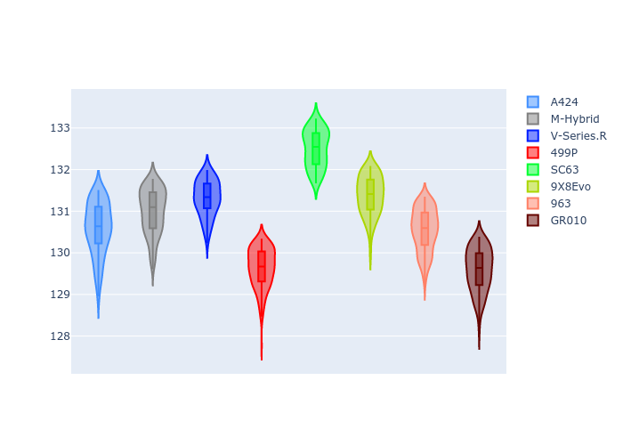
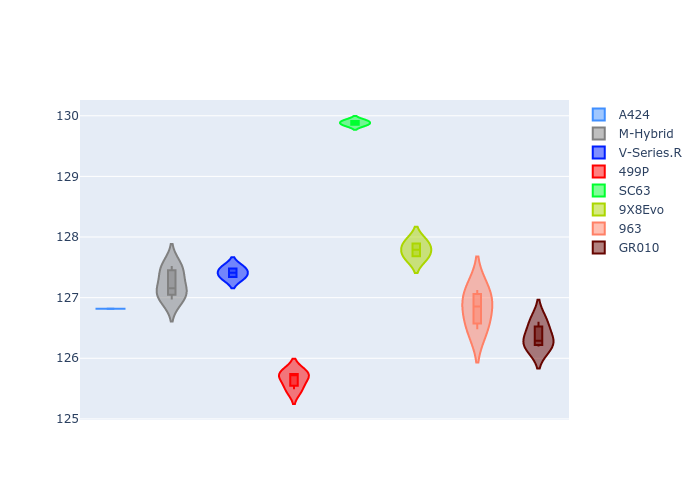
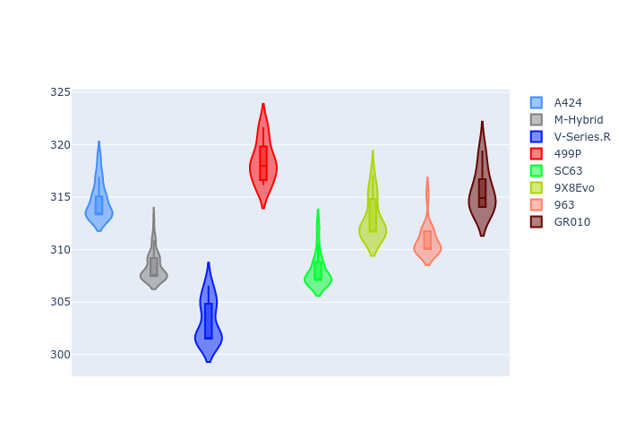
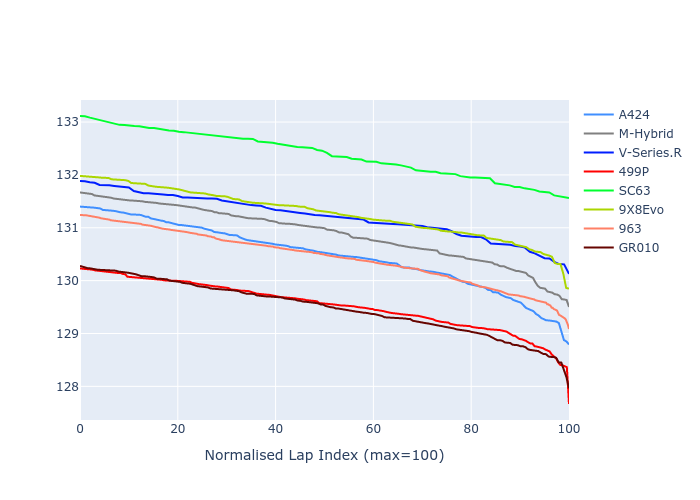

# Combined Plots

## Metadata

- BoP Accuracy: 67.76%
- Overall BoP Grade: D1
- Track: REFERENCETRACK
- Threshhold: 0.0kph
- Average Laptime: 2:10.82
- Average Quali Laptime: 2:07.35
- Laptime Std Dev: 0.90 seconds
- Filtered Average Topspeed: 311.50kph

## BoP Table
| Manufacturer   | Car        | Weight   | Power   | PINC   | E/Stint   | FDS   | RDP    | QDP    | TDP    |
|:---------------|:-----------|:---------|:--------|:-------|:----------|:------|:-------|:-------|:-------|
| Alpine         | A424       | 1030kg   | 520.0kw | -      | 915MJ     | -     | 53.15% | 33.33% | 3.76%  |
| BMW            | M-Hybrid   | 1030kg   | 520.0kw | -      | 914MJ     | -     | 56.32% | 71.43% | 11.52% |
| Cadillac       | V-Series.R | 1030kg   | 520.0kw | -      | 909MJ     | -     | 55.19% | 66.67% | 11.71% |
| Ferrari        | 499P       | 1030kg   | 520.0kw | -      | 911MJ     | -     | 54.16% | 42.86% | 3.90%  |
| Lamborghini    | SC63       | 1030kg   | 520.0kw | -      | 908MJ     | -     | 54.95% | 66.67% | 9.28%  |
| Peugeot        | 9X8Evo     | 1030kg   | 520.0kw | -      | 914MJ     | -     | 57.10% | 50.00% | 4.59%  |
| Porsche        | 963        | 1030kg   | 520.0kw | -      | 913MJ     | -     | 56.05% | 37.50% | 1.93%  |
| Toyota         | GR010      | 1030kg   | 520.0kw | -      | 912MJ     | -     | 52.75% | 75.00% | 2.01%  |

## Performance Table
| Manufacturer   | Car        | RP      | QP      | Vavg      |   RDLC | BOP-Grade   | Match   |
|:---------------|:-----------|:--------|:--------|:----------|-------:|:------------|:--------|
| Alpine         | A424       | 2:10.58 | 2:06.92 | 314.65kph |   1.03 | -A2         | 93.81%  |
| BMW            | M-Hybrid   | 2:10.99 | 2:07.33 | 308.37kph |   1.03 | +B1         | 85.37%  |
| Cadillac       | V-Series.R | 2:11.31 | 2:07.51 | 303.19kph |   1.03 | +D1         | 67.33%  |
| Ferrari        | 499P       | 2:09.64 | 2:05.75 | 318.39kph |   1.03 | -C2         | 70.18%  |
| Lamborghini    | SC63       | 2:12.50 | 2:09.99 | 307.97kph |   1.02 | +Ω2         | 0.00%   |
| Peugeot        | 9X8Evo     | 2:11.38 | 2:07.89 | 312.91kph |   1.03 | +D2         | 64.74%  |
| Porsche        | 963        | 2:10.55 | 2:06.92 | 310.87kph |   1.03 | ~A1         | 98.66%  |
| Toyota         | GR010      | 2:09.59 | 2:06.46 | 315.61kph |   1.02 | -D2         | 61.98%  |

## Race Laptimes

## Quali Laptimes

## Topspeeds

## Laptimes Lineplot

