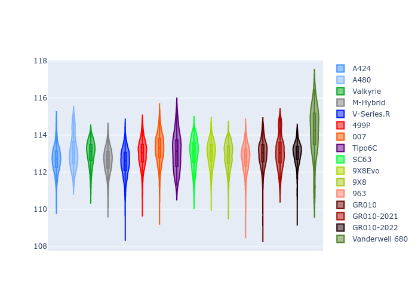
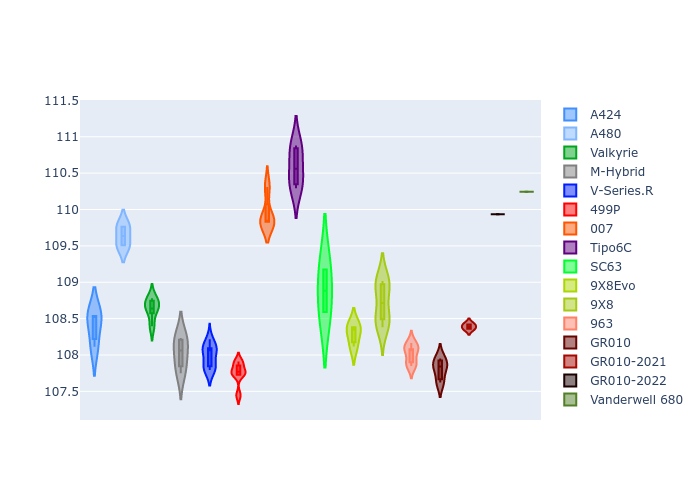
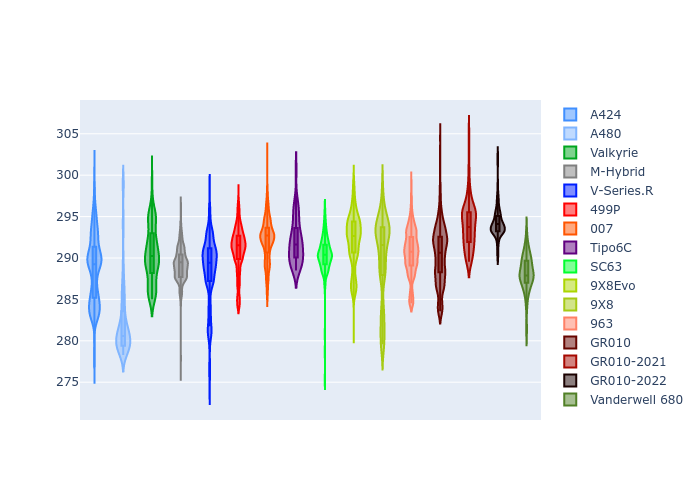
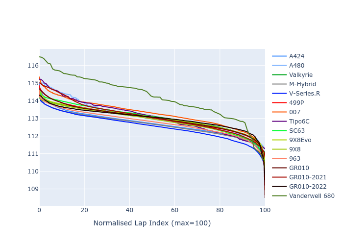

# Combined Plots

## Metadata

- BoP Accuracy: 96.52%
- Overall BoP Grade: A1
- Track: SEBRING
- Threshhold: 250.0kph
- Average Laptime: 1:52.85
- Average Quali Laptime: 1:48.83
- Laptime Std Dev: 0.36 seconds
- Filtered Average Topspeed: 291.32kph

## BoP Table
| Manufacturer     | Car            | Weight   | Power   | PINC   | E/Stint   | FDS    | RDP    | QDP    | TDP    |
|:-----------------|:---------------|:---------|:--------|:-------|:----------|:-------|:-------|:-------|:-------|
| Alpine           | A424           | 1056kg   | 511.0kw | +0.10% | 898MJ     | -      | 51.38% | 57.54% | 26.10% |
| Alpine           | A480           | 988kg    | 422.0kw | +0.10% | 793MJ     | -      | 54.81% | 80.56% | 55.69% |
| Aston Martin     | Valkyrie       | 1031kg   | 519.0kw | -      | 910MJ     | -      | 52.56% | 51.11% | 27.23% |
| BMW              | M-Hybrid       | 1053kg   | 513.0kw | +0.10% | 908MJ     | -      | 52.62% | 53.36% | 32.99% |
| Cadillac         | V-Series.R     | 1053kg   | 519.0kw | -      | 912MJ     | -      | 48.29% | 59.47% | 18.65% |
| Ferrari          | 499P           | 1062kg   | 503.0kw | +0.10% | 898MJ     | 190kph | 51.25% | 43.28% | 10.17% |
| Glickenhaus      | 007            | 1030kg   | 520.0kw | -      | 910MJ     | -      | 46.15% | 49.30% | 41.45% |
| Isotta Fraschini | Tipo6C         | 1030kg   | 520.0kw | -      | 914MJ     | 190kph | 43.95% | 47.22% | 31.53% |
| Lamborghini      | SC63           | 1033kg   | 519.0kw | -      | 907MJ     | -      | 48.33% | 60.95% | 28.65% |
| Peugeot          | 9X8Evo         | 1056kg   | 518.0kw | -0.10% | 903MJ     | 190kph | 48.70% | 50.83% | 18.68% |
| Peugeot          | 9X8            | 1030kg   | 515.0kw | -      | 904MJ     | 150kph | 54.54% | 58.39% | 9.69%  |
| Porsche          | 963            | 1056kg   | 511.0kw | +0.10% | 908MJ     | -      | 50.57% | 42.80% | 29.05% |
| Toyota           | GR010          | 1063kg   | 502.0kw | +0.10% | 900MJ     | 190kph | 51.03% | 51.78% | 14.64% |
| Toyota           | GR010-2021     | 1055kg   | 509.0kw | -0.10% | 901MJ     | 150kph | 53.89% | 50.91% | 25.87% |
| Toyota           | GR010-2022     | 1053kg   | 503.0kw | -0.10% | 893MJ     | 190kph | 53.24% | 64.49% | 9.72%  |
| Vanwall          | Vanderwell 680 | 1030kg   | 520.0kw | -      | 908MJ     | -      | 35.83% | 59.29% | 34.15% |

## Performance Table
| Manufacturer     | Car            | RP      | QP      | Vavg      |   RDLC | BOP-Grade   | Match   |
|:-----------------|:---------------|:--------|:--------|:----------|-------:|:------------|:--------|
| Alpine           | A424           | 1:52.71 | 1:48.39 | 289.73kph |   1.04 | ~A1         | 99.50%  |
| Alpine           | A480           | 1:52.70 | 1:49.64 | 281.31kph |   1.03 | ~A1         | 98.25%  |
| Aston Martin     | Valkyrie       | 1:52.69 | 1:48.64 | 292.71kph |   1.04 | ~A1         | 100.00% |
| BMW              | M-Hybrid       | 1:52.69 | 1:48.03 | 289.95kph |   1.04 | ~A1         | 100.00% |
| Cadillac         | V-Series.R     | 1:52.69 | 1:47.98 | 288.90kph |   1.04 | ~A1         | 99.90%  |
| Ferrari          | 499P           | 1:52.74 | 1:47.75 | 292.14kph |   1.05 | ~A1         | 99.94%  |
| Glickenhaus      | 007            | 1:53.26 | 1:49.95 | 293.65kph |   1.03 | ~A1         | 96.55%  |
| Isotta Fraschini | Tipo6C         | 1:52.78 | 1:50.58 | 294.60kph |   1.02 | ~A1         | 100.00% |
| Lamborghini      | SC63           | 1:52.70 | 1:48.88 | 291.90kph |   1.04 | ~A1         | 100.00% |
| Peugeot          | 9X8Evo         | 1:52.70 | 1:48.29 | 292.59kph |   1.04 | ~A1         | 100.00% |
| Peugeot          | 9X8            | 1:52.70 | 1:48.72 | 290.99kph |   1.04 | ~A1         | 99.92%  |
| Porsche          | 963            | 1:52.73 | 1:48.01 | 291.71kph |   1.04 | ~A1         | 99.88%  |
| Toyota           | GR010          | 1:52.82 | 1:47.81 | 292.34kph |   1.05 | ~A1         | 99.50%  |
| Toyota           | GR010-2021     | 1:52.81 | 1:48.39 | 294.78kph |   1.04 | +A2         | 94.53%  |
| Toyota           | GR010-2022     | 1:52.82 | 1:49.94 | 295.97kph |   1.03 | ~A1         | 99.55%  |
| Vanwall          | Vanderwell 680 | 1:54.13 | 1:50.24 | 287.88kph |   1.04 | +E1         | 56.86%  |

## Race Laptimes

## Quali Laptimes

## Topspeeds

## Laptimes Lineplot

