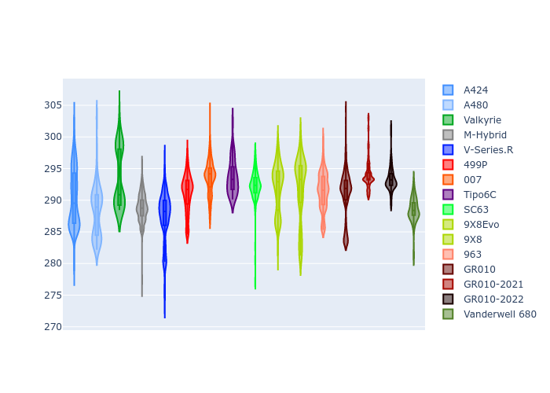

# Combined Plots

## Metadata

- BoP Accuracy: 94.08%
- Overall BoP Grade: A2
- Track: SEBRING
- Threshhold: 250.0kph
- Average Laptime: 1:52.52
- Average Quali Laptime: 1:48.41
- Average Topspeed: 291.33kph

## BoP Table
| Manufacturer     | Car            | Weight   | Power   | PINC   | E/Stint   | FDS    | RDP    | QDP    | TDP    |
|:-----------------|:---------------|:---------|:--------|:-------|:----------|:-------|:-------|:-------|:-------|
| Alpine           | A424           | 1067kg   | 520.0kw | -      | 915MJ     | -      | 51.64% | 59.31% | 26.80% |
| Alpine           | A480           | 952kg    | 432.0kw | +0.10% | 799MJ     | -      | 53.05% | 74.07% | 48.97% |
| Aston Martin     | Valkyrie       | 1030kg   | 520.0kw | -      | 911MJ     | -      | 53.50% | 53.33% | 21.51% |
| BMW              | M-Hybrid       | 1061kg   | 512.0kw | +0.10% | 908MJ     | -      | 52.89% | 56.22% | 33.41% |
| Cadillac         | V-Series.R     | 1048kg   | 510.0kw | +0.10% | 904MJ     | -      | 48.63% | 60.80% | 19.01% |
| Ferrari          | 499P           | 1083kg   | 508.0kw | +0.10% | 905MJ     | 190kph | 51.38% | 44.98% | 9.83%  |
| Glickenhaus      | 007            | 1030kg   | 520.0kw | -      | 910MJ     | -      | 46.15% | 49.30% | 41.45% |
| Isotta Fraschini | Tipo6C         | 1039kg   | 520.0kw | -      | 915MJ     | 190kph | 43.95% | 47.22% | 31.53% |
| Lamborghini      | SC63           | 1030kg   | 520.0kw | -      | 908MJ     | -      | 48.33% | 60.95% | 28.65% |
| Peugeot          | 9X8Evo         | 1048kg   | 511.0kw | -      | 899MJ     | 190kph | 48.87% | 52.78% | 15.41% |
| Peugeot          | 9X8            | 1031kg   | 520.0kw | -      | 909MJ     | 150kph | 54.54% | 58.39% | 9.69%  |
| Porsche          | 963            | 1067kg   | 516.0kw | -0.10% | 913MJ     | -      | 50.70% | 44.30% | 29.51% |
| Toyota           | GR010          | 1100kg   | 512.0kw | +0.10% | 913MJ     | 190kph | 51.09% | 52.71% | 11.46% |
| Toyota           | GR010-2021     | 1085kg   | 513.0kw | -0.10% | 907MJ     | 150kph | 54.08% | 54.81% | 9.72%  |
| Toyota           | GR010-2022     | 1100kg   | 512.0kw | -0.10% | 906MJ     | 190kph | 53.45% | 68.83% | 9.58%  |
| Vanwall          | Vanderwell 680 | 1030kg   | 520.0kw | -      | 908MJ     | -      | 49.68% | 60.93% | 34.43% |

## Performance Table
| Manufacturer     | Car            | RP      | QP      | Vavg      |   RDLC | BOP-Grade   | Match   |
|:-----------------|:---------------|:--------|:--------|:----------|-------:|:------------|:--------|
| Alpine           | A424           | 1:51.99 | 1:47.54 | 290.33kph |   1.04 | ~A1         | 99.94%  |
| Alpine           | A480           | 1:51.46 | 1:48.48 | 288.26kph |   1.03 | ~A1         | 97.87%  |
| Aston Martin     | Valkyrie       | 1:52.74 | 1:47.74 | 293.54kph |   1.05 | ~A1         | 100.00% |
| BMW              | M-Hybrid       | 1:52.29 | 1:47.43 | 288.81kph |   1.05 | ~A1         | 100.00% |
| Cadillac         | V-Series.R     | 1:52.59 | 1:47.76 | 287.31kph |   1.04 | ~A1         | 99.49%  |
| Ferrari          | 499P           | 1:52.01 | 1:47.14 | 291.11kph |   1.05 | ~A1         | 99.91%  |
| Glickenhaus      | 007            | 1:53.26 | 1:49.93 | 293.65kph |   1.03 | +B1         | 88.27%  |
| Isotta Fraschini | Tipo6C         | 1:53.09 | 1:50.82 | 293.67kph |   1.02 | +B1         | 86.57%  |
| Lamborghini      | SC63           | 1:52.61 | 1:48.77 | 292.41kph |   1.04 | ~A1         | 100.00% |
| Peugeot          | 9X8Evo         | 1:52.59 | 1:47.96 | 292.03kph |   1.04 | ~A1         | 100.00% |
| Peugeot          | 9X8            | 1:52.58 | 1:48.64 | 291.91kph |   1.04 | ~A1         | 100.00% |
| Porsche          | 963            | 1:52.11 | 1:47.66 | 291.41kph |   1.04 | ~A1         | 99.76%  |
| Toyota           | GR010          | 1:52.00 | 1:46.98 | 291.00kph |   1.05 | ~A1         | 99.71%  |
| Toyota           | GR010-2021     | 1:51.92 | 1:47.88 | 294.02kph |   1.04 | ~A1         | 100.00% |
| Toyota           | GR010-2022     | 1:52.55 | 1:49.58 | 293.35kph |   1.03 | ~A1         | 99.66%  |
| Vanwall          | Vanderwell 680 | 1:54.53 | 1:50.17 | 288.47kph |   1.04 | +Ω1         | 34.12%  |

## Race Laptimes

## Quali Laptimes

## Topspeeds

## Laptimes Lineplot

