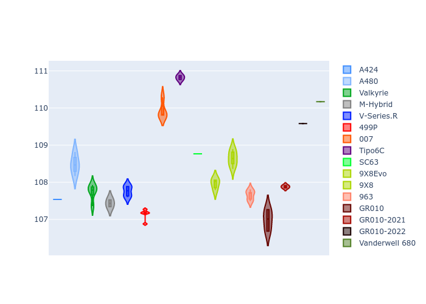

# Combined Plots

## Metadata

- BoP Accuracy: 94.26%
- Overall BoP Grade: A2
- Track: SEBRING
- Threshhold: 210.0kph

## BoP Table
| Manufacturer     | Car            | Weight   | Power   | PINC   | E/Stint   | FDS    |
|:-----------------|:---------------|:---------|:--------|:-------|:----------|:-------|
| Alpine           | A424           | 1067kg   | 520.0kw | -1.00% | 913MJ     | -      |
| Alpine           | A480           | 1052kg   | 432.0kw | +1.00% | 800MJ     | -      |
| Aston Martin     | Valkyrie       | 1062kg   | 504.0kw | +1.00% | 902MJ     | -      |
| BMW              | M-Hybrid       | 1061kg   | 512.0kw | -1.00% | 906MJ     | -      |
| Cadillac         | V-Series.R     | 1054kg   | 510.0kw | +1.00% | 906MJ     | -      |
| Ferrari          | 499P           | 1083kg   | 508.0kw | -1.00% | 903MJ     | 190kph |
| Glickenhaus      | 007            | 1050kg   | 520.0kw | -      | 912MJ     | -      |
| Isotta Fraschini | Tipo6C         | 1059kg   | 520.0kw | -      | 917MJ     | 190kph |
| Lamborghini      | SC63           | 1062kg   | 519.0kw | -1.00% | 908MJ     | -      |
| Peugeot          | 9X8Evo         | 1070kg   | 510.0kw | -1.00% | 899MJ     | 190kph |
| Peugeot          | 9X8            | 1050kg   | 520.0kw | -      | 911MJ     | 150kph |
| Porsche          | 963            | 1067kg   | 516.0kw | -1.00% | 911MJ     | -      |
| Toyota           | GR010          | 1100kg   | 512.0kw | -1.00% | 911MJ     | 190kph |
| Toyota           | GR010OLD       | 1085kg   | 513.0kw | +1.00% | 964MJ     | 150kph |
| Vanwall          | Vanderwell 680 | 1030kg   | 520.0kw | -      | 908MJ     | -      |

## Performance Table
| Manufacturer     | Car            | RP      | QP      | Vavg      |   RDLC | BOP-Grade   | Match   |
|:-----------------|:---------------|:--------|:--------|:----------|-------:|:------------|:--------|
| Alpine           | A424           | 1:51.56 | 1:47.36 | 288.00kph |   1.04 | ~A1         | 99.77%  |
| Alpine           | A480           | 1:50.96 | 1:47.90 | 280.67kph |   1.03 | ~A1         | 96.64%  |
| Aston Martin     | Valkyrie       | 1:52.80 | 1:47.75 | 285.72kph |   1.05 | ~A1         | 98.43%  |
| BMW              | M-Hybrid       | 1:51.75 | 1:47.18 | 285.94kph |   1.04 | ~A1         | 99.77%  |
| Cadillac         | V-Series.R     | 1:51.84 | 1:47.36 | 284.47kph |   1.04 | ~A1         | 99.87%  |
| Ferrari          | 499P           | 1:51.71 | 1:47.06 | 286.51kph |   1.04 | ~A1         | 99.51%  |
| Glickenhaus      | 007            | 1:52.56 | 1:49.11 | 285.56kph |   1.03 | +A2         | 93.12%  |
| Isotta Fraschini | Tipo6C         | 1:53.16 | 1:50.74 | 287.36kph |   1.02 | +B1         | 88.06%  |
| Lamborghini      | SC63           | 1:52.83 | 1:49.10 | 286.16kph |   1.03 | ~A1         | 95.78%  |
| Peugeot          | 9X8Evo         | 1:52.32 | 1:47.73 | 287.48kph |   1.04 | ~A1         | 98.12%  |
| Peugeot          | 9X8            | 1:52.23 | 1:48.04 | 281.94kph |   1.04 | ~A1         | 99.96%  |
| Porsche          | 963            | 1:51.75 | 1:47.25 | 286.33kph |   1.04 | ~A1         | 99.86%  |
| Toyota           | GR010          | 1:52.15 | 1:47.37 | 286.20kph |   1.04 | ~A1         | 99.97%  |
| Toyota           | GR010OLD       | 1:51.01 | 1:47.62 | 283.85kph |   1.03 | ~A1         | 96.89%  |
| Vanwall          | Vanderwell 680 | 1:54.01 | 1:49.08 | 281.90kph |   1.05 | +Ω1         | 48.21%  |

## Race Laptimes

## Quali Laptimes

## Topspeeds

## Laptimes Lineplot

