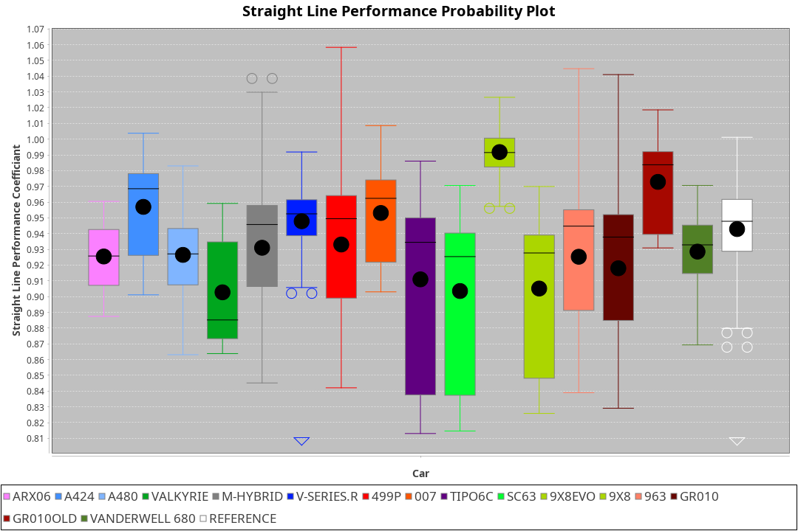
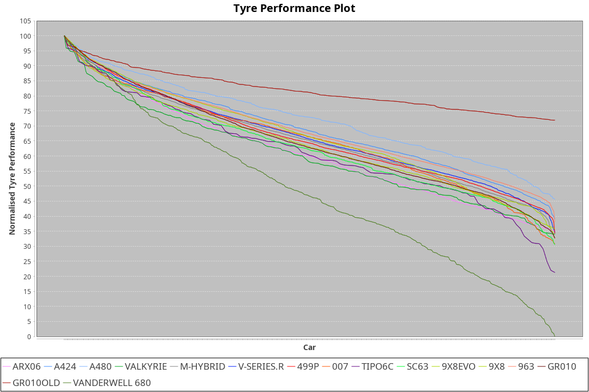

| Manufacturer     | Car            | Weight | Power   | PINC    | E/Stint | FDS     |
|:-|:-|:-|:-|:-|:-|:-|
| Acura            | ARX06          | 1070kg | 512.0kw |    -    | 912MJ   |    -    |
| Alpine           | A424           | 1057kg | 517.0kw |    -    | 912MJ   |    -    |
| Alpine           | A480           | 952kg  | 431.0kw |    -    | 766MJ   |    -    |
| BMW              | M-Hybrid       | 1050kg | 509.0kw |    -    | 903MJ   |    -    |
| Cadillac         | V-Series.R     | 1044kg | 507.0kw |    -    | 896MJ   |    -    |
| Ferrari          | 499P           | 1069kg | 505.0kw |    -    | 893MJ   | 190kph  |
| Glickenhaus      | 007            | 1038kg | 514.0kw |    -    | 905MJ   |    -    |
| Isotta Fraschini | Tipo6C         | 1051kg | 520.0kw |    -    | 918MJ   | 190kph  |
| Lamborghini      | SC63           | 1033kg | 504.0kw |    -    | 894MJ   |    -    |
| Peugeot          | 9X8Evo         | 1058kg | 507.0kw |    -    | 897MJ   | 190kph  |
| Peugeot          | 9X8            | 1040kg | 518.0kw |    -    | 903MJ   | 150kph  |
| Porsche          | 963            | 1057kg | 513.0kw |    -    | 900MJ   |    -    |
| Toyota           | GR010          | 1080kg | 510.0kw |    -    | 903MJ   | 190kph  |
| Toyota           | GR010OLD       | 1066kg | 511.0kw |    -    | 904MJ   | 190kph  |
| Vanwall          | Vanderwell 680 | 1030kg | 520.0kw |    -    | 903MJ   |    -    |

### BoP Accuracy: 83.28%; Overall BoP Grade: B2
| Manufacturer     | Car            | Type  | RP      | QP      | Weight | Power¹  | Threshhold | PINC    | Power²   | E/Stint | AVG Vmax  | FDS     | RDLC | L/Stint | BOP-Grade | Model Accuracy | Model Points | Match%  | SimDiff |
|:-|:-|:-|:-|:-|:-|:-|:-|:-|:-|:-|:-|:-|:-|:-|:-|:-|:-|:-|:-|
| Acura            | ARX06          | LMDH  | 1:52.69 | 1:47.29 | 1070kg | 512.0kw | 210.0kph   |    -    | 512.00kw |  912MJ  | 279.41kph |    -    | 1.00 | 29      | -B1       | 100.00%        | 995          | 85.09%  | #       |
| Alpine           | A424           | LMDH  | 1:52.48 | 1:48.39 | 1057kg | 517.0kw | 210.0kph   |    -    | 517.00kw |  912MJ  | 292.10kph |    -    | 1.00 | 29      | -B2       | 100.00%        | 635          | 84.57%  | #       |
| Alpine           | A480           | LMP1  | 1:52.66 | 1:48.85 |  952kg | 431.0kw | 210.0kph   |    -    | 431.00kw |  766MJ  | 281.01kph |    -    | 0.97 | 27      | +A2       | 94.90%         | 707          | 93.15%  | ±2.37s  |
| BMW              | M-Hybrid       | LMDH  | 1:52.69 | 1:47.88 | 1050kg | 509.0kw | 210.0kph   |    -    | 509.00kw |  903MJ  | 289.18kph |    -    | 1.01 | 29      | -A2       | 100.00%        | 1696         | 93.87%  | #       |
| Cadillac         | V-Series.R     | LMDH  | 1:52.30 | 1:47.72 | 1044kg | 507.0kw | 210.0kph   |    -    | 507.00kw |  896MJ  | 285.56kph |    -    | 1.02 | 29      | -B2       | 88.64%         | 2076         | 83.06%  | ±1.99s  |
| Ferrari          | 499P           | LMHHU | 1:52.71 | 1:47.89 | 1069kg | 505.0kw | 210.0kph   |    -    | 505.00kw |  893MJ  | 288.33kph | 190kph  | 1.01 | 29      | ~A1       | 91.94%         | 2476         | 100.00% | ±1.52s  |
| Glickenhaus      | 007            | LMHNH | 1:52.69 | 1:48.82 | 1038kg | 514.0kw | 210.0kph   |    -    | 514.00kw |  905MJ  | 286.74kph |    -    | 0.96 | 29      | ~A1       | 95.63%         | 1510         | 98.97%  | ±0.86s  |
| Isotta Fraschini | Tipo6C         | LMHHU | 1:52.69 | 1:50.21 | 1051kg | 520.0kw | 210.0kph   |    -    | 520.00kw |  918MJ  | 290.80kph | 190kph  | 1.05 | 29      | +Ω1       | 100.00%        | 66           | 46.97%  | #       |
| Lamborghini      | SC63           | LMDH  | 1:52.70 | 1:49.92 | 1033kg | 504.0kw | 210.0kph   |    -    | 504.00kw |  894MJ  | 289.58kph |    -    | 1.04 | 29      | -A2       | 100.00%        | 504          | 93.04%  | #       |
| Peugeot          | 9X8Evo         | LMHHU | 1:52.71 | 1:49.11 | 1058kg | 507.0kw | 210.0kph   |    -    | 507.00kw |  897MJ  | 290.89kph | 190kph  | 0.99 | 29      | +B2       | 100.00%        | 249          | 81.64%  | #       |
| Peugeot          | 9X8            | LMHHE | 1:52.69 | 1:48.27 | 1040kg | 518.0kw | 210.0kph   |    -    | 518.00kw |  903MJ  | 287.28kph | 150kph  | 1.03 | 29      | ~A1       | 98.33%         | 2173         | 97.46%  | ±0.54s  |
| Porsche          | 963            | LMDH  | 1:52.58 | 1:47.47 | 1057kg | 513.0kw | 210.0kph   |    -    | 513.00kw |  900MJ  | 288.11kph |    -    | 1.00 | 29      | ~A1       | 90.40%         | 5633         | 96.33%  | ±1.04s  |
| Toyota           | GR010          | LMHHU | 1:52.68 | 1:48.01 | 1080kg | 510.0kw | 210.0kph   |    -    | 510.00kw |  903MJ  | 287.21kph | 190kph  | 1.01 | 29      | ~A1       | 90.11%         | 3235         | 100.00% | ±1.02s  |
| Toyota           | GR010OLD       | LMHHE | 1:52.71 | 1:47.78 | 1066kg | 511.0kw | 210.0kph   |    -    | 511.00kw |  904MJ  | 285.33kph | 190kph  | 1.02 | 29      | ~A1       | 99.03%         | 1536         | 97.96%  | #       |
| Vanwall          | Vanderwell 680 | LMHNH | 1:55.30 | 1:49.85 | 1030kg | 520.0kw | 210.0kph   |    -    | 520.00kw |  903MJ  | 280.24kph |    -    | 1.01 | 29      | +Ω2       | 97.68%         | 632          | -2.87%  | ±0.32s  |

## Power below Threshhold
| N/Nmax    | ARX06   | A424    | M-HYBRID | V-SERIES.R | 499P    | 007     | TIPO6C  | SC63    | 9X8EVO  | 9X8     | 963     | GR010   | GR010OLD | VANDERWELL 680 | ​     | RPM      | A480    |
|:-|:-|:-|:-|:-|:-|:-|:-|:-|:-|:-|:-|:-|:-|:-|:-|:-|:-|
|  0.550    |  252    |  255    |  251     |  250       |  249    |  253    |  256    |  248    |  250    |  255    |  253    |  251    |  252     |  256           |  ​    |   --     |   -     |
|  0.575    |  275    |  278    |  274     |  273       |  272    |  276    |  279    |  271    |  273    |  278    |  276    |  274    |  275     |  279           |  ​    |   --     |   -     |
|  0.600    |  296    |  298    |  294     |  293       |  292    |  297    |  300    |  291    |  293    |  299    |  296    |  295    |  295     |  300           |  ​    |   --     |   -     |
|  0.625    |  317    |  320    |  315     |  314       |  312    |  318    |  322    |  312    |  314    |  321    |  317    |  316    |  316     |  322           |  ​    |   --     |   -     |
|  0.650    |  338    |  341    |  336     |  335       |  333    |  339    |  343    |  333    |  335    |  342    |  338    |  337    |  337     |  343           |  ​    |   --     |   -     |
|  0.675    |  359    |  363    |  357     |  356       |  355    |  361    |  365    |  354    |  356    |  364    |  360    |  358    |  359     |  365           |  ​    |   --     |   -     |
|  0.700    |  381    |  385    |  379     |  377       |  376    |  383    |  387    |  375    |  377    |  386    |  382    |  380    |  380     |  387           |  ​    |   --     |   -     |
|  0.725    |  403    |  407    |  400     |  399       |  397    |  404    |  409    |  396    |  399    |  407    |  403    |  401    |  402     |  409           |  ​    |   --     |   -     |
|  0.750    |  423    |  427    |  421     |  419       |  417    |  425    |  430    |  416    |  419    |  428    |  424    |  422    |  422     |  430           |  ​    |   --     |   -     |
|  0.775    |  442    |  446    |  440     |  438       |  436    |  444    |  449    |  435    |  438    |  447    |  443    |  441    |  441     |  449           |  ​    |  5000    |  253    |
|  0.800    |  460    |  464    |  457     |  455       |  454    |  462    |  467    |  453    |  455    |  465    |  461    |  458    |  459     |  467           |  ​    |  5500    |  299    |
|  0.825    |  475    |  479    |  472     |  470       |  469    |  477    |  482    |  468    |  470    |  480    |  476    |  473    |  474     |  482           |  ​    |  6000    |  334    |
|  0.850    |  486    |  491    |  484     |  482       |  480    |  488    |  494    |  479    |  482    |  492    |  487    |  485    |  485     |  494           |  ​    |  6500    |  377    |
|  0.875    |  497    |  502    |  494     |  492       |  490    |  499    |  505    |  489    |  492    |  503    |  498    |  495    |  496     |  505           |  ​    |  7000    |  421    |
|  0.900    |  504    |  509    |  501     |  499       |  497    |  506    |  512    |  496    |  499    |  510    |  505    |  502    |  503     |  512           |  ​    |  7500    |  432    |
|  0.925    |  509    |  514    |  506     |  504       |  502    |  511    |  517    |  501    |  504    |  515    |  510    |  507    |  508     |  517           |  ​    |  8000    |  428    |
| **0.950** | **512** | **517** | **509**  | **507**    | **505** | **514** | **520** | **504** | **507** | **518** | **513** | **510** | **511**  | **520**        | **​** | **8500** | **431** |
|  0.975    |  510    |  515    |  507     |  505       |  503    |  512    |  518    |  502    |  505    |  516    |  511    |  508    |  509     |  518           |  ​    |  9000    |  216    |
|  1.000    |  506    |  511    |  504     |  502       |  500    |  508    |  514    |  499    |  502    |  512    |  507    |  505    |  505     |  514           |  ​    |   --     |   -     |
|  1.025    |  437    |  441    |  435     |  433       |  431    |  439    |  444    |  430    |  433    |  442    |  438    |  436    |  436     |  444           |  ​    |   --     |   -     |

## Power above Threshhold
| N/Nmax    | ARX06   | A424    | M-HYBRID | V-SERIES.R | 499P    | 007     | TIPO6C  | SC63    | 9X8EVO  | 9X8     | 963     | GR010   | GR010OLD | VANDERWELL 680 | ​     | RPM      | A480    |
|:-|:-|:-|:-|:-|:-|:-|:-|:-|:-|:-|:-|:-|:-|:-|:-|:-|:-|
|  0.550    |  252    |  255    |  251     |  250       |  249    |  253    |  256    |  248    |  250    |  255    |  253    |  251    |  252     |  256           |  ​    |   --     |   -     |
|  0.575    |  275    |  278    |  274     |  273       |  272    |  276    |  279    |  271    |  273    |  278    |  276    |  274    |  275     |  279           |  ​    |   --     |   -     |
|  0.600    |  296    |  298    |  294     |  293       |  292    |  297    |  300    |  291    |  293    |  299    |  296    |  295    |  295     |  300           |  ​    |   --     |   -     |
|  0.625    |  317    |  320    |  315     |  314       |  312    |  318    |  322    |  312    |  314    |  321    |  317    |  316    |  316     |  322           |  ​    |   --     |   -     |
|  0.650    |  338    |  341    |  336     |  335       |  333    |  339    |  343    |  333    |  335    |  342    |  338    |  337    |  337     |  343           |  ​    |   --     |   -     |
|  0.675    |  359    |  363    |  357     |  356       |  355    |  361    |  365    |  354    |  356    |  364    |  360    |  358    |  359     |  365           |  ​    |   --     |   -     |
|  0.700    |  381    |  385    |  379     |  377       |  376    |  383    |  387    |  375    |  377    |  386    |  382    |  380    |  380     |  387           |  ​    |   --     |   -     |
|  0.725    |  403    |  407    |  400     |  399       |  397    |  404    |  409    |  396    |  399    |  407    |  403    |  401    |  402     |  409           |  ​    |   --     |   -     |
|  0.750    |  423    |  427    |  421     |  419       |  417    |  425    |  430    |  416    |  419    |  428    |  424    |  422    |  422     |  430           |  ​    |   --     |   -     |
|  0.775    |  442    |  446    |  440     |  438       |  436    |  444    |  449    |  435    |  438    |  447    |  443    |  441    |  441     |  449           |  ​    |  5000    |  253    |
|  0.800    |  460    |  464    |  457     |  455       |  454    |  462    |  467    |  453    |  455    |  465    |  461    |  458    |  459     |  467           |  ​    |  5500    |  299    |
|  0.825    |  475    |  479    |  472     |  470       |  469    |  477    |  482    |  468    |  470    |  480    |  476    |  473    |  474     |  482           |  ​    |  6000    |  334    |
|  0.850    |  486    |  491    |  484     |  482       |  480    |  488    |  494    |  479    |  482    |  492    |  487    |  485    |  485     |  494           |  ​    |  6500    |  377    |
|  0.875    |  497    |  502    |  494     |  492       |  490    |  499    |  505    |  489    |  492    |  503    |  498    |  495    |  496     |  505           |  ​    |  7000    |  421    |
|  0.900    |  504    |  509    |  501     |  499       |  497    |  506    |  512    |  496    |  499    |  510    |  505    |  502    |  503     |  512           |  ​    |  7500    |  432    |
|  0.925    |  509    |  514    |  506     |  504       |  502    |  511    |  517    |  501    |  504    |  515    |  510    |  507    |  508     |  517           |  ​    |  8000    |  428    |
| **0.950** | **512** | **517** | **509**  | **507**    | **505** | **514** | **520** | **504** | **507** | **518** | **513** | **510** | **511**  | **520**        | **​** | **8500** | **431** |
|  0.975    |  510    |  515    |  507     |  505       |  503    |  512    |  518    |  502    |  505    |  516    |  511    |  508    |  509     |  518           |  ​    |  9000    |  216    |
|  1.000    |  506    |  511    |  504     |  502       |  500    |  508    |  514    |  499    |  502    |  512    |  507    |  505    |  505     |  514           |  ​    |   --     |   -     |
|  1.025    |  437    |  441    |  435     |  433       |  431    |  439    |  444    |  430    |  433    |  442    |  438    |  436    |  436     |  444           |  ​    |   --     |   -     |
