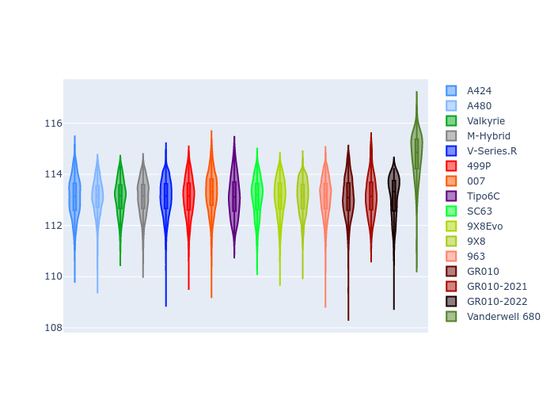
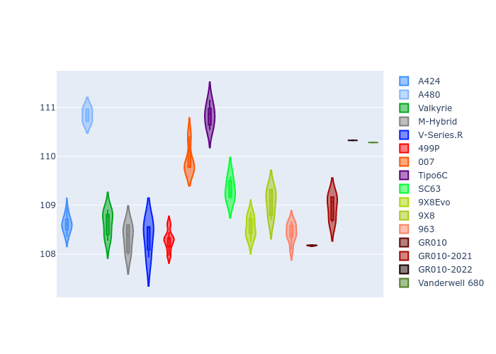
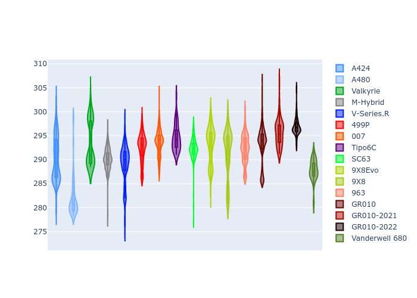
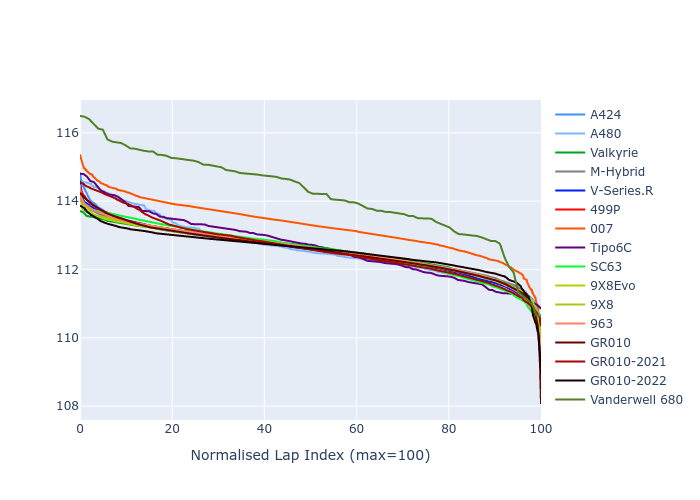

# Combined Plots

## Metadata

- BoP Accuracy: 96.09%
- Overall BoP Grade: A1
- Track: SEBRING
- Threshhold: 0.0kph
- Average Laptime: 1:52.64
- Average Quali Laptime: 1:48.63
- Laptime Std Dev: 0.44 seconds
- Filtered Average Topspeed: 292.03kph

## BoP Table
| Manufacturer     | Car            | Weight   | Power   | PINC   | E/Stint   | FDS    | RDP    | QDP    | TDP    |
|:-----------------|:---------------|:---------|:--------|:-------|:----------|:-------|:-------|:-------|:-------|
| Alpine           | A424           | 1042kg   | 509.0kw | -      | 894MJ     | -      | 51.38% | 57.54% | 26.10% |
| Alpine           | A480           | 949kg    | 410.0kw | -      | 778MJ     | -      | 54.81% | 80.56% | 55.69% |
| Aston Martin     | Valkyrie       | 1030kg   | 520.0kw | -      | 911MJ     | -      | 52.56% | 51.11% | 27.23% |
| BMW              | M-Hybrid       | 1042kg   | 512.0kw | -      | 906MJ     | -      | 52.62% | 53.36% | 32.99% |
| Cadillac         | V-Series.R     | 1047kg   | 520.0kw | -      | 912MJ     | -      | 48.29% | 59.47% | 18.65% |
| Ferrari          | 499P           | 1063kg   | 508.0kw | -      | 902MJ     | 200kph | 51.25% | 43.28% | 10.17% |
| Glickenhaus      | 007            | 1030kg   | 520.0kw | -      | 910MJ     | -      | 46.15% | 49.30% | 41.45% |
| Isotta Fraschini | Tipo6C         | 1030kg   | 520.0kw | -      | 914MJ     | 190kph | 43.95% | 47.22% | 31.53% |
| Lamborghini      | SC63           | 1030kg   | 520.0kw | -      | 908MJ     | -      | 48.33% | 60.95% | 28.65% |
| Peugeot          | 9X8Evo         | 1030kg   | 510.0kw | -      | 894MJ     | 200kph | 48.70% | 50.83% | 18.68% |
| Peugeot          | 9X8            | 1033kg   | 520.0kw | -      | 909MJ     | 200kph | 54.54% | 58.39% | 9.69%  |
| Porsche          | 963            | 1039kg   | 508.0kw | -      | 903MJ     | -      | 50.57% | 42.80% | 29.05% |
| Toyota           | GR010          | 1061kg   | 507.0kw | -      | 904MJ     | 200kph | 51.03% | 51.78% | 14.64% |
| Toyota           | GR010-2021     | 1062kg   | 517.0kw | -      | 909MJ     | 200kph | 53.89% | 50.91% | 25.87% |
| Toyota           | GR010-2022     | 1058kg   | 510.0kw | -      | 900MJ     | 190kph | 53.24% | 64.49% | 9.72%  |
| Vanwall          | Vanderwell 680 | 1030kg   | 520.0kw | -      | 908MJ     | -      | 35.83% | 59.29% | 34.15% |

## Performance Table
| Manufacturer     | Car            | RP      | QP      | Vavg      |   RDLC | BOP-Grade   | Match   |
|:-----------------|:---------------|:--------|:--------|:----------|-------:|:------------|:--------|
| Alpine           | A424           | 1:52.45 | 1:48.15 | 290.64kph |   1.04 | ~A1         | 99.59%  |
| Alpine           | A480           | 1:52.45 | 1:49.40 | 282.40kph |   1.03 | ~A1         | 99.25%  |
| Aston Martin     | Valkyrie       | 1:52.59 | 1:48.55 | 293.02kph |   1.04 | ~A1         | 100.00% |
| BMW              | M-Hybrid       | 1:52.45 | 1:47.81 | 290.77kph |   1.04 | ~A1         | 100.00% |
| Cadillac         | V-Series.R     | 1:52.45 | 1:47.76 | 289.70kph |   1.04 | ~A1         | 99.90%  |
| Ferrari          | 499P           | 1:52.44 | 1:47.48 | 293.01kph |   1.05 | ~A1         | 99.93%  |
| Glickenhaus      | 007            | 1:53.26 | 1:49.95 | 293.65kph |   1.03 | -A2         | 94.00%  |
| Isotta Fraschini | Tipo6C         | 1:52.78 | 1:50.58 | 294.60kph |   1.02 | ~A1         | 97.76%  |
| Lamborghini      | SC63           | 1:52.54 | 1:48.74 | 292.41kph |   1.03 | ~A1         | 100.00% |
| Peugeot          | 9X8Evo         | 1:52.44 | 1:48.05 | 293.67kph |   1.04 | ~A1         | 100.00% |
| Peugeot          | 9X8            | 1:52.45 | 1:48.49 | 291.70kph |   1.04 | ~A1         | 99.92%  |
| Porsche          | 963            | 1:52.45 | 1:47.76 | 292.72kph |   1.04 | ~A1         | 99.83%  |
| Toyota           | GR010          | 1:52.44 | 1:47.46 | 293.51kph |   1.05 | ~A1         | 99.67%  |
| Toyota           | GR010-2021     | 1:52.45 | 1:48.06 | 295.82kph |   1.04 | ~A1         | 96.14%  |
| Toyota           | GR010-2022     | 1:52.46 | 1:49.60 | 297.03kph |   1.03 | ~A1         | 99.55%  |
| Vanwall          | Vanderwell 680 | 1:54.13 | 1:50.24 | 287.88kph |   1.04 | +E2         | 51.96%  |

## Race Laptimes

## Quali Laptimes

## Topspeeds

## Laptimes Lineplot

