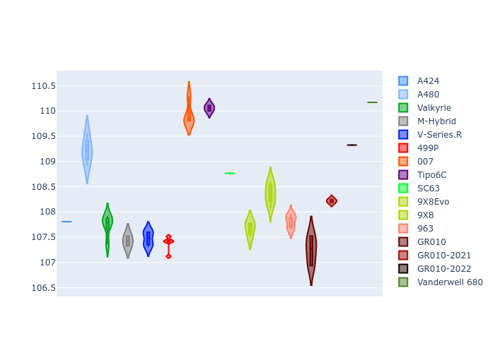
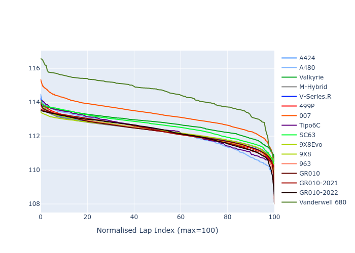

# Combined Plots

## Metadata

- BoP Accuracy: 98.05%
- Overall BoP Grade: A1
- Track: SEBRING
- Threshhold: 0.0kph

## BoP Table
| Manufacturer     | Car            | Weight   | Power   | PINC   | E/Stint   | FDS    |
|:-----------------|:---------------|:---------|:--------|:-------|:----------|:-------|
| Alpine           | A424           | 1098kg   | 480.0kw | -      | 882MJ     | -      |
| Alpine           | A480           | 1052kg   | 410.0kw | -      | 778MJ     | -      |
| Aston Martin     | Valkyrie       | 1064kg   | 480.0kw | -      | 879MJ     | -      |
| BMW              | M-Hybrid       | 1094kg   | 480.0kw | -      | 882MJ     | -      |
| Cadillac         | V-Series.R     | 1081kg   | 480.0kw | -      | 880MJ     | -      |
| Ferrari          | 499P           | 1100kg   | 480.0kw | -      | 881MJ     | 200kph |
| Glickenhaus      | 007            | 1048kg   | 480.0kw | -      | 876MJ     | -      |
| Isotta Fraschini | Tipo6C         | 1077kg   | 520.0kw | -      | 919MJ     | 190kph |
| Lamborghini      | SC63           | 1057kg   | 486.0kw | -      | 880MJ     | -      |
| Peugeot          | 9X8Evo         | 1086kg   | 480.0kw | -      | 876MJ     | 190kph |
| Peugeot          | 9X8            | 1055kg   | 480.0kw | -      | 876MJ     | 150kph |
| Porsche          | 963            | 1096kg   | 480.0kw | -      | 884MJ     | -      |
| Toyota           | GR010          | 1100kg   | 480.0kw | -      | 884MJ     | 200kph |
| Toyota           | GR010OLD       | 1100kg   | 480.0kw | -      | 932MJ     | 200kph |
| Vanwall          | Vanderwell 680 | 1030kg   | 520.0kw | -      | 908MJ     | -      |

## Performance Table
| Manufacturer     | Car            | RP      | QP      | Vavg      |   RDLC | BOP-Grade   | Match   |
|:-----------------|:---------------|:--------|:--------|:----------|-------:|:------------|:--------|
| Alpine           | A424           | 1:53.72 | 1:49.38 | 277.57kph |   1.04 | ~A1         | 98.66%  |
| Alpine           | A480           | 1:51.83 | 1:48.73 | 274.72kph |   1.03 | -B1         | 88.14%  |
| Aston Martin     | Valkyrie       | 1:53.73 | 1:48.60 | 279.82kph |   1.05 | ~A1         | 100.00% |
| BMW              | M-Hybrid       | 1:53.73 | 1:49.02 | 276.94kph |   1.04 | ~A1         | 100.00% |
| Cadillac         | V-Series.R     | 1:53.72 | 1:49.10 | 275.06kph |   1.04 | ~A1         | 99.66%  |
| Ferrari          | 499P           | 1:53.20 | 1:48.44 | 279.80kph |   1.04 | ~A1         | 99.83%  |
| Glickenhaus      | 007            | 1:53.73 | 1:50.22 | 277.59kph |   1.03 | ~A1         | 95.48%  |
| Isotta Fraschini | Tipo6C         | 1:53.72 | 1:51.28 | 285.61kph |   1.02 | ~A1         | 100.00% |
| Lamborghini      | SC63           | 1:53.72 | 1:49.93 | 280.61kph |   1.03 | ~A1         | 98.55%  |
| Peugeot          | 9X8Evo         | 1:53.71 | 1:49.02 | 280.43kph |   1.04 | ~A1         | 97.87%  |
| Peugeot          | 9X8            | 1:53.71 | 1:49.42 | 273.41kph |   1.04 | ~A1         | 99.96%  |
| Porsche          | 963            | 1:53.73 | 1:49.10 | 276.92kph |   1.04 | ~A1         | 99.87%  |
| Toyota           | GR010          | 1:53.26 | 1:48.39 | 280.29kph |   1.04 | ~A1         | 99.93%  |
| Toyota           | GR010OLD       | 1:53.30 | 1:49.79 | 275.03kph |   1.03 | ~A1         | 100.00% |
| Vanwall          | Vanderwell 680 | 1:54.01 | 1:49.08 | 281.90kph |   1.05 | -A2         | 92.86%  |

## Race Laptimes

## Quali Laptimes

## Topspeeds

## Laptimes Lineplot

