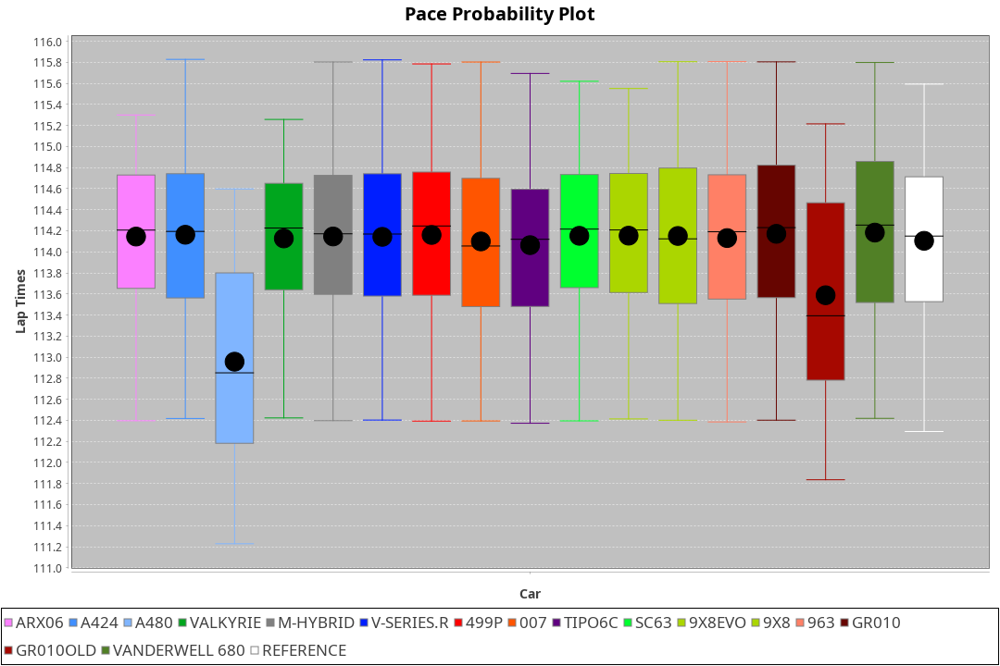
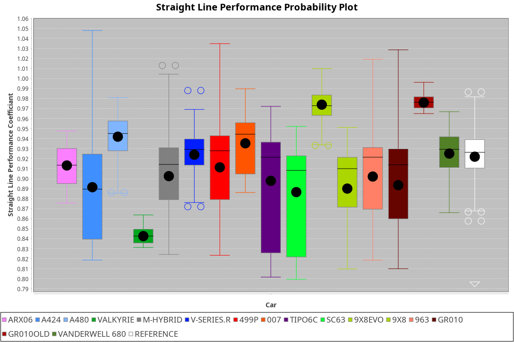
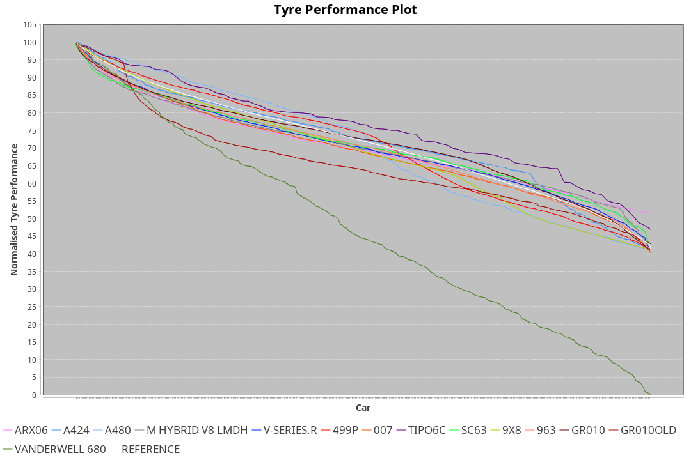

| Manufacturer     | Car            | Weight | Power   | PINC    | E/Stint | FDS     |
|:-|:-|:-|:-|:-|:-|:-|
| Acura            | ARX06          | 1048kg | 512.0kw |    -    | 909MJ   |    -    |
| Alpine           | A424           | 1031kg | 520.0kw |    -    | 913MJ   |    -    |
| Alpine           | A480           | 932kg  | 430.0kw |    -    | 763MJ   |    -    |
| BMW              | M-Hybrid       | 1037kg | 520.0kw |    -    | 911MJ   |    -    |
| Cadillac         | V-Series.R     | 1039kg | 516.0kw |    -    | 904MJ   |    -    |
| Ferrari          | 499P           | 1060kg | 504.0kw |    -    | 895MJ   | 190kph  |
| Glickenhaus      | 007            | 1030kg | 520.0kw |    -    | 910MJ   |    -    |
| Isotta Fraschini | Tipo6C         | 1030kg | 520.0kw |    -    | 914MJ   | 140kph  |
| Lamborghini      | SC63           | 1030kg | 520.0kw |    -    | 910MJ   |    -    |
| Peugeot          | 9X8            | 1035kg | 494.0kw |    -    | 882MJ   |    -    |
| Peugeot          | 9X8Evo         | 1030kg | 510.0kw |    -    | 903MJ   | 190kph  |
| Porsche          | 963            | 1037kg | 516.0kw |    -    | 901MJ   |    -    |
| Toyota           | GR010          | 1063kg | 503.0kw |    -    | 895MJ   | 190kph  |
| Toyota           | GR010OLD       | 1100kg | 480.0kw |    -    | 879MJ   |    -    |
| Vanwall          | Vanderwell 680 | 1030kg | 520.0kw |    -    | 903MJ   |    -    |

### BoP Accuracy: 78.96%; Overall BoP Grade: C1
| Manufacturer     | Car            | Type  | RP      | QP      | Weight | Power¹  | Threshhold | PINC    | Power²   | E/Stint | AVG Vmax  | FDS     | RDLC | L/Stint | BOP-Grade | Model Accuracy | Model Points | Match%  | SimDiff |
|:-|:-|:-|:-|:-|:-|:-|:-|:-|:-|:-|:-|:-|:-|:-|:-|:-|:-|:-|:-|
| Acura            | ARX06          | LMDH  | 1:51.33 | 1:46.23 | 1048kg | 512.0kw | 0.0kph     |    -    | 512.00kw |  909MJ  | 281.52kph |    -    | 1.02 | 29      | +D1       | 100.00%        | 995          | 68.72%  | ±0.13s  |
| Alpine           | A424           | LMDH  | 1:51.34 | 1:46.94 | 1031kg | 520.0kw | 0.0kph     |    -    | 520.00kw |  913MJ  | 294.90kph |    -    | 1.02 | 29      | -A2       | 86.43%         | 618          | 93.65%  | #       |
| Alpine           | A480           | LMP1  | 1:51.33 | 1:47.59 |  932kg | 430.0kw | 0.0kph     |    -    | 430.00kw |  763MJ  | 281.49kph |    -    | 1.00 | 27      | ~A1       | 68.63%         | 967          | 100.00% | ±1.31s  |
| BMW              | M-Hybrid       | LMDH  | 1:51.34 | 1:46.46 | 1037kg | 520.0kw | 0.0kph     |    -    | 520.00kw |  911MJ  | 291.57kph |    -    | 1.02 | 29      | -B1       | 93.77%         | 1672         | 88.76%  | ±0.46s  |
| Cadillac         | V-Series.R     | LMDH  | 1:51.34 | 1:46.92 | 1039kg | 516.0kw | 0.0kph     |    -    | 516.00kw |  904MJ  | 287.70kph |    -    | 1.02 | 29      | ~A1       | 83.12%         | 1921         | 95.61%  | ±0.21s  |
| Ferrari          | 499P           | LMHHU | 1:51.34 | 1:46.76 | 1060kg | 504.0kw | 0.0kph     |    -    | 504.00kw |  895MJ  | 288.83kph | 190kph  | 1.02 | 29      | ~A1       | 69.49%         | 1950         | 100.00% | ±1.99s  |
| Glickenhaus      | 007            | LMHNH | 1:52.02 | 1:48.39 | 1030kg | 520.0kw | 0.0kph     |    -    | 520.00kw |  910MJ  | 288.76kph |    -    | 0.96 | 29      | ~A1       | 89.50%         | 1518         | 100.00% | ±0.90s  |
| Isotta Fraschini | Tipo6C         | LMHHU | 1:51.37 | 1:48.54 | 1030kg | 520.0kw | 0.0kph     |    -    | 520.00kw |  914MJ  | 290.34kph | 140kph  | 1.07 | 29      | +C2       | 73.56%         | 64           | 73.15%  | #       |
| Lamborghini      | SC63           | LMDH  | 1:51.82 | 1:49.12 | 1030kg | 520.0kw | 0.0kph     |    -    | 520.00kw |  910MJ  | 291.33kph |    -    | 1.05 | 29      | +B2       | 95.82%         | 459          | 83.55%  | ±0.28s  |
| Peugeot          | 9X8            | LMHHE | 1:51.34 | 1:47.02 | 1035kg | 494.0kw | 0.0kph     |    -    | 494.00kw |  882MJ  | 282.01kph |    -    | 1.03 | 29      | -A2       | 88.75%         | 2383         | 92.53%  | ±0.98s  |
| Peugeot          | 9X8Evo         | LMHHU | 1:51.33 | 1:46.80 | 1030kg | 510.0kw | 0.0kph     |    -    | 510.00kw |  903MJ  | 291.53kph | 190kph  | 1.03 | 29      | ~A1       | 66.97%         | 221          | 100.00% | #       |
| Porsche          | 963            | LMDH  | 1:51.33 | 1:46.70 | 1037kg | 516.0kw | 0.0kph     |    -    | 516.00kw |  901MJ  | 290.73kph |    -    | 1.02 | 29      | ~A1       | 81.02%         | 5243         | 96.78%  | ±0.29s  |
| Toyota           | GR010          | LMHHU | 1:51.34 | 1:46.91 | 1063kg | 503.0kw | 0.0kph     |    -    | 503.00kw |  895MJ  | 287.13kph | 190kph  | 1.02 | 29      | ~A1       | 73.70%         | 2701         | 100.00% | ±1.55s  |
| Toyota           | GR010OLD       | LMHHE | 1:50.64 | 1:45.87 | 1100kg | 480.0kw | 0.0kph     |    -    | 480.00kw |  879MJ  | 275.78kph |    -    | 0.99 | 29      | -E2       | 99.03%         | 1536         | 53.43%  | #       |
| Vanwall          | Vanderwell 680 | LMHNH | 1:55.35 | 1:49.82 | 1030kg | 520.0kw | 0.0kph     |    -    | 520.00kw |  903MJ  | 281.86kph |    -    | 1.01 | 29      | +Ω2       | 97.01%         | 649          | -61.82% | ±0.39s  |

## Power below Threshhold
| N/Nmax    | ARX06   | A424    | M-HYBRID | V-SERIES.R | 499P    | 007     | TIPO6C  | SC63    | 9X8     | 9X8EVO  | 963     | GR010   | GR010OLD | VANDERWELL 680 | ​     | RPM      | A480    |
|:-|:-|:-|:-|:-|:-|:-|:-|:-|:-|:-|:-|:-|:-|:-|:-|:-|:-|
|  0.550    |  252    |  256    |  256     |  254       |  248    |  256    |  256    |  256    |  243    |  251    |  254    |  248    |  236     |  256           |  ​    |   --     |   -     |
|  0.575    |  275    |  279    |  279     |  277       |  271    |  279    |  279    |  279    |  266    |  274    |  277    |  271    |  258     |  279           |  ​    |   --     |   -     |
|  0.600    |  296    |  300    |  300     |  298       |  291    |  300    |  300    |  300    |  285    |  295    |  298    |  291    |  277     |  300           |  ​    |   --     |   -     |
|  0.625    |  317    |  322    |  322     |  319       |  312    |  322    |  322    |  322    |  305    |  316    |  319    |  311    |  297     |  322           |  ​    |   --     |   -     |
|  0.650    |  338    |  343    |  343     |  340       |  333    |  343    |  343    |  343    |  326    |  337    |  340    |  332    |  317     |  343           |  ​    |   --     |   -     |
|  0.675    |  359    |  365    |  365     |  362       |  354    |  365    |  365    |  365    |  347    |  358    |  362    |  353    |  337     |  365           |  ​    |   --     |   -     |
|  0.700    |  381    |  387    |  387     |  384       |  375    |  387    |  387    |  387    |  368    |  380    |  384    |  374    |  358     |  387           |  ​    |   --     |   -     |
|  0.725    |  403    |  409    |  409     |  406       |  396    |  409    |  409    |  409    |  389    |  401    |  406    |  395    |  378     |  409           |  ​    |   --     |   -     |
|  0.750    |  423    |  430    |  430     |  427       |  416    |  430    |  430    |  430    |  408    |  422    |  427    |  416    |  397     |  430           |  ​    |   --     |   -     |
|  0.775    |  442    |  449    |  449     |  446       |  435    |  449    |  449    |  449    |  427    |  441    |  446    |  435    |  415     |  449           |  ​    |  5000    |  252    |
|  0.800    |  460    |  467    |  467     |  463       |  453    |  467    |  467    |  467    |  444    |  458    |  463    |  452    |  431     |  467           |  ​    |  5500    |  298    |
|  0.825    |  475    |  482    |  482     |  478       |  468    |  482    |  482    |  482    |  458    |  473    |  478    |  467    |  445     |  482           |  ​    |  6000    |  333    |
|  0.850    |  486    |  494    |  494     |  490       |  479    |  494    |  494    |  494    |  469    |  485    |  490    |  478    |  456     |  494           |  ​    |  6500    |  376    |
|  0.875    |  497    |  505    |  505     |  501       |  489    |  505    |  505    |  505    |  479    |  495    |  501    |  488    |  466     |  505           |  ​    |  7000    |  420    |
|  0.900    |  504    |  512    |  512     |  508       |  496    |  512    |  512    |  512    |  486    |  502    |  508    |  495    |  472     |  512           |  ​    |  7500    |  431    |
|  0.925    |  509    |  517    |  517     |  513       |  501    |  517    |  517    |  517    |  491    |  507    |  513    |  500    |  477     |  517           |  ​    |  8000    |  427    |
| **0.950** | **512** | **520** | **520**  | **516**    | **504** | **520** | **520** | **520** | **494** | **510** | **516** | **503** | **480**  | **520**        | **​** | **8500** | **430** |
|  0.975    |  510    |  518    |  518     |  514       |  502    |  518    |  518    |  518    |  492    |  508    |  514    |  501    |  478     |  518           |  ​    |  9000    |  215    |
|  1.000    |  506    |  514    |  514     |  510       |  499    |  514    |  514    |  514    |  489    |  505    |  510    |  498    |  475     |  514           |  ​    |   --     |   -     |
|  1.025    |  437    |  444    |  444     |  441       |  430    |  444    |  444    |  444    |  422    |  436    |  441    |  430    |  410     |  444           |  ​    |   --     |   -     |

## Power above Threshhold
| N/Nmax    | ARX06   | A424    | M-HYBRID | V-SERIES.R | 499P    | 007     | TIPO6C  | SC63    | 9X8     | 9X8EVO  | 963     | GR010   | GR010OLD | VANDERWELL 680 | ​     | RPM      | A480    |
|:-|:-|:-|:-|:-|:-|:-|:-|:-|:-|:-|:-|:-|:-|:-|:-|:-|:-|
|  0.550    |  252    |  256    |  256     |  254       |  248    |  256    |  256    |  256    |  243    |  251    |  254    |  248    |  236     |  256           |  ​    |   --     |   -     |
|  0.575    |  275    |  279    |  279     |  277       |  271    |  279    |  279    |  279    |  266    |  274    |  277    |  271    |  258     |  279           |  ​    |   --     |   -     |
|  0.600    |  296    |  300    |  300     |  298       |  291    |  300    |  300    |  300    |  285    |  295    |  298    |  291    |  277     |  300           |  ​    |   --     |   -     |
|  0.625    |  317    |  322    |  322     |  319       |  312    |  322    |  322    |  322    |  305    |  316    |  319    |  311    |  297     |  322           |  ​    |   --     |   -     |
|  0.650    |  338    |  343    |  343     |  340       |  333    |  343    |  343    |  343    |  326    |  337    |  340    |  332    |  317     |  343           |  ​    |   --     |   -     |
|  0.675    |  359    |  365    |  365     |  362       |  354    |  365    |  365    |  365    |  347    |  358    |  362    |  353    |  337     |  365           |  ​    |   --     |   -     |
|  0.700    |  381    |  387    |  387     |  384       |  375    |  387    |  387    |  387    |  368    |  380    |  384    |  374    |  358     |  387           |  ​    |   --     |   -     |
|  0.725    |  403    |  409    |  409     |  406       |  396    |  409    |  409    |  409    |  389    |  401    |  406    |  395    |  378     |  409           |  ​    |   --     |   -     |
|  0.750    |  423    |  430    |  430     |  427       |  416    |  430    |  430    |  430    |  408    |  422    |  427    |  416    |  397     |  430           |  ​    |   --     |   -     |
|  0.775    |  442    |  449    |  449     |  446       |  435    |  449    |  449    |  449    |  427    |  441    |  446    |  435    |  415     |  449           |  ​    |  5000    |  252    |
|  0.800    |  460    |  467    |  467     |  463       |  453    |  467    |  467    |  467    |  444    |  458    |  463    |  452    |  431     |  467           |  ​    |  5500    |  298    |
|  0.825    |  475    |  482    |  482     |  478       |  468    |  482    |  482    |  482    |  458    |  473    |  478    |  467    |  445     |  482           |  ​    |  6000    |  333    |
|  0.850    |  486    |  494    |  494     |  490       |  479    |  494    |  494    |  494    |  469    |  485    |  490    |  478    |  456     |  494           |  ​    |  6500    |  376    |
|  0.875    |  497    |  505    |  505     |  501       |  489    |  505    |  505    |  505    |  479    |  495    |  501    |  488    |  466     |  505           |  ​    |  7000    |  420    |
|  0.900    |  504    |  512    |  512     |  508       |  496    |  512    |  512    |  512    |  486    |  502    |  508    |  495    |  472     |  512           |  ​    |  7500    |  431    |
|  0.925    |  509    |  517    |  517     |  513       |  501    |  517    |  517    |  517    |  491    |  507    |  513    |  500    |  477     |  517           |  ​    |  8000    |  427    |
| **0.950** | **512** | **520** | **520**  | **516**    | **504** | **520** | **520** | **520** | **494** | **510** | **516** | **503** | **480**  | **520**        | **​** | **8500** | **430** |
|  0.975    |  510    |  518    |  518     |  514       |  502    |  518    |  518    |  518    |  492    |  508    |  514    |  501    |  478     |  518           |  ​    |  9000    |  215    |
|  1.000    |  506    |  514    |  514     |  510       |  499    |  514    |  514    |  514    |  489    |  505    |  510    |  498    |  475     |  514           |  ​    |   --     |   -     |
|  1.025    |  437    |  444    |  444     |  441       |  430    |  444    |  444    |  444    |  422    |  436    |  441    |  430    |  410     |  444           |  ​    |   --     |   -     |
