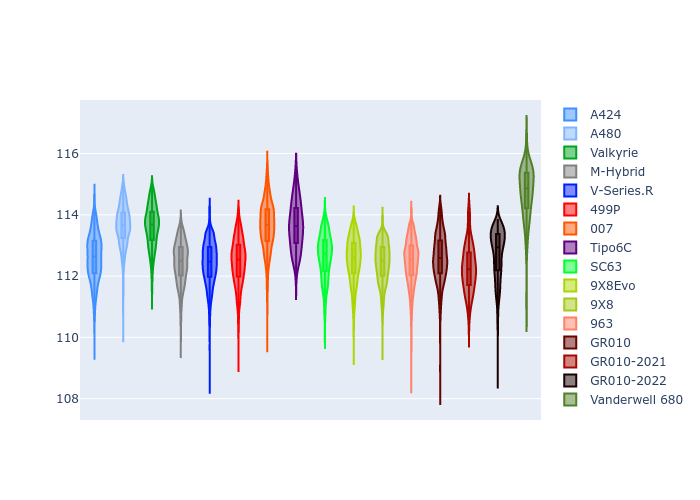
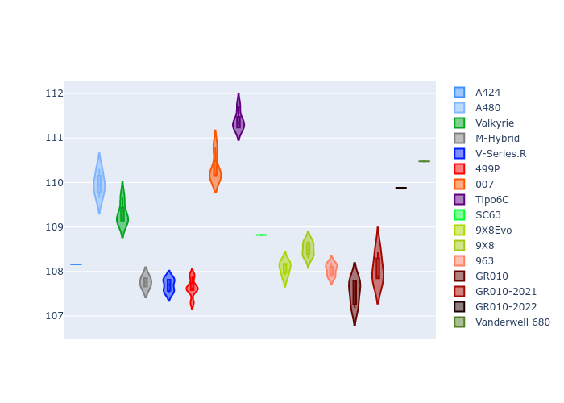
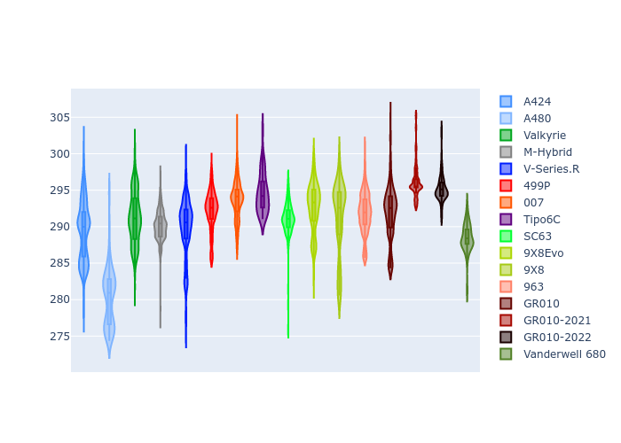
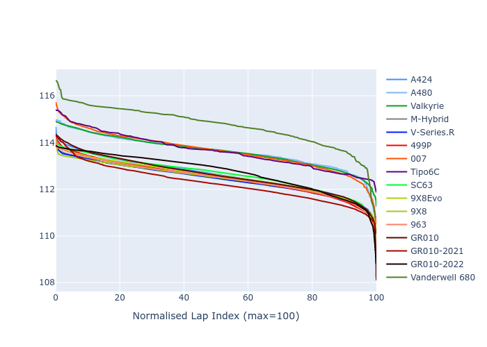

# Combined Plots

## Metadata

- BoP Accuracy: 94.95%
- Overall BoP Grade: A2
- Track: SEBRING
- Threshhold: 250.0kph
- Average Laptime: 1:52.60
- Average Quali Laptime: 1:48.60
- Laptime Std Dev: 0.65 seconds
- Filtered Average Topspeed: 291.26kph

## BoP Table
| Manufacturer     | Car            | Weight   | Power   | PINC   | E/Stint   | FDS    | RDP    | QDP    | TDP    |
|:-----------------|:---------------|:---------|:--------|:-------|:----------|:-------|:-------|:-------|:-------|
| Alpine           | A424           | 1056kg   | 511.0kw | +0.10% | 898MJ     | -      | 52.20% | 54.51% | 24.58% |
| Alpine           | A480           | 1000kg   | 420.0kw | +0.10% | 793MJ     | -      | 53.05% | 74.07% | 48.97% |
| Aston Martin     | Valkyrie       | 1030kg   | 520.0kw | -      | 911MJ     | -      | 53.39% | 54.11% | 23.71% |
| BMW              | M-Hybrid       | 1050kg   | 513.0kw | +0.10% | 908MJ     | -      | 53.47% | 52.95% | 33.73% |
| Cadillac         | V-Series.R     | 1047kg   | 519.0kw | -      | 911MJ     | -      | 49.22% | 60.31% | 18.04% |
| Ferrari          | 499P           | 1062kg   | 503.0kw | +0.10% | 898MJ     | 190kph | 51.56% | 44.72% | 9.86%  |
| Glickenhaus      | 007            | 1030kg   | 520.0kw | -      | 910MJ     | -      | 46.14% | 49.30% | 41.45% |
| Isotta Fraschini | Tipo6C         | 1030kg   | 520.0kw | -      | 914MJ     | 190kph | 43.95% | 47.22% | 31.53% |
| Lamborghini      | SC63           | 1030kg   | 520.0kw | -1.60% | 904MJ     | -      | 48.25% | 60.95% | 28.65% |
| Peugeot          | 9X8Evo         | 1052kg   | 518.0kw | -0.10% | 903MJ     | 190kph | 50.17% | 49.36% | 17.73% |
| Peugeot          | 9X8            | 1046kg   | 524.0kw | -      | 914MJ     | 150kph | 54.54% | 58.39% | 9.69%  |
| Porsche          | 963            | 1056kg   | 511.0kw | +0.10% | 908MJ     | -      | 50.78% | 41.25% | 27.61% |
| Toyota           | GR010          | 1071kg   | 502.0kw | +0.10% | 901MJ     | 190kph | 51.68% | 51.25% | 14.48% |
| Toyota           | GR010-2021     | 1055kg   | 509.0kw | -0.10% | 901MJ     | 150kph | 54.04% | 54.81% | 9.72%  |
| Toyota           | GR010-2022     | 1060kg   | 503.0kw | -0.10% | 894MJ     | 190kph | 53.24% | 64.49% | 9.72%  |
| Vanwall          | Vanderwell 680 | 1030kg   | 520.0kw | -      | 908MJ     | -      | 49.68% | 60.93% | 34.43% |

## Performance Table
| Manufacturer     | Car            | RP      | QP      | Vavg      |   RDLC | BOP-Grade   | Match   |
|:-----------------|:---------------|:--------|:--------|:----------|-------:|:------------|:--------|
| Alpine           | A424           | 1:52.45 | 1:47.98 | 289.42kph |   1.04 | ~A1         | 99.96%  |
| Alpine           | A480           | 1:52.75 | 1:50.48 | 280.29kph |   1.02 | ~A1         | 96.47%  |
| Aston Martin     | Valkyrie       | 1:52.98 | 1:48.50 | 291.20kph |   1.04 | ~A1         | 100.00% |
| BMW              | M-Hybrid       | 1:52.36 | 1:47.63 | 290.19kph |   1.04 | ~A1         | 99.98%  |
| Cadillac         | V-Series.R     | 1:52.29 | 1:47.59 | 289.83kph |   1.04 | ~A1         | 99.98%  |
| Ferrari          | 499P           | 1:52.07 | 1:47.31 | 292.24kph |   1.04 | ~A1         | 99.96%  |
| Glickenhaus      | 007            | 1:53.26 | 1:49.93 | 293.65kph |   1.03 | +A2         | 90.64%  |
| Isotta Fraschini | Tipo6C         | 1:52.83 | 1:50.55 | 294.60kph |   1.02 | ~A1         | 97.76%  |
| Lamborghini      | SC63           | 1:52.80 | 1:49.03 | 291.13kph |   1.03 | ~A1         | 99.90%  |
| Peugeot          | 9X8Evo         | 1:52.44 | 1:47.92 | 292.69kph |   1.04 | ~A1         | 100.00% |
| Peugeot          | 9X8            | 1:52.46 | 1:48.43 | 291.19kph |   1.04 | ~A1         | 100.00% |
| Porsche          | 963            | 1:52.33 | 1:47.71 | 291.89kph |   1.04 | ~A1         | 99.95%  |
| Toyota           | GR010          | 1:52.18 | 1:47.31 | 291.87kph |   1.05 | ~A1         | 99.74%  |
| Toyota           | GR010-2021     | 1:51.59 | 1:47.52 | 296.18kph |   1.04 | ~A1         | 100.00% |
| Toyota           | GR010-2022     | 1:52.26 | 1:49.50 | 295.26kph |   1.03 | ~A1         | 99.33%  |
| Vanwall          | Vanderwell 680 | 1:54.62 | 1:50.28 | 288.47kph |   1.04 | +Ω1         | 35.55%  |

## Race Laptimes

## Quali Laptimes

## Topspeeds

## Laptimes Lineplot

