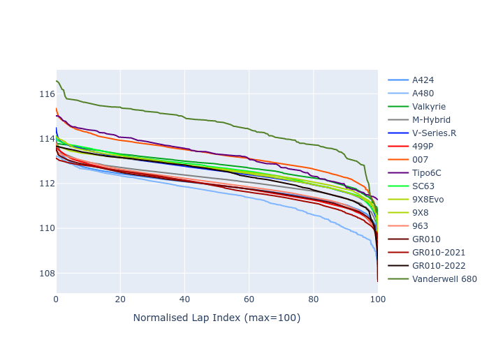

# Combined Plots

## Metadata

- BoP Accuracy: 93.50%
- Overall BoP Grade: A2
- Track: SEBRING
- Threshhold: 210.0kph

## BoP Table
| Manufacturer     | Car            | Weight   | Power   | PINC   | E/Stint   | FDS    |
|:-----------------|:---------------|:---------|:--------|:-------|:----------|:-------|
| Alpine           | A424           | 1057kg   | 520.0kw | -1.00% | 912MJ     | -      |
| Alpine           | A480           | 1052kg   | 432.0kw | +1.00% | 800MJ     | -      |
| Aston Martin     | Valkyrie       | 1052kg   | 504.0kw | +1.00% | 901MJ     | -      |
| BMW              | M-Hybrid       | 1051kg   | 512.0kw | -1.00% | 905MJ     | -      |
| Cadillac         | V-Series.R     | 1044kg   | 510.0kw | +1.00% | 905MJ     | -      |
| Ferrari          | 499P           | 1073kg   | 508.0kw | -1.00% | 902MJ     | 190kph |
| Glickenhaus      | 007            | 1040kg   | 520.0kw | -      | 911MJ     | -      |
| Isotta Fraschini | Tipo6C         | 1059kg   | 520.0kw | -      | 917MJ     | 190kph |
| Lamborghini      | SC63           | 1052kg   | 519.0kw | -1.00% | 907MJ     | -      |
| Peugeot          | 9X8Evo         | 1060kg   | 510.0kw | -1.00% | 898MJ     | 190kph |
| Peugeot          | 9X8            | 1040kg   | 520.0kw | -      | 910MJ     | 150kph |
| Porsche          | 963            | 1057kg   | 516.0kw | -1.00% | 910MJ     | -      |
| Toyota           | GR010          | 1090kg   | 512.0kw | -1.00% | 910MJ     | 190kph |
| Toyota           | GR010OLD       | 1075kg   | 513.0kw | +1.00% | 963MJ     | 150kph |
| Vanwall          | Vanderwell 680 | 1030kg   | 520.0kw | -      | 908MJ     | -      |

## Performance Table
| Manufacturer     | Car            | RP      | QP      | Vavg      |   RDLC | BOP-Grade   | Match   |
|:-----------------|:---------------|:--------|:--------|:----------|-------:|:------------|:--------|
| Alpine           | A424           | 1:51.25 | 1:47.07 | 288.98kph |   1.04 | ~A1         | 99.77%  |
| Alpine           | A480           | 1:50.96 | 1:47.90 | 280.67kph |   1.03 | ~A1         | 98.77%  |
| Aston Martin     | Valkyrie       | 1:52.49 | 1:47.46 | 286.70kph |   1.05 | ~A1         | 98.90%  |
| BMW              | M-Hybrid       | 1:51.44 | 1:46.89 | 286.92kph |   1.04 | ~A1         | 99.49%  |
| Cadillac         | V-Series.R     | 1:51.53 | 1:47.07 | 285.45kph |   1.04 | ~A1         | 99.85%  |
| Ferrari          | 499P           | 1:51.41 | 1:46.79 | 287.47kph |   1.04 | ~A1         | 99.46%  |
| Glickenhaus      | 007            | 1:52.21 | 1:48.78 | 286.56kph |   1.03 | +A2         | 94.41%  |
| Isotta Fraschini | Tipo6C         | 1:53.16 | 1:50.74 | 287.36kph |   1.02 | +B2         | 80.60%  |
| Lamborghini      | SC63           | 1:52.52 | 1:48.80 | 287.14kph |   1.03 | ~A1         | 96.38%  |
| Peugeot          | 9X8Evo         | 1:52.00 | 1:47.44 | 288.46kph |   1.04 | ~A1         | 98.37%  |
| Peugeot          | 9X8            | 1:51.91 | 1:47.74 | 282.92kph |   1.04 | ~A1         | 99.96%  |
| Porsche          | 963            | 1:51.44 | 1:46.97 | 287.31kph |   1.04 | ~A1         | 99.82%  |
| Toyota           | GR010          | 1:51.86 | 1:47.09 | 287.15kph |   1.04 | ~A1         | 99.97%  |
| Toyota           | GR010OLD       | 1:50.72 | 1:47.34 | 284.80kph |   1.03 | ~A1         | 96.14%  |
| Vanwall          | Vanderwell 680 | 1:54.01 | 1:49.08 | 281.90kph |   1.05 | +Ω1         | 40.62%  |

## Race Laptimes

## Quali Laptimes

## Topspeeds

## Laptimes Lineplot

