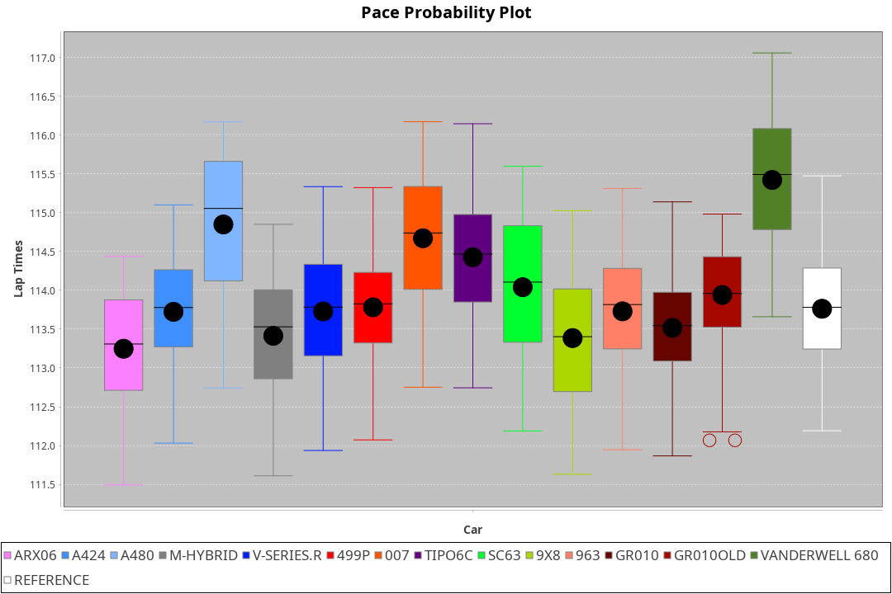
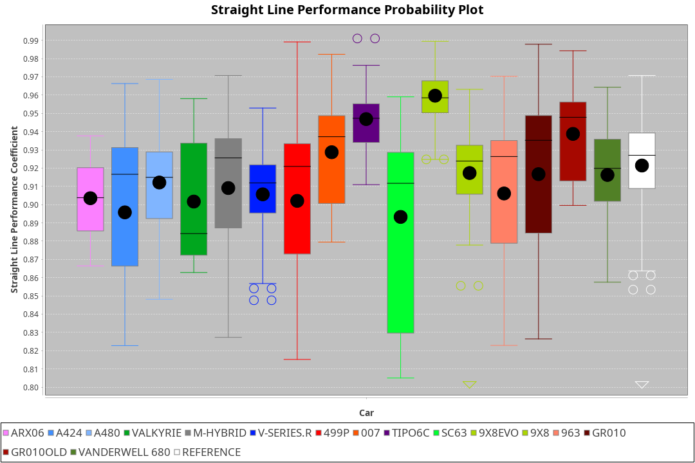
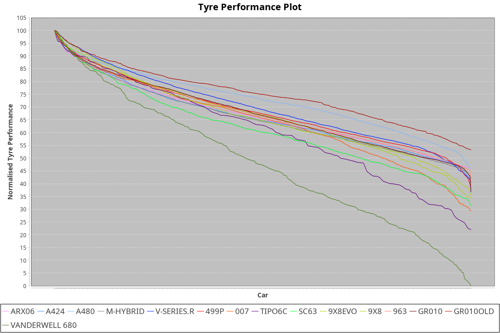

| Manufacturer     | Car            | Weight | Power | PINC    | E/Stint | FDS     |
|:-|:-|:-|:-|:-|:-|:-|
| Acura            | ARX06          | 1079kg | 508kw | 1%      | 911MJ   |    -    |
| Alpine           | A424           | 1039kg | 513kw |    -    | 908MJ   |    -    |
| Alpine           | A480           | 952kg  | 429kw | 1%      | 766MJ   |    -    |
| BMW              | M-Hybrid       | 1041kg | 512kw |    -    | 905MJ   |    -    |
| Cadillac         | V-Series.R     | 1044kg | 507kw | 1%      | 898MJ   |    -    |
| Ferrari          | 499P           | 1073kg | 505kw | -1%     | 895MJ   | 190kph  |
| Glickenhaus      | 007            | 1030kg | 520kw |    -    | 910MJ   |    -    |
| Isotta Fraschini | Tipo6C         | 1049kg | 520kw |    -    | 916MJ   | 190kph  |
| Lamborghini      | SC63           | 1032kg | 520kw |    -    | 910MJ   |    -    |
| Peugeot          | 9X8            | 1030kg | 520kw |    -    | 904MJ   | 150kph  |
| Peugeot          | 9X8Evo         | 1050kg | 507kw | -1%     | 900MJ   | 190kph  |
| Porsche          | 963            | 1054kg | 513kw | -1%     | 898MJ   |    -    |
| Toyota           | GR010          | 1090kg | 509kw | 1%      | 905MJ   | 190kph  |
| Toyota           | GR010OLD       | 1075kg | 510kw | 1%      | 906MJ   | 190kph  |
| Vanwall          | Vanderwell 680 | 1030kg | 520kw |    -    | 903MJ   |    -    |

### BoP Accuracy: 80.68%; Overall BoP Grade: B2
| Manufacturer     | Car            | Type  | RP      | QP      | Weight | Power¹ | Threshhold | PINC    | Power² | E/Stint | AVG Vmax  | FDS     | RDLC | L/Stint | BOP-Grade | Model Accuracy | Model Points | Match%  | SimDiff |
|:-|:-|:-|:-|:-|:-|:-|:-|:-|:-|:-|:-|:-|:-|:-|:-|:-|:-|:-|:-|
| Acura            | ARX06          | LMDH  | 1:51.75 | 1:46.61 | 1079kg | 508kw  | 210.0kph   | 1%      | 513kw  |  911MJ  | 278.56kph |    -    | 0.99 | 29      | +D1       | 100.00%        | 995          | 68.77%  | ±0.06s  |
| Alpine           | A424           | LMDH  | 1:51.75 | 1:47.32 | 1039kg | 513kw  | 210.0kph   |    -    | 513kw  |  908MJ  | 292.63kph |    -    | 1.02 | 29      | ~A1       | 86.43%         | 618          | 95.56%  | #       |
| Alpine           | A480           | LMP1  | 1:51.51 | 1:47.75 |  952kg | 429kw  | 210.0kph   | 1%      | 433kw  |  766MJ  | 279.80kph |    -    | 0.98 | 27      | -A2       | 68.63%         | 967          | 94.32%  | ±1.19s  |
| BMW              | M-Hybrid       | LMDH  | 1:51.75 | 1:46.84 | 1041kg | 512kw  | 210.0kph   |    -    | 512kw  |  905MJ  | 289.53kph |    -    | 1.02 | 29      | +B1       | 93.77%         | 1672         | 89.96%  | ±0.40s  |
| Cadillac         | V-Series.R     | LMDH  | 1:51.71 | 1:47.27 | 1044kg | 507kw  | 210.0kph   | 1%      | 512kw  |  898MJ  | 286.19kph |    -    | 1.02 | 29      | ~A1       | 83.12%         | 1921         | 96.59%  | ±0.06s  |
| Ferrari          | 499P           | LMHHU | 1:51.51 | 1:46.92 | 1073kg | 505kw  | 210.0kph   | -1%     | 500kw  |  895MJ  | 287.14kph | 190kph  | 1.01 | 29      | -A2       | 69.49%         | 1950         | 93.79%  | ±2.33s  |
| Glickenhaus      | 007            | LMHNH | 1:52.02 | 1:48.39 | 1030kg | 520kw  | 210.0kph   |    -    | 520kw  |  910MJ  | 288.76kph |    -    | 0.96 | 29      | ~A1       | 89.50%         | 1518         | 100.00% | ±0.89s  |
| Isotta Fraschini | Tipo6C         | LMHHU | 1:52.24 | 1:49.38 | 1049kg | 520kw  | 210.0kph   |    -    | 520kw  |  916MJ  | 288.42kph | 190kph  | 1.05 | 29      | +D2       | 73.56%         | 64           | 64.30%  | #       |
| Lamborghini      | SC63           | LMDH  | 1:51.85 | 1:49.14 | 1032kg | 520kw  | 210.0kph   |    -    | 520kw  |  910MJ  | 291.13kph |    -    | 1.05 | 29      | +A2       | 95.82%         | 459          | 93.80%  | ±0.15s  |
| Peugeot          | 9X8            | LMHHE | 1:52.18 | 1:47.81 | 1030kg | 520kw  | 210.0kph   |    -    | 520kw  |  904MJ  | 287.80kph | 150kph  | 1.04 | 29      | ~A1       | 88.75%         | 2383         | 100.00% | ±1.10s  |
| Peugeot          | 9X8Evo         | LMHHU | 1:51.77 | 1:47.21 | 1050kg | 507kw  | 210.0kph   | -1%     | 502kw  |  900MJ  | 288.27kph | 190kph  | 1.01 | 29      | ~A1       | 66.97%         | 221          | 100.00% | #       |
| Porsche          | 963            | LMDH  | 1:51.74 | 1:47.07 | 1054kg | 513kw  | 210.0kph   | -1%     | 508kw  |  898MJ  | 287.80kph |    -    | 1.00 | 29      | ~A1       | 81.02%         | 5243         | 99.57%  | ±0.06s  |
| Toyota           | GR010          | LMHHU | 1:51.23 | 1:46.82 | 1090kg | 509kw  | 210.0kph   | 1%      | 514kw  |  905MJ  | 286.57kph | 190kph  | 1.00 | 29      | -C1       | 73.70%         | 2701         | 75.25%  | ±1.90s  |
| Toyota           | GR010OLD       | LMHHE | 1:51.58 | 1:46.74 | 1075kg | 510kw  | 210.0kph   | 1%      | 515kw  |  906MJ  | 285.07kph | 190kph  | 1.02 | 29      | -B2       | 99.03%         | 1536         | 82.12%  | #       |
| Vanwall          | Vanderwell 680 | LMHNH | 1:55.35 | 1:49.82 | 1030kg | 520kw  | 210.0kph   |    -    | 520kw  |  903MJ  | 281.86kph |    -    | 1.01 | 29      | +Ω2       | 97.01%         | 649          | -43.88% | ±0.44s  |

## Power below Threshhold
| N/Nmax    | ARX06   | A424    | M-HYBRID | V-SERIES.R | 499P    | 007     | TIPO6C  | SC63    | 9X8     | 9X8EVO  | 963     | GR010   | GR010OLD | VANDERWELL 680 | ​     | RPM      | A480    |
|:-|:-|:-|:-|:-|:-|:-|:-|:-|:-|:-|:-|:-|:-|:-|:-|:-|:-|
|  0.550    |  250    |  253    |  252     |  250       |  249    |  256    |  256    |  256    |  256    |  250    |  253    |  251    |  251     |  256           |  ​    |   --     |   -     |
|  0.575    |  273    |  276    |  275     |  273       |  272    |  279    |  279    |  279    |  279    |  273    |  276    |  274    |  274     |  279           |  ​    |   --     |   -     |
|  0.600    |  293    |  296    |  296     |  293       |  292    |  300    |  300    |  300    |  300    |  293    |  296    |  294    |  295     |  300           |  ​    |   --     |   -     |
|  0.625    |  314    |  317    |  317     |  314       |  312    |  322    |  322    |  322    |  322    |  314    |  317    |  315    |  316     |  322           |  ​    |   --     |   -     |
|  0.650    |  335    |  338    |  338     |  335       |  333    |  343    |  343    |  343    |  343    |  335    |  338    |  336    |  337     |  343           |  ​    |   --     |   -     |
|  0.675    |  357    |  360    |  359     |  356       |  355    |  365    |  365    |  365    |  365    |  356    |  360    |  357    |  358     |  365           |  ​    |   --     |   -     |
|  0.700    |  378    |  382    |  381     |  377       |  376    |  387    |  387    |  387    |  387    |  377    |  382    |  379    |  380     |  387           |  ​    |   --     |   -     |
|  0.725    |  399    |  403    |  403     |  399       |  397    |  409    |  409    |  409    |  409    |  399    |  403    |  400    |  401     |  409           |  ​    |   --     |   -     |
|  0.750    |  420    |  424    |  423     |  419       |  417    |  430    |  430    |  430    |  430    |  419    |  424    |  421    |  422     |  430           |  ​    |   --     |   -     |
|  0.775    |  439    |  443    |  442     |  438       |  436    |  449    |  449    |  449    |  449    |  438    |  443    |  440    |  441     |  449           |  ​    |  5000    |  253    |
|  0.800    |  456    |  461    |  460     |  455       |  454    |  467    |  467    |  467    |  467    |  455    |  461    |  457    |  458     |  467           |  ​    |  5500    |  299    |
|  0.825    |  471    |  476    |  475     |  470       |  469    |  482    |  482    |  482    |  482    |  470    |  476    |  472    |  473     |  482           |  ​    |  6000    |  334    |
|  0.850    |  483    |  487    |  486     |  482       |  480    |  494    |  494    |  494    |  494    |  482    |  487    |  484    |  485     |  494           |  ​    |  6500    |  377    |
|  0.875    |  493    |  498    |  497     |  492       |  490    |  505    |  505    |  505    |  505    |  492    |  498    |  494    |  495     |  505           |  ​    |  7000    |  421    |
|  0.900    |  500    |  505    |  504     |  499       |  497    |  512    |  512    |  512    |  512    |  499    |  505    |  501    |  502     |  512           |  ​    |  7500    |  432    |
|  0.925    |  505    |  510    |  509     |  504       |  502    |  517    |  517    |  517    |  517    |  504    |  510    |  506    |  507     |  517           |  ​    |  8000    |  428    |
| **0.950** | **508** | **513** | **512**  | **507**    | **505** | **520** | **520** | **520** | **520** | **507** | **513** | **509** | **510**  | **520**        | **​** | **8500** | **431** |
|  0.975    |  506    |  511    |  510     |  505       |  503    |  518    |  518    |  518    |  518    |  505    |  511    |  507    |  508     |  518           |  ​    |  9000    |  216    |
|  1.000    |  503    |  507    |  506     |  502       |  500    |  514    |  514    |  514    |  514    |  502    |  507    |  504    |  505     |  514           |  ​    |   --     |   -     |
|  1.025    |  434    |  438    |  437     |  433       |  431    |  444    |  444    |  444    |  444    |  433    |  438    |  435    |  436     |  444           |  ​    |   --     |   -     |

## Power above Threshhold
| N/Nmax    | ARX06   | A424    | M-HYBRID | V-SERIES.R | 499P    | 007     | TIPO6C  | SC63    | 9X8     | 9X8EVO  | 963     | GR010   | GR010OLD | VANDERWELL 680 | ​     | RPM      | A480    |
|:-|:-|:-|:-|:-|:-|:-|:-|:-|:-|:-|:-|:-|:-|:-|:-|:-|:-|
|  0.550    |  253    |  253    |  252     |  252       |  246    |  256    |  256    |  256    |  256    |  247    |  250    |  253    |  254     |  256           |  ​    |   --     |   -     |
|  0.575    |  276    |  276    |  275     |  275       |  269    |  279    |  279    |  279    |  279    |  270    |  273    |  276    |  277     |  279           |  ​    |   --     |   -     |
|  0.600    |  296    |  296    |  296     |  296       |  289    |  300    |  300    |  300    |  300    |  290    |  293    |  297    |  297     |  300           |  ​    |   --     |   -     |
|  0.625    |  317    |  317    |  317     |  317       |  309    |  322    |  322    |  322    |  322    |  310    |  314    |  318    |  319     |  322           |  ​    |   --     |   -     |
|  0.650    |  338    |  338    |  338     |  338       |  330    |  343    |  343    |  343    |  343    |  331    |  335    |  339    |  340     |  343           |  ​    |   --     |   -     |
|  0.675    |  360    |  360    |  359     |  359       |  351    |  365    |  365    |  365    |  365    |  352    |  357    |  361    |  362     |  365           |  ​    |   --     |   -     |
|  0.700    |  382    |  382    |  381     |  381       |  372    |  387    |  387    |  387    |  387    |  374    |  378    |  383    |  383     |  387           |  ​    |   --     |   -     |
|  0.725    |  403    |  403    |  403     |  403       |  393    |  409    |  409    |  409    |  409    |  395    |  399    |  404    |  405     |  409           |  ​    |   --     |   -     |
|  0.750    |  424    |  424    |  423     |  423       |  413    |  430    |  430    |  430    |  430    |  415    |  420    |  425    |  426     |  430           |  ​    |   --     |   -     |
|  0.775    |  443    |  443    |  442     |  442       |  432    |  449    |  449    |  449    |  449    |  434    |  439    |  444    |  445     |  449           |  ​    |  5000    |  253    |
|  0.800    |  461    |  461    |  460     |  460       |  449    |  467    |  467    |  467    |  467    |  451    |  456    |  462    |  463     |  467           |  ​    |  5500    |  299    |
|  0.825    |  476    |  476    |  475     |  475       |  464    |  482    |  482    |  482    |  482    |  466    |  471    |  477    |  478     |  482           |  ​    |  6000    |  334    |
|  0.850    |  487    |  487    |  486     |  486       |  475    |  494    |  494    |  494    |  494    |  477    |  483    |  488    |  489     |  494           |  ​    |  6500    |  377    |
|  0.875    |  498    |  498    |  497     |  497       |  485    |  505    |  505    |  505    |  505    |  487    |  493    |  499    |  500     |  505           |  ​    |  7000    |  421    |
|  0.900    |  505    |  505    |  504     |  504       |  492    |  512    |  512    |  512    |  512    |  494    |  500    |  506    |  507     |  512           |  ​    |  7500    |  432    |
|  0.925    |  510    |  510    |  509     |  509       |  497    |  517    |  517    |  517    |  517    |  499    |  505    |  511    |  512     |  517           |  ​    |  8000    |  428    |
| **0.950** | **513** | **513** | **512**  | **512**    | **500** | **520** | **520** | **520** | **520** | **502** | **508** | **514** | **515**  | **520**        | **​** | **8500** | **431** |
|  0.975    |  511    |  511    |  510     |  510       |  498    |  518    |  518    |  518    |  518    |  500    |  506    |  512    |  513     |  518           |  ​    |  9000    |  216    |
|  1.000    |  507    |  507    |  506     |  506       |  495    |  514    |  514    |  514    |  514    |  497    |  503    |  508    |  509     |  514           |  ​    |   --     |   -     |
|  1.025    |  438    |  438    |  437     |  437       |  427    |  444    |  444    |  444    |  444    |  429    |  434    |  439    |  440     |  444           |  ​    |   --     |   -     |
