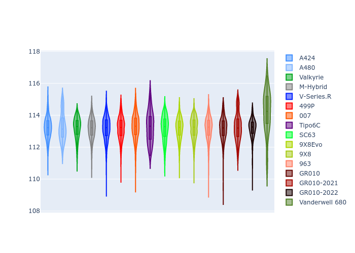
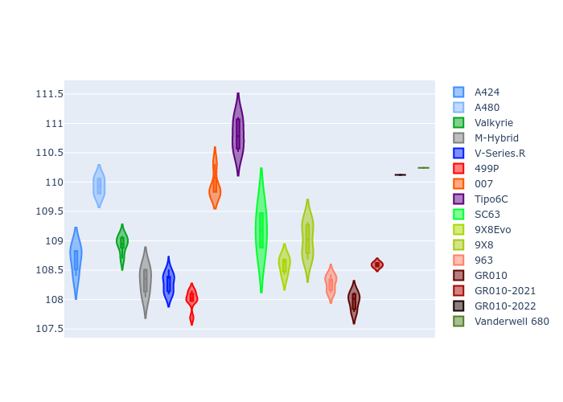
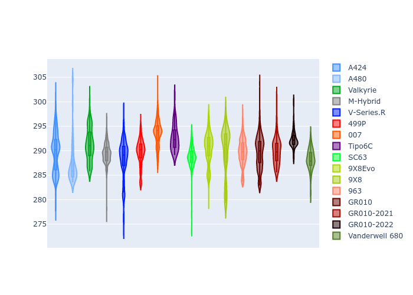
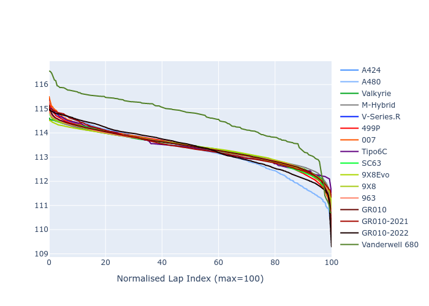

# Combined Plots

## Metadata

- BoP Accuracy: 97.54%
- Overall BoP Grade: A1
- Track: SEBRING
- Threshhold: 250.0kph
- Average Laptime: 1:53.47
- Average Quali Laptime: 1:49.42
- Laptime Std Dev: 0.30 seconds
- Filtered Average Topspeed: 286.83kph

## BoP Table
| Manufacturer     | Car            | Weight   | Power   | PINC   | E/Stint   | FDS    | RDP    | QDP    | TDP    |
|:-----------------|:---------------|:---------|:--------|:-------|:----------|:-------|:-------|:-------|:-------|
| Alpine           | A424           | 1071kg   | 485.0kw | +3.80% | 884MJ     | -      | 52.20% | 54.51% | 24.58% |
| Alpine           | A480           | 1000kg   | 410.0kw | +0.10% | 783MJ     | -      | 53.05% | 74.07% | 48.97% |
| Aston Martin     | Valkyrie       | 1058kg   | 520.0kw | -      | 914MJ     | -      | 53.39% | 54.11% | 23.71% |
| BMW              | M-Hybrid       | 1066kg   | 484.0kw | +4.40% | 893MJ     | -      | 53.47% | 52.95% | 33.73% |
| Cadillac         | V-Series.R     | 1074kg   | 487.0kw | +6.30% | 900MJ     | -      | 49.22% | 60.31% | 18.04% |
| Ferrari          | 499P           | 1095kg   | 481.0kw | +1.00% | 884MJ     | 200kph | 51.56% | 44.72% | 9.86%  |
| Glickenhaus      | 007            | 1039kg   | 520.0kw | -      | 911MJ     | -      | 46.14% | 49.30% | 41.45% |
| Isotta Fraschini | Tipo6C         | 1070kg   | 520.0kw | -      | 918MJ     | 190kph | 43.95% | 47.22% | 31.53% |
| Lamborghini      | SC63           | 1077kg   | 520.0kw | -1.00% | 911MJ     | -      | 48.25% | 60.95% | 28.65% |
| Peugeot          | 9X8Evo         | 1030kg   | 497.0kw | -3.00% | 875MJ     | 190kph | 50.17% | 49.36% | 17.73% |
| Peugeot          | 9X8            | 1052kg   | 506.0kw | -0.50% | 898MJ     | 200kph | 54.54% | 58.39% | 9.69%  |
| Porsche          | 963            | 1051kg   | 488.0kw | -0.80% | 885MJ     | -      | 50.78% | 41.25% | 27.61% |
| Toyota           | GR010          | 1088kg   | 480.0kw | +0.20% | 883MJ     | 200kph | 51.68% | 51.25% | 14.48% |
| Toyota           | GR010-2021     | 1094kg   | 480.0kw | -      | 879MJ     | 150kph | 54.04% | 54.81% | 9.72%  |
| Toyota           | GR010-2022     | 1074kg   | 484.0kw | -0.80% | 877MJ     | 200kph | 53.24% | 64.49% | 9.72%  |
| Vanwall          | Vanderwell 680 | 1030kg   | 520.0kw | -      | 908MJ     | -      | 49.68% | 60.93% | 34.43% |

## Performance Table
| Manufacturer     | Car            | RP      | QP      | Vavg      |   RDLC | BOP-Grade   | Match   |
|:-----------------|:---------------|:--------|:--------|:----------|-------:|:------------|:--------|
| Alpine           | A424           | 1:53.41 | 1:48.88 | 285.38kph |   1.04 | ~A1         | 99.94%  |
| Alpine           | A480           | 1:53.25 | 1:50.97 | 277.85kph |   1.02 | ~A1         | 99.60%  |
| Aston Martin     | Valkyrie       | 1:53.40 | 1:48.89 | 288.38kph |   1.04 | ~A1         | 100.00% |
| BMW              | M-Hybrid       | 1:53.41 | 1:48.61 | 285.87kph |   1.04 | ~A1         | 100.00% |
| Cadillac         | V-Series.R     | 1:53.40 | 1:48.62 | 285.39kph |   1.04 | ~A1         | 99.86%  |
| Ferrari          | 499P           | 1:53.40 | 1:48.55 | 285.07kph |   1.04 | ~A1         | 99.82%  |
| Glickenhaus      | 007            | 1:53.40 | 1:50.07 | 292.72kph |   1.03 | ~A1         | 99.08%  |
| Isotta Fraschini | Tipo6C         | 1:53.41 | 1:51.11 | 290.56kph |   1.02 | ~A1         | 100.00% |
| Lamborghini      | SC63           | 1:53.40 | 1:49.59 | 286.94kph |   1.03 | ~A1         | 100.00% |
| Peugeot          | 9X8Evo         | 1:53.41 | 1:48.82 | 288.23kph |   1.04 | ~A1         | 100.00% |
| Peugeot          | 9X8            | 1:53.40 | 1:49.32 | 286.54kph |   1.04 | ~A1         | 100.00% |
| Porsche          | 963            | 1:53.40 | 1:48.70 | 286.84kph |   1.04 | ~A1         | 99.92%  |
| Toyota           | GR010          | 1:53.40 | 1:48.43 | 285.62kph |   1.05 | ~A1         | 99.85%  |
| Toyota           | GR010-2021     | 1:53.41 | 1:49.23 | 286.24kph |   1.04 | ~A1         | 100.00% |
| Toyota           | GR010-2022     | 1:53.40 | 1:50.60 | 289.23kph |   1.03 | ~A1         | 99.48%  |
| Vanwall          | Vanderwell 680 | 1:54.62 | 1:50.28 | 288.47kph |   1.04 | +D2         | 63.03%  |

## Race Laptimes

## Quali Laptimes

## Topspeeds

## Laptimes Lineplot

