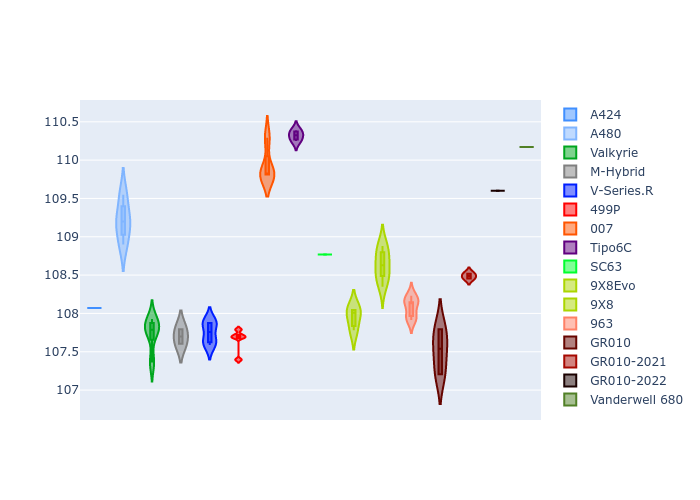
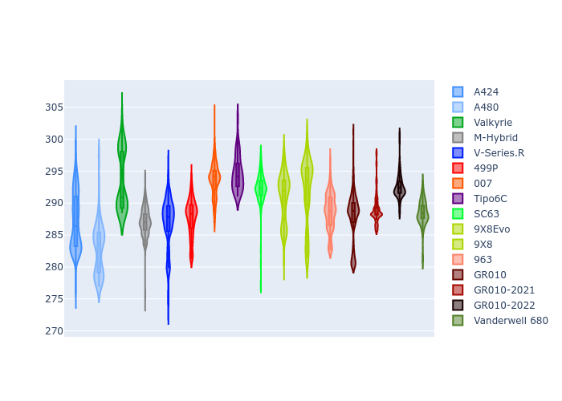
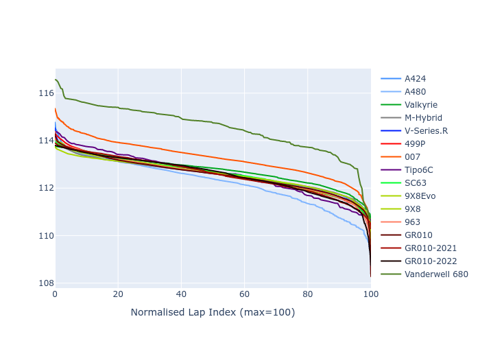

# Combined Plots

## Metadata

- BoP Accuracy: 97.17%
- Overall BoP Grade: A1
- Track: SEBRING
- Threshhold: 250.0kph

## BoP Table
| Manufacturer     | Car            | Weight   | Power   | PINC   | E/Stint   | FDS    | RDP    | QDP    | TDP    |
|:-----------------|:---------------|:---------|:--------|:-------|:----------|:-------|:-------|:-------|:-------|
| Alpine           | A424           | 1064kg   | 480.0kw | +0.10% | 879MJ     | -      | 52.35% | 61.85% | 27.84% |
| Alpine           | A480           | 952kg    | 410.0kw | -      | 778MJ     | -      | 54.51% | 76.19% | 54.04% |
| Aston Martin     | Valkyrie       | 1039kg   | 487.0kw | -1.40% | 880MJ     | -      | 53.59% | 53.33% | 21.51% |
| BMW              | M-Hybrid       | 1068kg   | 480.0kw | +1.40% | 883MJ     | -      | 53.26% | 57.23% | 34.54% |
| Cadillac         | V-Series.R     | 1091kg   | 485.0kw | +5.30% | 897MJ     | -      | 47.80% | 56.73% | 19.63% |
| Ferrari          | 499P           | 1099kg   | 480.0kw | -      | 881MJ     | 190kph | 53.02% | 42.32% | 9.88%  |
| Glickenhaus      | 007            | 1047kg   | 481.0kw | +5.30% | 888MJ     | -      | 46.49% | 46.07% | 47.78% |
| Isotta Fraschini | Tipo6C         | 1077kg   | 520.0kw | -2.80% | 913MJ     | 190kph | 43.95% | 47.22% | 31.53% |
| Lamborghini      | SC63           | 1072kg   | 512.0kw | -3.20% | 898MJ     | -      | 46.33% | 59.50% | 29.33% |
| Peugeot          | 9X8Evo         | 1052kg   | 480.0kw | -      | 872MJ     | 190kph | 48.47% | 51.26% | 16.02% |
| Peugeot          | 9X8            | 1096kg   | 490.0kw | +6.10% | 902MJ     | 150kph | 54.07% | 57.08% | 10.80% |
| Porsche          | 963            | 1065kg   | 480.0kw | +0.50% | 882MJ     | -      | 50.87% | 45.25% | 30.77% |
| Toyota           | GR010          | 1100kg   | 480.0kw | -      | 884MJ     | 200kph | 52.43% | 57.12% | 12.82% |
| Toyota           | GR010-2021     | 1100kg   | 483.0kw | +7.60% | 898MJ     | 200kph | 54.09% | 52.67% | 26.37% |
| Toyota           | GR010-2022     | 1100kg   | 480.0kw | +1.60% | 881MJ     | 200kph | 53.48% | 69.44% | 7.86%  |
| Vanwall          | Vanderwell 680 | 1035kg   | 520.0kw | -      | 908MJ     | -      | 53.41% | 56.28% | 29.85% |

## Performance Table
| Manufacturer     | Car            | RP      | QP      | Vavg      |   RDLC | BOP-Grade   | Match   |
|:-----------------|:---------------|:--------|:--------|:----------|-------:|:------------|:--------|
| Alpine           | A424           | 1:54.12 | 1:49.59 | 280.64kph |   1.04 | ~A1         | 99.05%  |
| Alpine           | A480           | 1:51.95 | 1:48.57 | 276.35kph |   1.03 | -C2         | 71.03%  |
| Aston Martin     | Valkyrie       | 1:54.12 | 1:48.94 | 282.66kph |   1.05 | ~A1         | 100.00% |
| BMW              | M-Hybrid       | 1:54.13 | 1:49.20 | 280.37kph |   1.05 | ~A1         | 99.09%  |
| Cadillac         | V-Series.R     | 1:54.12 | 1:49.23 | 278.82kph |   1.04 | ~A1         | 99.66%  |
| Ferrari          | 499P           | 1:54.12 | 1:48.68 | 279.83kph |   1.05 | ~A1         | 99.87%  |
| Glickenhaus      | 007            | 1:54.12 | 1:50.59 | 281.80kph |   1.03 | ~A1         | 95.48%  |
| Isotta Fraschini | Tipo6C         | 1:54.13 | 1:51.78 | 283.45kph |   1.02 | ~A1         | 95.52%  |
| Lamborghini      | SC63           | 1:54.14 | 1:50.27 | 282.04kph |   1.04 | ~A1         | 99.64%  |
| Peugeot          | 9X8Evo         | 1:54.14 | 1:49.39 | 283.69kph |   1.04 | ~A1         | 98.79%  |
| Peugeot          | 9X8            | 1:54.12 | 1:49.43 | 274.75kph |   1.04 | ~A1         | 99.94%  |
| Porsche          | 963            | 1:54.13 | 1:49.27 | 280.53kph |   1.04 | ~A1         | 99.83%  |
| Toyota           | GR010          | 1:54.12 | 1:48.56 | 280.69kph |   1.05 | ~A1         | 99.71%  |
| Toyota           | GR010-2021     | 1:53.81 | 1:49.35 | 277.95kph |   1.04 | ~A1         | 100.00% |
| Toyota           | GR010-2022     | 1:53.98 | 1:50.35 | 279.78kph |   1.03 | ~A1         | 100.00% |
| Vanwall          | Vanderwell 680 | 1:54.13 | 1:49.22 | 281.41kph |   1.04 | ~A1         | 97.02%  |

## Race Laptimes

## Quali Laptimes

## Topspeeds

## Laptimes Lineplot

