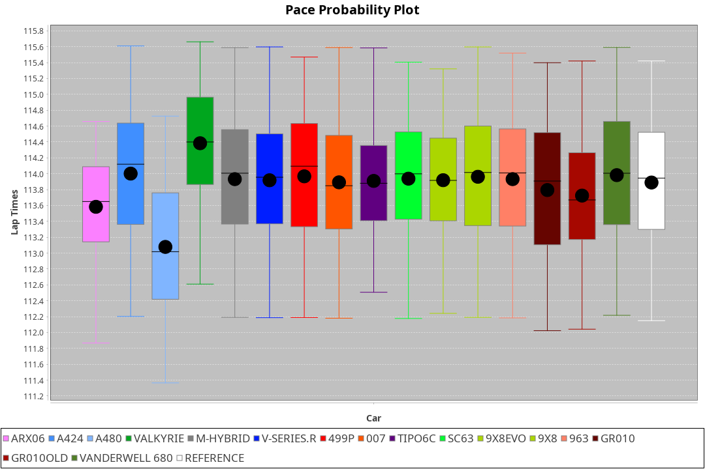
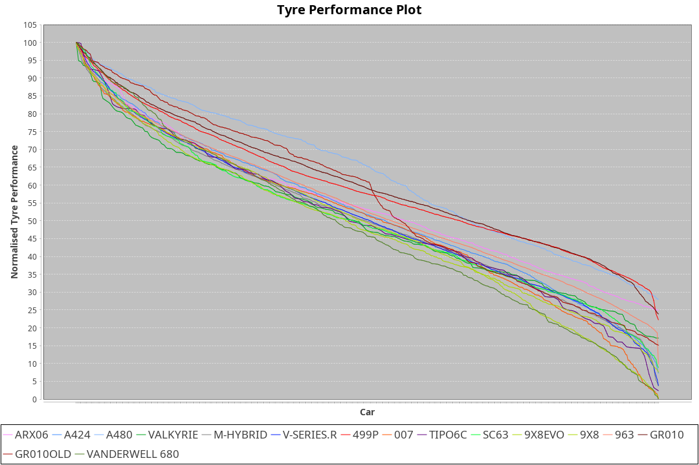

| Manufacturer     | Car            | Weight | Power   | PINC    | E/Stint | FDS     |
|:-|:-|:-|:-|:-|:-|:-|
| Acura            | ARX06          | 1100kg | 481.0kw | 8.10%   | 904MJ   |    -    |
| Alpine           | A424           | 1040kg | 488.0kw | -1.60%  | 881MJ   |    -    |
| Alpine           | A480           | 952kg  | 410.0kw | 0.10%   | 778MJ   |    -    |
| Aston Martin     | Valkyrie       | 1030kg | 520.0kw |    -    | 911MJ   |    -    |
| BMW              | M-Hybrid       | 1041kg | 489.0kw | -1.80%  | 880MJ   |    -    |
| Cadillac         | V-Series.R     | 1084kg | 485.0kw | 4.40%   | 898MJ   |    -    |
| Ferrari          | 499P           | 1080kg | 480.0kw |    -    | 879MJ   | 190kph  |
| Glickenhaus      | 007            | 1050kg | 485.0kw | 6.90%   | 895MJ   |    -    |
| Isotta Fraschini | Tipo6C         | 1090kg | 520.0kw | -1.20%  | 918MJ   | 190kph  |
| Lamborghini      | SC63           | 1082kg | 505.0kw | 1.50%   | 908MJ   |    -    |
| Peugeot          | 9X8Evo         | 1051kg | 480.0kw |    -    | 872MJ   | 190kph  |
| Peugeot          | 9X8            | 1057kg | 486.0kw | 6.80%   | 895MJ   | 150kph  |
| Porsche          | 963            | 1056kg | 487.0kw | -1.20%  | 883MJ   |    -    |
| Toyota           | GR010          | 1100kg | 480.0kw | 3.70%   | 891MJ   | 200kph  |
| Toyota           | GR010OLD       | 1100kg | 480.0kw | 5.70%   | 945MJ   | 200kph  |
| Vanwall          | Vanderwell 680 | 1030kg | 520.0kw |    -    | 908MJ   |    -    |

### BoP Accuracy: 91.63%; Overall BoP Grade: A2
| Manufacturer     | Car            | Type  | RP      | QP      | Weight | Power¹  | Threshhold | PINC    | Power²   | E/Stint | AVG Vmax  | FDS     | RDLC | L/Stint | BOP-Grade | Model Accuracy | Model Points | Match%  | SimDiff |
|:-|:-|:-|:-|:-|:-|:-|:-|:-|:-|:-|:-|:-|:-|:-|:-|:-|:-|:-|:-|
| Acura            | ARX06          | LMDH  | 1:53.56 | 1:48.53 | 1100kg | 481.0kw | 250.0kph   | 8.10%   | 520.00kw |  904MJ  | 276.18kph |    -    | 0.97 | 29      | -C1       | 100.00%        | 996          | 76.09%  | -0.68   |
| Alpine           | A424           | LMDH  | 1:53.90 | 1:49.90 | 1040kg | 488.0kw | 250.0kph   | -1.60%  | 480.20kw |  881MJ  | 286.48kph |    -    | 1.01 | 29      | ~A1       | 99.49%         | 1360         | 99.24%  | #       |
| Alpine           | A480           | LMP1  | 1:53.06 | 1:49.63 |  952kg | 410.0kw | 250.0kph   | 0.10%   | 410.40kw |  778MJ  | 275.28kph |    -    | 0.98 | 27      | -D1       | 97.75%         | 1567         | 66.47%  | +0.18   |
| Aston Martin     | Valkyrie       | LMHNH | 1:54.31 | 1:49.51 | 1030kg | 520.0kw | 0.0kph     |    -    | 520.00kw |  911MJ  | 285.98kph |    -    | 1.04 | 29      | +A2       | 100.00%        | 312          | 93.77%  | #       |
| BMW              | M-Hybrid       | LMDH  | 1:53.89 | 1:48.91 | 1041kg | 489.0kw | 250.0kph   | -1.80%  | 480.20kw |  880MJ  | 285.24kph |    -    | 1.01 | 29      | ~A1       | 98.62%         | 2363         | 100.00% | #       |
| Cadillac         | V-Series.R     | LMDH  | 1:53.89 | 1:49.30 | 1084kg | 485.0kw | 250.0kph   | 4.40%   | 506.30kw |  898MJ  | 280.61kph |    -    | 0.98 | 29      | +A2       | 98.50%         | 4201         | 91.37%  | +1.40   |
| Ferrari          | 499P           | LMHHU | 1:53.90 | 1:49.14 | 1080kg | 480.0kw | 250.0kph   |    -    | 480.00kw |  879MJ  | 282.81kph | 190kph  | 1.01 | 29      | ~A1       | 100.00%        | 4441         | 100.00% | +1.53   |
| Glickenhaus      | 007            | LMHNH | 1:53.89 | 1:50.05 | 1050kg | 485.0kw | 250.0kph   | 6.90%   | 518.50kw |  895MJ  | 282.09kph |    -    | 0.95 | 29      | +A2       | 94.07%         | 2174         | 92.90%  | +0.03   |
| Isotta Fraschini | Tipo6C         | LMHHU | 1:53.90 | 1:50.93 | 1090kg | 520.0kw | 250.0kph   | -1.20%  | 513.80kw |  918MJ  | 283.77kph | 190kph  | 1.01 | 29      | +C1       | 98.48%         | 130          | 75.86%  | #       |
| Lamborghini      | SC63           | LMDH  | 1:53.88 | 1:49.98 | 1082kg | 505.0kw | 250.0kph   | 1.50%   | 512.60kw |  908MJ  | 282.72kph |    -    | 1.00 | 29      | ~A1       | 100.00%        | 784          | 100.00% | -0.43   |
| Peugeot          | 9X8Evo         | LMHHU | 1:53.90 | 1:49.55 | 1051kg | 480.0kw | 250.0kph   |    -    | 480.00kw |  872MJ  | 285.28kph | 190kph  | 1.00 | 29      | +B1       | 100.00%        | 808          | 85.02%  | #       |
| Peugeot          | 9X8            | LMHHE | 1:53.90 | 1:49.38 | 1057kg | 486.0kw | 250.0kph   | 6.80%   | 519.00kw |  895MJ  | 282.69kph | 150kph  | 1.01 | 29      | ~A1       | 98.79%         | 5064         | 97.80%  | +0.24   |
| Porsche          | 963            | LMDH  | 1:53.89 | 1:48.88 | 1056kg | 487.0kw | 250.0kph   | -1.20%  | 481.20kw |  883MJ  | 282.78kph |    -    | 1.00 | 29      | ~A1       | 99.87%         | 12613        | 100.00% | +0.86   |
| Toyota           | GR010          | LMHHU | 1:53.72 | 1:48.78 | 1100kg | 480.0kw | 250.0kph   | 3.70%   | 497.80kw |  891MJ  | 281.35kph | 200kph  | 0.99 | 29      | ~A1       | 99.73%         | 2956         | 97.24%  | +1.14   |
| Toyota           | GR010OLD       | LMHHE | 1:53.72 | 1:50.09 | 1100kg | 480.0kw | 250.0kph   | 5.70%   | 507.40kw |  945MJ  | 280.29kph | 200kph  | 0.99 | 29      | +A2       | 94.62%         | 880          | 90.28%  | #       |
| Vanwall          | Vanderwell 680 | LMHNH | 1:53.89 | 1:48.86 | 1030kg | 520.0kw | 0.0kph     |    -    | 520.00kw |  908MJ  | 282.86kph |    -    | 1.02 | 29      | ~A1       | 99.09%         | 544          | 100.00% | +0.83   |

## Power below Threshhold
| N/Nmax    | ARX06   | A424    | VALKYRIE | M-HYBRID | V-SERIES.R | 499P    | 007     | TIPO6C  | SC63    | 9X8EVO  | 9X8     | 963     | GR010   | GR010OLD | VANDERWELL 680 | ​     | RPM      | A480       |
|:-|:-|:-|:-|:-|:-|:-|:-|:-|:-|:-|:-|:-|:-|:-|:-|:-|:-|:-|
|  0.550    |  237    |  240    |  256     |  241     |  239       |  236    |  239    |  256    |  249    |  236    |  239    |  240    |  236    |  236     |  256           |  ​    |   --     |  0.00      |
|  0.575    |  259    |  262    |  279     |  263     |  261       |  258    |  261    |  279    |  272    |  258    |  261    |  262    |  258    |  258     |  279           |  ​    |   --     |  0.00      |
|  0.600    |  278    |  282    |  300     |  282     |  280       |  277    |  280    |  300    |  292    |  277    |  281    |  281    |  277    |  277     |  300           |  ​    |   --     |  0.00      |
|  0.625    |  298    |  302    |  322     |  302     |  300       |  297    |  300    |  322    |  312    |  297    |  301    |  301    |  297    |  297     |  322           |  ​    |   --     |  0.00      |
|  0.650    |  318    |  322    |  343     |  323     |  320       |  317    |  320    |  343    |  333    |  317    |  321    |  322    |  317    |  317     |  343           |  ​    |   --     |  0.00      |
|  0.675    |  338    |  343    |  365     |  343     |  341       |  337    |  341    |  365    |  355    |  337    |  341    |  342    |  337    |  337     |  365           |  ​    |   --     |  0.00      |
|  0.700    |  359    |  364    |  387     |  364     |  362       |  358    |  362    |  387    |  376    |  358    |  362    |  363    |  358    |  358     |  387           |  ​    |   --     |  0.00      |
|  0.725    |  379    |  384    |  409     |  385     |  382       |  378    |  382    |  409    |  397    |  378    |  383    |  383    |  378    |  378     |  409           |  ​    |   --     |  0.00      |
|  0.750    |  398    |  403    |  430     |  404     |  401       |  397    |  401    |  430    |  417    |  397    |  402    |  403    |  397    |  397     |  430           |  ​    |   --     |  0.00      |
|  0.775    |  416    |  422    |  449     |  423     |  419       |  415    |  419    |  449    |  436    |  415    |  420    |  421    |  415    |  415     |  449           |  ​    |  5000    |  241.11    |
|  0.800    |  432    |  438    |  467     |  439     |  436       |  431    |  436    |  467    |  454    |  431    |  436    |  437    |  431    |  431     |  467           |  ​    |  5500    |  284.14    |
|  0.825    |  446    |  453    |  482     |  454     |  450       |  445    |  450    |  482    |  469    |  445    |  451    |  452    |  445    |  445     |  482           |  ​    |  6000    |  318.15    |
|  0.850    |  457    |  464    |  494     |  465     |  461       |  456    |  461    |  494    |  480    |  456    |  462    |  463    |  456    |  456     |  494           |  ​    |  6500    |  359.17    |
|  0.875    |  467    |  474    |  505     |  475     |  471       |  466    |  471    |  505    |  490    |  466    |  472    |  473    |  466    |  466     |  505           |  ​    |  7000    |  401.19    |
|  0.900    |  473    |  480    |  512     |  481     |  477       |  472    |  477    |  512    |  497    |  472    |  478    |  479    |  472    |  472     |  512           |  ​    |  7500    |  411.20    |
|  0.925    |  478    |  485    |  517     |  486     |  482       |  477    |  482    |  517    |  502    |  477    |  483    |  484    |  477    |  477     |  517           |  ​    |  8000    |  407.19    |
| **0.950** | **481** | **488** | **520**  | **489**  | **485**    | **480** | **485** | **520** | **505** | **480** | **486** | **487** | **480** | **480**  | **520**        | **​** | **8500** | **410.20** |
|  0.975    |  479    |  486    |  518     |  487     |  483       |  478    |  483    |  518    |  503    |  478    |  484    |  485    |  478    |  478     |  518           |  ​    |  9000    |  205.10    |
|  1.000    |  476    |  483    |  514     |  484     |  480       |  475    |  480    |  514    |  500    |  475    |  481    |  482    |  475    |  475     |  514           |  ​    |   --     |  0.00      |
|  1.025    |  411    |  417    |  444     |  418     |  414       |  410    |  414    |  444    |  431    |  410    |  415    |  416    |  410    |  410     |  444           |  ​    |   --     |  0.00      |

## Power above Threshhold
| N/Nmax    | ARX06      | A424       | VALKYRIE | M-HYBRID   | V-SERIES.R | 499P    | 007        | TIPO6C     | SC63       | 9X8EVO  | 9X8        | 963        | GR010      | GR010OLD   | VANDERWELL 680 | ​     | RPM      | A480       |
|:-|:-|:-|:-|:-|:-|:-|:-|:-|:-|:-|:-|:-|:-|:-|:-|:-|:-|:-|
|  0.550    |  256.47    |  236.09    |  256     |  236.10    |  249.17    |  236    |  255.23    |  253.37    |  252.28    |  236    |  256.02    |  237.08    |  245.37    |  250.18    |  256           |  ​    |   --     |  0.00      |
|  0.575    |  279.52    |  258.10    |  279     |  258.11    |  272.18    |  258    |  278.25    |  276.41    |  275.31    |  258    |  279.03    |  259.08    |  267.41    |  273.19    |  279           |  ​    |   --     |  0.00      |
|  0.600    |  299.55    |  277.11    |  300     |  277.11    |  292.20    |  277    |  299.27    |  296.44    |  296.33    |  277    |  299.03    |  278.09    |  287.44    |  293.21    |  300           |  ​    |   --     |  0.00      |
|  0.625    |  321.59    |  297.12    |  322     |  297.12    |  313.21    |  297    |  321.29    |  317.47    |  317.36    |  297    |  321.03    |  298.10    |  307.47    |  314.22    |  322           |  ​    |   --     |  0.00      |
|  0.650    |  342.63    |  317.13    |  343     |  317.13    |  334.22    |  317    |  342.31    |  338.50    |  338.38    |  317    |  342.03    |  318.10    |  328.50    |  335.24    |  343           |  ​    |   --     |  0.00      |
|  0.675    |  364.67    |  337.13    |  365     |  337.14    |  355.24    |  337    |  364.33    |  360.53    |  359.40    |  337    |  364.03    |  338.11    |  349.53    |  356.25    |  365           |  ​    |   --     |  0.00      |
|  0.700    |  386.71    |  358.14    |  387     |  358.15    |  377.25    |  358    |  386.35    |  382.57    |  381.43    |  358    |  386.04    |  359.12    |  370.57    |  377.27    |  387           |  ​    |   --     |  0.00      |
|  0.725    |  408.76    |  378.15    |  409     |  378.16    |  398.27    |  378    |  407.37    |  403.60    |  403.45    |  378    |  408.04    |  379.12    |  391.60    |  399.28    |  409           |  ​    |   --     |  0.00      |
|  0.750    |  429.79    |  397.16    |  430     |  397.16    |  418.28    |  397    |  428.38    |  424.63    |  423.48    |  397    |  429.04    |  398.13    |  411.63    |  419.30    |  430           |  ​    |   --     |  0.00      |
|  0.775    |  448.83    |  415.17    |  449     |  415.17    |  437.29    |  415    |  447.40    |  443.66    |  442.50    |  415    |  448.04    |  416.13    |  429.66    |  438.31    |  449           |  ​    |  5000    |  241.11    |
|  0.800    |  466.86    |  431.17    |  467     |  431.18    |  454.31    |  431    |  465.42    |  461.68    |  460.52    |  431    |  466.04    |  432.14    |  446.68    |  455.32    |  467           |  ​    |  5500    |  284.14    |
|  0.825    |  481.89    |  445.18    |  482     |  445.18    |  469.32    |  445    |  480.43    |  476.71    |  475.53    |  445    |  481.04    |  446.14    |  461.70    |  470.33    |  482           |  ​    |  6000    |  318.15    |
|  0.850    |  493.91    |  456.18    |  494     |  456.19    |  481.32    |  456    |  492.44    |  487.72    |  486.55    |  456    |  493.05    |  457.15    |  472.72    |  482.34    |  494           |  ​    |  6500    |  359.17    |
|  0.875    |  504.93    |  466.19    |  505     |  466.19    |  491.33    |  466    |  503.45    |  498.74    |  497.56    |  466    |  504.05    |  467.15    |  482.74    |  492.35    |  505           |  ​    |  7000    |  401.19    |
|  0.900    |  511.95    |  472.19    |  512     |  472.19    |  498.33    |  472    |  510.46    |  505.75    |  504.57    |  472    |  511.05    |  473.15    |  489.75    |  499.35    |  512           |  ​    |  7500    |  411.20    |
|  0.925    |  516.96    |  477.19    |  517     |  477.20    |  503.34    |  477    |  515.46    |  510.76    |  509.57    |  477    |  516.05    |  478.16    |  494.76    |  504.36    |  517           |  ​    |  8000    |  407.19    |
| **0.950** | **519.96** | **480.19** | **520**  | **480.20** | **506.34** | **480** | **518.47** | **513.76** | **512.57** | **480** | **519.05** | **481.16** | **497.76** | **507.36** | **520**        | **​** | **8500** | **410.20** |
|  0.975    |  517.96    |  478.19    |  518     |  478.20    |  504.34    |  478    |  516.46    |  511.76    |  510.57    |  478    |  517.05    |  479.16    |  495.76    |  505.36    |  518           |  ​    |  9000    |  205.10    |
|  1.000    |  513.95    |  475.19    |  514     |  475.20    |  501.34    |  475    |  512.46    |  507.75    |  506.57    |  475    |  513.05    |  476.15    |  492.75    |  502.36    |  514           |  ​    |   --     |  0.00      |
|  1.025    |  443.82    |  410.16    |  444     |  410.17    |  432.29    |  410    |  442.40    |  438.65    |  437.49    |  410    |  443.04    |  411.13    |  424.65    |  433.31    |  444           |  ​    |   --     |  0.00      |
