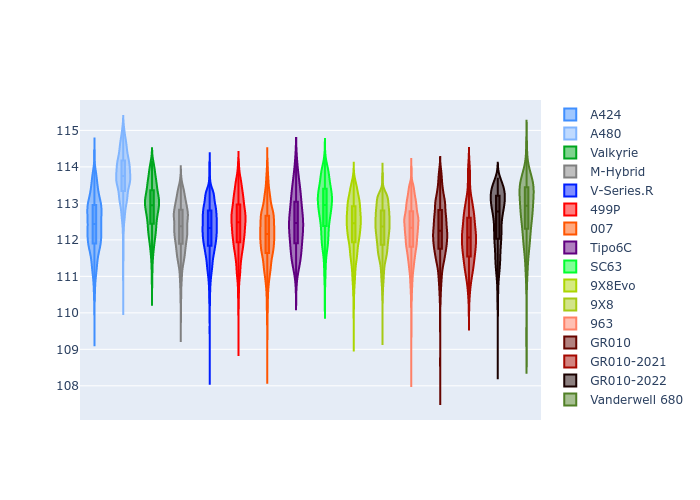
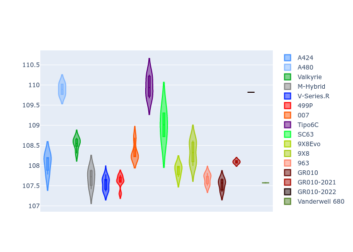
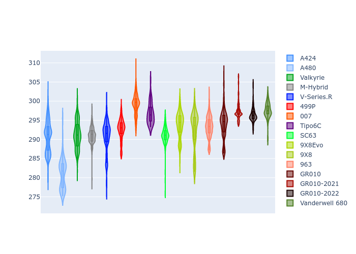
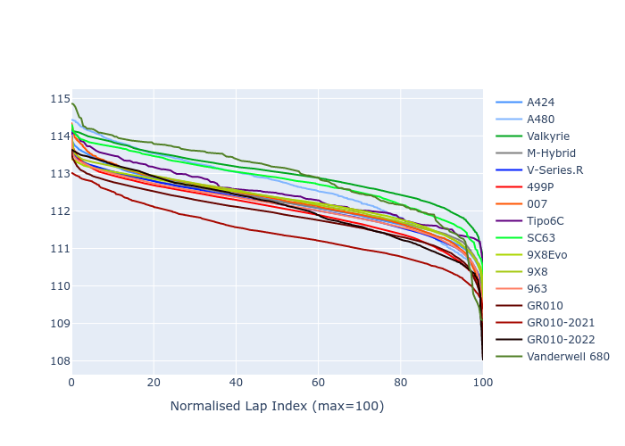

# Combined Plots

## Metadata

- BoP Accuracy: 98.05%
- Overall BoP Grade: A1
- Track: SEBRING
- Threshhold: 250.0kph
- Average Laptime: 1:52.50
- Average Quali Laptime: 1:48.45
- Laptime Std Dev: 0.40 seconds
- Filtered Average Topspeed: 293.11kph

## BoP Table
| Manufacturer     | Car            | Weight   | Power   | PINC   | E/Stint   | FDS    | RDP    | QDP    | TDP    |
|:-----------------|:---------------|:---------|:--------|:-------|:----------|:-------|:-------|:-------|:-------|
| Alpine           | A424           | 1046kg   | 511.0kw | +0.50% | 898MJ     | -      | 51.45% | 55.09% | 24.89% |
| Alpine           | A480           | 992kg    | 420.0kw | +0.10% | 792MJ     | -      | 54.77% | 76.19% | 54.04% |
| Aston Martin     | Valkyrie       | 1030kg   | 520.0kw | -      | 911MJ     | -      | 53.07% | 48.70% | 24.00% |
| BMW              | M-Hybrid       | 1040kg   | 513.0kw | -      | 906MJ     | -      | 52.63% | 52.34% | 34.06% |
| Cadillac         | V-Series.R     | 1037kg   | 519.0kw | -      | 910MJ     | -      | 48.80% | 57.26% | 18.10% |
| Ferrari          | 499P           | 1052kg   | 503.0kw | -0.60% | 895MJ     | 190kph | 51.39% | 44.34% | 9.89%  |
| Glickenhaus      | 007            | 1003kg   | 533.0kw | -      | 918MJ     | -      | 46.14% | 49.30% | 41.45% |
| Isotta Fraschini | Tipo6C         | 1015kg   | 523.0kw | -      | 915MJ     | 190kph | 43.95% | 47.22% | 31.53% |
| Lamborghini      | SC63           | 1030kg   | 520.0kw | -1.60% | 904MJ     | -      | 48.32% | 60.95% | 28.65% |
| Peugeot          | 9X8Evo         | 1042kg   | 518.0kw | -      | 902MJ     | 190kph | 49.16% | 50.25% | 18.00% |
| Peugeot          | 9X8            | 1036kg   | 524.0kw | -      | 913MJ     | 150kph | 54.54% | 58.39% | 9.69%  |
| Porsche          | 963            | 1046kg   | 511.0kw | +0.60% | 908MJ     | -      | 50.61% | 41.90% | 27.68% |
| Toyota           | GR010          | 1061kg   | 502.0kw | +1.50% | 903MJ     | 190kph | 51.33% | 51.71% | 14.89% |
| Toyota           | GR010-2021     | 1045kg   | 509.0kw | +0.10% | 900MJ     | 150kph | 54.02% | 52.67% | 26.37% |
| Toyota           | GR010-2022     | 1050kg   | 503.0kw | +0.10% | 893MJ     | 190kph | 53.24% | 64.49% | 9.72%  |
| Vanwall          | Vanderwell 680 | 980kg    | 539.0kw | -      | 919MJ     | -      | 50.86% | 59.83% | 31.84% |

## Performance Table
| Manufacturer     | Car            | RP      | QP      | Vavg      |   RDLC | BOP-Grade   | Match   |
|:-----------------|:---------------|:--------|:--------|:----------|-------:|:------------|:--------|
| Alpine           | A424           | 1:52.41 | 1:47.98 | 291.08kph |   1.04 | ~A1         | 99.90%  |
| Alpine           | A480           | 1:53.72 | 1:50.05 | 281.44kph |   1.03 | +C2         | 74.90%  |
| Aston Martin     | Valkyrie       | 1:52.89 | 1:48.61 | 292.74kph |   1.04 | ~A1         | 100.00% |
| BMW              | M-Hybrid       | 1:52.33 | 1:47.64 | 291.18kph |   1.04 | ~A1         | 100.00% |
| Cadillac         | V-Series.R     | 1:52.28 | 1:47.56 | 290.66kph |   1.04 | ~A1         | 99.92%  |
| Ferrari          | 499P           | 1:52.43 | 1:47.59 | 292.63kph |   1.04 | ~A1         | 99.96%  |
| Glickenhaus      | 007            | 1:52.11 | 1:48.88 | 299.15kph |   1.03 | ~A1         | 99.67%  |
| Isotta Fraschini | Tipo6C         | 1:52.45 | 1:50.24 | 296.79kph |   1.02 | ~A1         | 98.51%  |
| Lamborghini      | SC63           | 1:52.86 | 1:49.02 | 291.13kph |   1.04 | ~A1         | 99.52%  |
| Peugeot          | 9X8Evo         | 1:52.38 | 1:47.93 | 294.26kph |   1.04 | ~A1         | 99.95%  |
| Peugeot          | 9X8            | 1:52.30 | 1:48.36 | 292.21kph |   1.04 | ~A1         | 100.00% |
| Porsche          | 963            | 1:52.26 | 1:47.84 | 293.05kph |   1.04 | ~A1         | 99.88%  |
| Toyota           | GR010          | 1:52.26 | 1:47.22 | 293.38kph |   1.05 | ~A1         | 99.77%  |
| Toyota           | GR010-2021     | 1:52.03 | 1:47.90 | 296.20kph |   1.04 | ~A1         | 100.00% |
| Toyota           | GR010-2022     | 1:52.57 | 1:49.73 | 296.44kph |   1.03 | ~A1         | 99.55%  |
| Vanwall          | Vanderwell 680 | 1:52.80 | 1:48.68 | 297.38kph |   1.04 | ~A1         | 97.21%  |

## Race Laptimes

## Quali Laptimes

## Topspeeds

## Laptimes Lineplot

