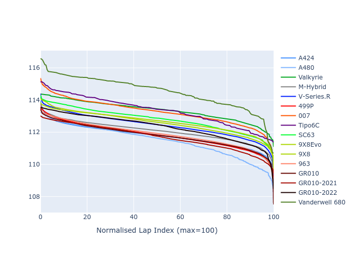

# Combined Plots

## Metadata

- BoP Accuracy: 92.81%
- Overall BoP Grade: A2
- Track: SEBRING
- Threshhold: 210.0kph
- Average Laptime: 1:52.48
- Average Quali Laptime: 1:48.37
- Average Topspeed: 291.78kph

## BoP Table
| Manufacturer     | Car            | Weight   | Power   | PINC   | E/Stint   | FDS    | RDP    | QDP    | TDP    |
|:-----------------|:---------------|:---------|:--------|:-------|:----------|:-------|:-------|:-------|:-------|
| Alpine           | A424           | 1047kg   | 520.0kw | -      | 913MJ     | -      | 51.64% | 59.31% | 26.80% |
| Alpine           | A480           | 952kg    | 432.0kw | -      | 799MJ     | -      | 53.05% | 74.07% | 48.97% |
| Aston Martin     | Valkyrie       | 1042kg   | 504.0kw | +0.40% | 899MJ     | -      | 53.50% | 53.33% | 21.51% |
| BMW              | M-Hybrid       | 1041kg   | 512.0kw | -      | 906MJ     | -      | 52.89% | 56.22% | 33.41% |
| Cadillac         | V-Series.R     | 1034kg   | 510.0kw | -      | 902MJ     | -      | 48.63% | 60.80% | 19.01% |
| Ferrari          | 499P           | 1063kg   | 508.0kw | -      | 902MJ     | 190kph | 51.38% | 44.98% | 9.83%  |
| Glickenhaus      | 007            | 1030kg   | 520.0kw | -      | 910MJ     | -      | 46.15% | 49.30% | 41.45% |
| Isotta Fraschini | Tipo6C         | 1059kg   | 520.0kw | -      | 917MJ     | 190kph | 43.95% | 47.22% | 31.53% |
| Lamborghini      | SC63           | 1042kg   | 519.0kw | -      | 908MJ     | -      | 48.33% | 60.95% | 28.65% |
| Peugeot          | 9X8Evo         | 1050kg   | 510.0kw | -      | 899MJ     | 190kph | 48.87% | 52.78% | 15.41% |
| Peugeot          | 9X8            | 1030kg   | 520.0kw | -      | 909MJ     | 150kph | 54.54% | 58.39% | 9.69%  |
| Porsche          | 963            | 1047kg   | 516.0kw | -      | 911MJ     | -      | 50.70% | 44.30% | 29.51% |
| Toyota           | GR010          | 1080kg   | 512.0kw | -      | 910MJ     | 190kph | 51.09% | 52.71% | 11.46% |
| Toyota           | GR010-2021     | 1065kg   | 513.0kw | -      | 906MJ     | 150kph | 54.08% | 54.81% | 9.72%  |
| Toyota           | GR010-2022     | 1080kg   | 512.0kw | -      | 904MJ     | 190kph | 53.45% | 68.83% | 9.58%  |
| Vanwall          | Vanderwell 680 | 1030kg   | 520.0kw | -      | 908MJ     | -      | 49.68% | 60.93% | 34.43% |

## Performance Table
| Manufacturer     | Car            | RP      | QP      | Vavg      |   RDLC | BOP-Grade   | Match   |
|:-----------------|:---------------|:--------|:--------|:----------|-------:|:------------|:--------|
| Alpine           | A424           | 1:51.75 | 1:47.32 | 292.33kph |   1.04 | ~A1         | 99.94%  |
| Alpine           | A480           | 1:51.47 | 1:48.49 | 288.18kph |   1.03 | ~A1         | 98.14%  |
| Aston Martin     | Valkyrie       | 1:53.35 | 1:48.30 | 289.34kph |   1.05 | +A2         | 91.52%  |
| BMW              | M-Hybrid       | 1:52.06 | 1:47.23 | 290.73kph |   1.05 | ~A1         | 100.00% |
| Cadillac         | V-Series.R     | 1:52.43 | 1:47.62 | 288.64kph |   1.04 | ~A1         | 99.65%  |
| Ferrari          | 499P           | 1:51.80 | 1:46.94 | 293.00kph |   1.05 | ~A1         | 99.81%  |
| Glickenhaus      | 007            | 1:53.26 | 1:49.93 | 293.65kph |   1.03 | +B1         | 87.26%  |
| Isotta Fraschini | Tipo6C         | 1:53.33 | 1:51.05 | 291.65kph |   1.02 | +C1         | 76.12%  |
| Lamborghini      | SC63           | 1:52.78 | 1:48.93 | 290.99kph |   1.04 | ~A1         | 99.62%  |
| Peugeot          | 9X8Evo         | 1:52.64 | 1:48.01 | 291.62kph |   1.04 | ~A1         | 100.00% |
| Peugeot          | 9X8            | 1:52.57 | 1:48.63 | 292.01kph |   1.04 | ~A1         | 100.00% |
| Porsche          | 963            | 1:51.87 | 1:47.43 | 293.50kph |   1.04 | ~A1         | 99.61%  |
| Toyota           | GR010          | 1:51.79 | 1:46.79 | 292.86kph |   1.05 | ~A1         | 99.66%  |
| Toyota           | GR010-2021     | 1:51.69 | 1:47.66 | 296.09kph |   1.04 | ~A1         | 100.00% |
| Toyota           | GR010-2022     | 1:52.32 | 1:49.36 | 295.39kph |   1.03 | ~A1         | 99.49%  |
| Vanwall          | Vanderwell 680 | 1:54.53 | 1:50.17 | 288.47kph |   1.04 | +Ω1         | 34.12%  |

## Race Laptimes

## Quali Laptimes

## Topspeeds

## Laptimes Lineplot

