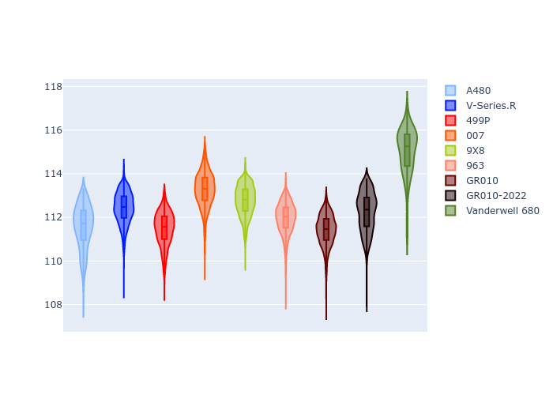
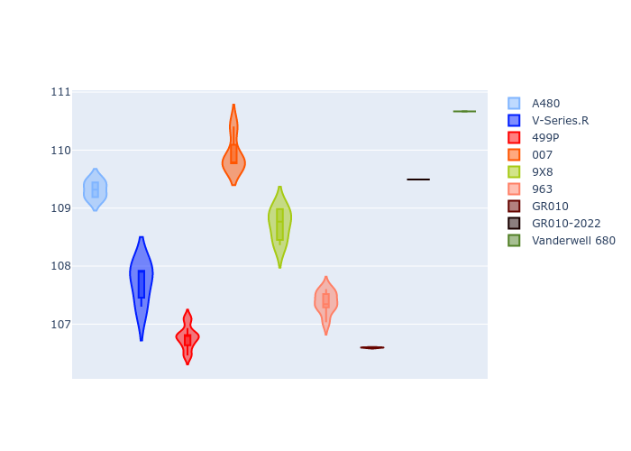
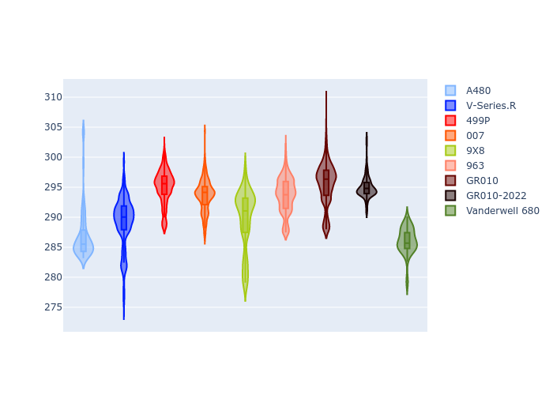
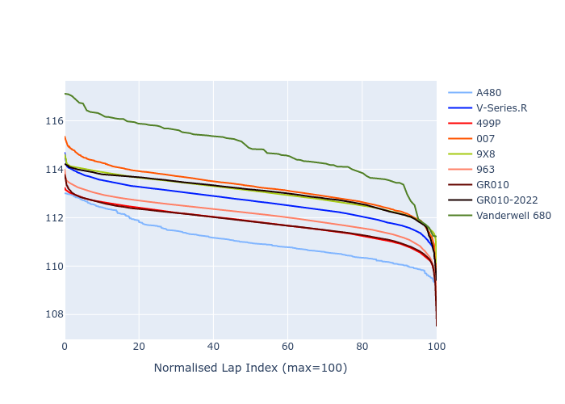

# Combined Plots

## Metadata

- BoP Accuracy: 92.35%
- Overall BoP Grade: A2
- Track: SEBRING
- Threshhold: 0.0kph
- Average Laptime: 1:52.61
- Average Quali Laptime: 1:48.58
- Laptime Std Dev: 1.02 seconds
- Filtered Average Topspeed: 291.64kph

## BoP Table
| Manufacturer   | Car            | Weight   | Power   | PINC   | E/Stint   | FDS    | RDP    | QDP    | TDP    |
|:---------------|:---------------|:---------|:--------|:-------|:----------|:-------|:-------|:-------|:-------|
| Alpine         | A480           | 952kg    | 430.0kw | -      | 797MJ     | -      | 54.81% | 80.56% | 55.69% |
| Cadillac       | V-Series.R     | 1038kg   | 513.0kw | -      | 905MJ     | -      | 48.29% | 59.47% | 18.65% |
| Ferrari        | 499P           | 1057kg   | 515.0kw | -      | 908MJ     | 190kph | 51.25% | 43.28% | 10.17% |
| Glickenhaus    | 007            | 1030kg   | 520.0kw | -      | 910MJ     | -      | 46.15% | 49.30% | 41.45% |
| Peugeot        | 9X8            | 1049kg   | 518.0kw | -      | 909MJ     | 150kph | 54.54% | 58.39% | 9.69%  |
| Porsche        | 963            | 1048kg   | 517.0kw | -      | 912MJ     | -      | 50.57% | 42.80% | 29.05% |
| Toyota         | GR010          | 1062kg   | 517.0kw | -      | 913MJ     | 190kph | 51.03% | 51.78% | 14.64% |
| Toyota         | GR010-2022     | 1070kg   | 506.0kw | -      | 898MJ     | 190kph | 53.24% | 64.49% | 9.72%  |
| Vanwall        | Vanderwell 680 | 1030kg   | 511.0kw | -      | 900MJ     | -      | 35.83% | 59.29% | 34.15% |

## Performance Table
| Manufacturer   | Car            | RP      | QP      | Vavg      |   RDLC | BOP-Grade   | Match   |
|:---------------|:---------------|:--------|:--------|:----------|-------:|:------------|:--------|
| Alpine         | A480           | 1:51.01 | 1:48.02 | 286.99kph |   1.03 | ~A1         | 100.00% |
| Cadillac       | V-Series.R     | 1:52.65 | 1:47.94 | 289.18kph |   1.04 | ~A1         | 99.70%  |
| Ferrari        | 499P           | 1:51.81 | 1:46.90 | 295.07kph |   1.05 | ~A1         | 99.93%  |
| Glickenhaus    | 007            | 1:53.26 | 1:49.95 | 293.65kph |   1.03 | +A2         | 94.06%  |
| Peugeot        | 9X8            | 1:53.06 | 1:49.06 | 289.68kph |   1.04 | ~A1         | 99.73%  |
| Porsche        | 963            | 1:52.12 | 1:47.45 | 293.67kph |   1.04 | ~A1         | 99.91%  |
| Toyota         | GR010          | 1:51.81 | 1:46.87 | 295.49kph |   1.05 | ~A1         | 99.63%  |
| Toyota         | GR010-2022     | 1:53.07 | 1:50.18 | 294.97kph |   1.03 | ~A1         | 100.00% |
| Vanwall        | Vanderwell 680 | 1:54.74 | 1:50.82 | 286.06kph |   1.04 | +Ω1         | 38.24%  |

## Race Laptimes

## Quali Laptimes

## Topspeeds

## Laptimes Lineplot

