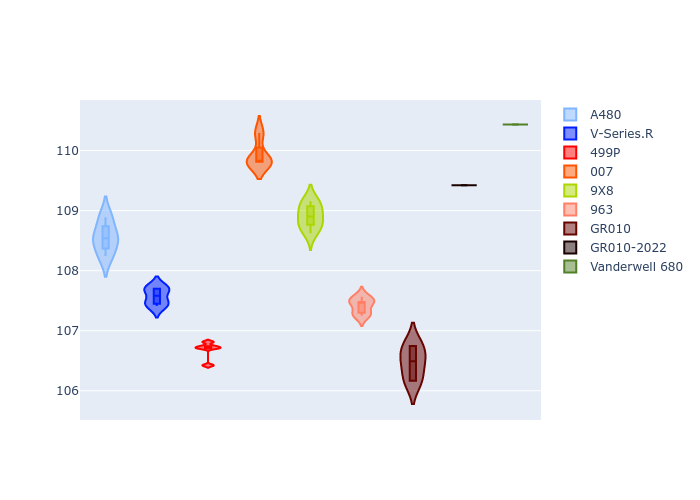
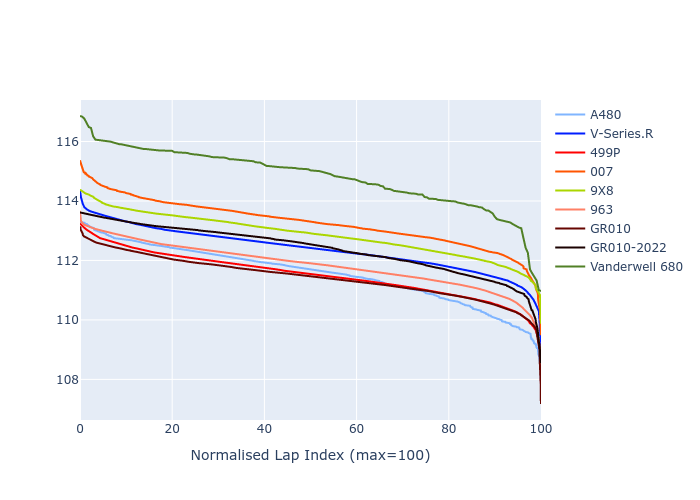

# Combined Plots

## Metadata

- BoP Accuracy: 90.14%
- Overall BoP Grade: A2
- Track: SEBRING
- Threshhold: 0.0kph
- Average Laptime: 1:52.45
- Average Quali Laptime: 1:48.38
- Average Topspeed: 291.78kph

## BoP Table
| Manufacturer   | Car            | Weight   | Power   | PINC   | E/Stint   | FDS    | RDP    | QDP    | TDP    |
|:---------------|:---------------|:---------|:--------|:-------|:----------|:-------|:-------|:-------|:-------|
| Alpine         | A480           | 952kg    | 430.0kw | -      | 797MJ     | -      | 53.05% | 74.07% | 48.97% |
| Cadillac       | V-Series.R     | 1038kg   | 513.0kw | -      | 905MJ     | -      | 48.63% | 60.80% | 19.01% |
| Ferrari        | 499P           | 1057kg   | 515.0kw | -      | 908MJ     | 190kph | 51.38% | 44.98% | 9.83%  |
| Glickenhaus    | 007            | 1030kg   | 520.0kw | -      | 910MJ     | -      | 46.15% | 49.30% | 41.45% |
| Peugeot        | 9X8            | 1049kg   | 518.0kw | -      | 909MJ     | 150kph | 54.54% | 58.39% | 9.69%  |
| Porsche        | 963            | 1048kg   | 517.0kw | -      | 912MJ     | -      | 50.70% | 44.30% | 29.51% |
| Toyota         | GR010          | 1062kg   | 517.0kw | -      | 913MJ     | 190kph | 51.09% | 52.71% | 11.46% |
| Toyota         | GR010-2022     | 1070kg   | 506.0kw | -      | 898MJ     | 190kph | 53.45% | 68.83% | 9.58%  |
| Vanwall        | Vanderwell 680 | 1030kg   | 511.0kw | -      | 900MJ     | -      | 49.68% | 60.93% | 34.43% |

## Performance Table
| Manufacturer   | Car            | RP      | QP      | Vavg      |   RDLC | BOP-Grade   | Match   |
|:---------------|:---------------|:--------|:--------|:----------|-------:|:------------|:--------|
| Alpine         | A480           | 1:51.53 | 1:48.55 | 287.69kph |   1.03 | ~A1         | 99.60%  |
| Cadillac       | V-Series.R     | 1:52.38 | 1:47.57 | 288.85kph |   1.04 | ~A1         | 99.89%  |
| Ferrari        | 499P           | 1:51.52 | 1:46.68 | 295.06kph |   1.05 | ~A1         | 99.91%  |
| Glickenhaus    | 007            | 1:53.26 | 1:49.93 | 293.65kph |   1.03 | +B1         | 88.77%  |
| Peugeot        | 9X8            | 1:52.86 | 1:48.91 | 289.68kph |   1.04 | ~A1         | 98.05%  |
| Porsche        | 963            | 1:51.85 | 1:47.41 | 293.60kph |   1.04 | ~A1         | 99.87%  |
| Toyota         | GR010          | 1:51.44 | 1:46.47 | 295.69kph |   1.05 | ~A1         | 99.71%  |
| Toyota         | GR010-2022     | 1:52.39 | 1:49.42 | 295.12kph |   1.03 | ~A1         | 99.83%  |
| Vanwall        | Vanderwell 680 | 1:54.81 | 1:50.44 | 286.65kph |   1.04 | +Ω1         | 25.59%  |

## Race Laptimes

## Quali Laptimes

## Topspeeds

## Laptimes Lineplot

