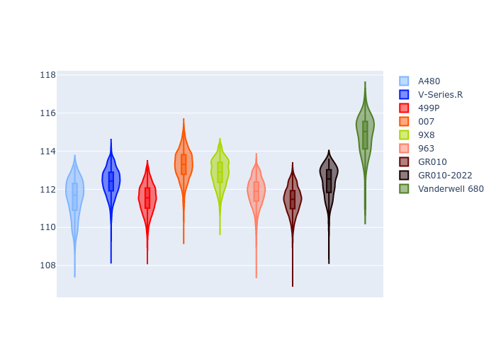

# Combined Plots

## Metadata

- BoP Accuracy: 90.11%
- Overall BoP Grade: A2
- Track: SEBRING
- Threshhold: 0.0kph

## BoP Table
| Manufacturer   | Car            | Weight   | Power   | PINC   | E/Stint   | FDS    |
|:---------------|:---------------|:---------|:--------|:-------|:----------|:-------|
| Alpine         | A480           | 1052kg   | 430.0kw | -      | 797MJ     | -      |
| Cadillac       | V-Series.R     | 1038kg   | 513.0kw | -      | 905MJ     | -      |
| Ferrari        | 499P           | 1057kg   | 515.0kw | -      | 908MJ     | 190kph |
| Glickenhaus    | 007            | 1030kg   | 520.0kw | -      | 910MJ     | -      |
| Peugeot        | 9X8            | 1049kg   | 518.0kw | -      | 909MJ     | 150kph |
| Porsche        | 963            | 1048kg   | 517.0kw | -      | 912MJ     | -      |
| Toyota         | GR010          | 1062kg   | 517.0kw | -      | 913MJ     | 190kph |
| Vanwall        | Vanderwell 680 | 1030kg   | 511.0kw | -      | 900MJ     | -      |

## Performance Table
| Manufacturer   | Car            | RP      | QP      | Vavg      |   RDLC | BOP-Grade   | Match   |
|:---------------|:---------------|:--------|:--------|:----------|-------:|:------------|:--------|
| Alpine         | A480           | 1:51.09 | 1:48.02 | 279.50kph |   1.03 | ~A1         | 99.66%  |
| Cadillac       | V-Series.R     | 1:51.31 | 1:46.86 | 285.94kph |   1.04 | ~A1         | 100.00% |
| Ferrari        | 499P           | 1:50.65 | 1:46.08 | 291.21kph |   1.04 | ~A1         | 99.10%  |
| Glickenhaus    | 007            | 1:51.87 | 1:48.46 | 287.56kph |   1.03 | ~A1         | 96.43%  |
| Peugeot        | 9X8            | 1:52.26 | 1:48.07 | 281.65kph |   1.04 | ~A1         | 96.43%  |
| Porsche        | 963            | 1:51.07 | 1:46.62 | 289.13kph |   1.04 | ~A1         | 99.95%  |
| Toyota         | GR010          | 1:50.80 | 1:46.12 | 291.62kph |   1.04 | ~A1         | 99.71%  |
| Vanwall        | Vanderwell 680 | 1:54.31 | 1:49.35 | 280.13kph |   1.05 | +Ω1         | 29.61%  |

## Race Laptimes

## Quali Laptimes

## Topspeeds

## Laptimes Lineplot

