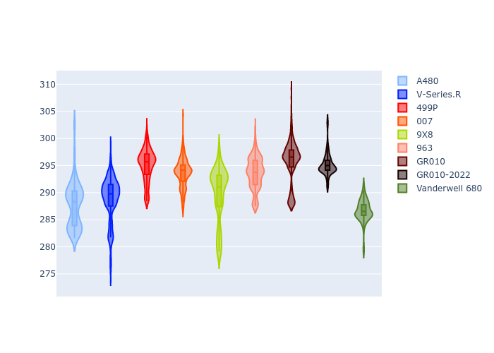

# Combined Plots

## Metadata

- BoP Accuracy: 88.69%
- Overall BoP Grade: B1
- Track: SEBRING
- Threshhold: 0.0kph

## BoP Table
| Manufacturer   | Car            | Weight   | Power   | PINC   | E/Stint   | FDS    | RDP    | QDP    | TDP    |
|:---------------|:---------------|:---------|:--------|:-------|:----------|:-------|:-------|:-------|:-------|
| Alpine         | A480           | 952kg    | 430.0kw | -      | 797MJ     | -      | 54.51% | 76.19% | 54.04% |
| Cadillac       | V-Series.R     | 1038kg   | 513.0kw | -      | 905MJ     | -      | 47.80% | 56.73% | 19.63% |
| Ferrari        | 499P           | 1057kg   | 515.0kw | -      | 908MJ     | 190kph | 53.02% | 42.32% | 9.88%  |
| Glickenhaus    | 007            | 1030kg   | 520.0kw | -      | 910MJ     | -      | 46.49% | 46.07% | 47.78% |
| Peugeot        | 9X8            | 1049kg   | 518.0kw | -      | 909MJ     | 150kph | 54.07% | 57.08% | 10.80% |
| Porsche        | 963            | 1048kg   | 517.0kw | -      | 912MJ     | -      | 50.87% | 45.25% | 30.77% |
| Toyota         | GR010          | 1062kg   | 517.0kw | -      | 913MJ     | 190kph | 52.43% | 57.12% | 12.82% |
| Toyota         | GR010-2022     | 1070kg   | 506.0kw | -      | 898MJ     | 190kph | 53.48% | 69.44% | 7.86%  |
| Vanwall        | Vanderwell 680 | 1030kg   | 511.0kw | -      | 900MJ     | -      | 53.41% | 56.28% | 29.85% |

## Performance Table
| Manufacturer   | Car            | RP      | QP      | Vavg      |   RDLC | BOP-Grade   | Match   |
|:---------------|:---------------|:--------|:--------|:----------|-------:|:------------|:--------|
| Alpine         | A480           | 1:50.42 | 1:47.13 | 281.16kph |   1.03 | ~A1         | 95.24%  |
| Cadillac       | V-Series.R     | 1:51.58 | 1:46.88 | 285.71kph |   1.04 | ~A1         | 99.91%  |
| Ferrari        | 499P           | 1:50.60 | 1:45.45 | 291.14kph |   1.05 | ~A1         | 98.13%  |
| Glickenhaus    | 007            | 1:51.87 | 1:48.46 | 287.56kph |   1.03 | +A2         | 93.12%  |
| Peugeot        | 9X8            | 1:51.88 | 1:47.35 | 280.30kph |   1.04 | ~A1         | 99.94%  |
| Porsche        | 963            | 1:51.22 | 1:46.58 | 289.48kph |   1.04 | ~A1         | 99.83%  |
| Toyota         | GR010          | 1:50.46 | 1:45.21 | 292.04kph |   1.05 | ~A1         | 98.06%  |
| Toyota         | GR010-2022     | 1:51.51 | 1:48.01 | 286.82kph |   1.03 | ~A1         | 100.00% |
| Vanwall        | Vanderwell 680 | 1:54.59 | 1:49.65 | 280.13kph |   1.05 | +Ω1         | 13.99%  |

## Race Laptimes

## Quali Laptimes

## Topspeeds

## Laptimes Lineplot

