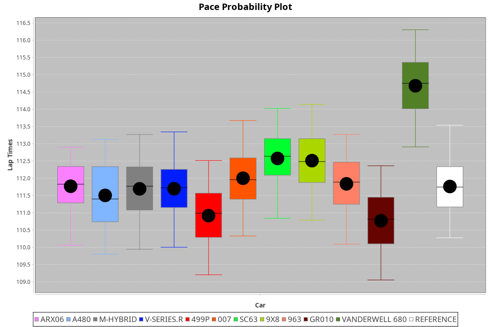
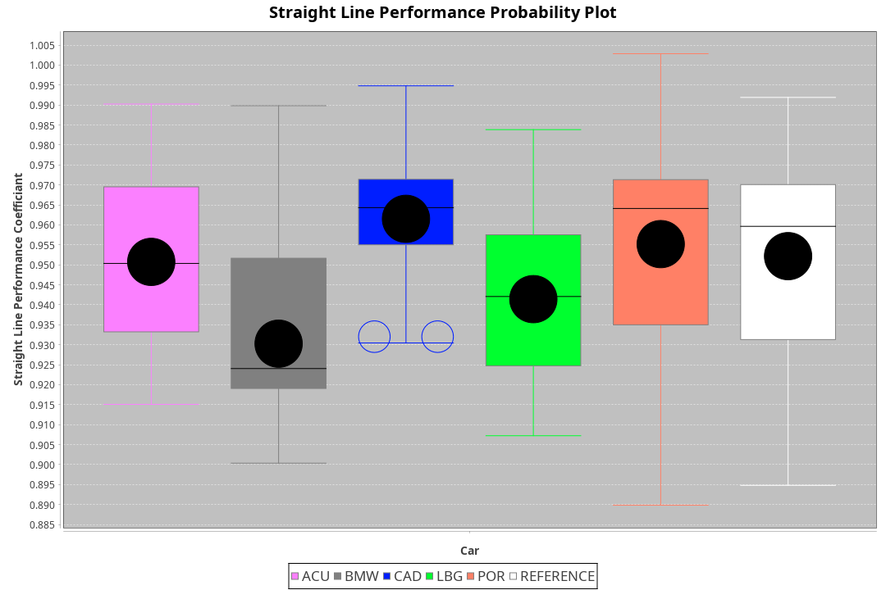
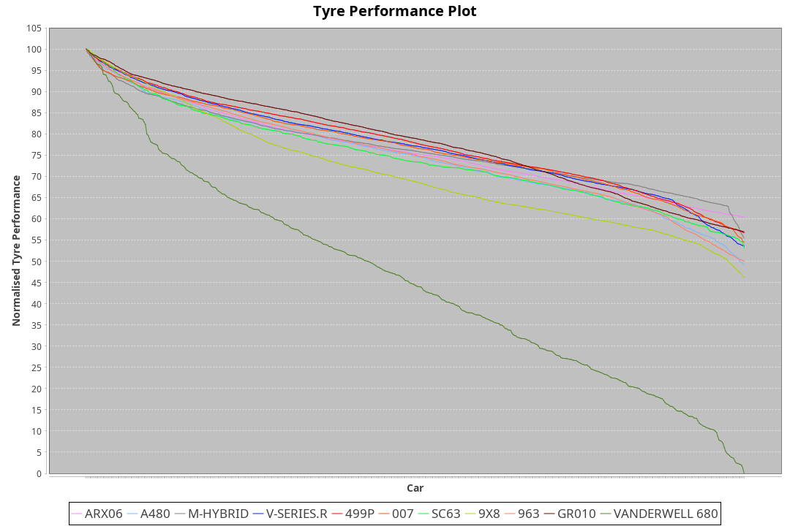

| Manufacturer | Car            | Weight | Power   | PINC    | E/Stint | FDS     |
|:-|:-|:-|:-|:-|:-|:-|
| Acura        | ARX06          | 1055kg | 512.0kw |    -    | 910MJ   |    -    |
| Alpine       | A480           | 952kg  | 430.0kw |    -    | 797MJ   |    -    |
| BMW          | M-Hybrid       | 1030kg | 506.0kw |    -    | 898MJ   |    -    |
| Cadillac     | V-Series.R     | 1060kg | 520.0kw |    -    | 918MJ   |    -    |
| Ferrari      | 499P           | 1057kg | 515.0kw |    -    | 908MJ   | 190kph  |
| Glickenhaus  | 007            | 1030kg | 520.0kw |    -    | 910MJ   |    -    |
| Lamborghini  | SC63           | 1044kg | 513.0kw |    -    | 908MJ   |    -    |
| Peugeot      | 9X8            | 1049kg | 518.0kw |    -    | 909MJ   | 150kph  |
| Porsche      | 963            | 1049kg | 508.0kw |    -    | 904MJ   |    -    |
| Toyota       | GR010          | 1062kg | 517.0kw |    -    | 913MJ   | 190kph  |
| Vanwall      | Vanderwell 680 | 1030kg | 511.0kw |    -    | 900MJ   |    -    |

### BoP Accuracy: 66.81%; Overall BoP Grade: D1
| Manufacturer | Car            | Type  | RP      | QP      | Weight | Power¹  | Threshhold | PINC    | Power²   | E/Stint | AVG Vmax  | FDS     | RDLC | L/Stint | BOP-Grade | Model Accuracy | Model Points | Match%  | SimDiff |
|:-|:-|:-|:-|:-|:-|:-|:-|:-|:-|:-|:-|:-|:-|:-|:-|:-|:-|:-|:-|
| Acura        | ARX06          | LMDH  | 1:51.53 | 1:46.65 | 1055kg | 512.0kw | 0.0kph     |    -    | 512.00kw |  910MJ  | 280.84kph |    -    | 1.02 | 29      | -D1       | 100.00%        | 996          | 68.97%  | -1.06   |
| Alpine       | A480           | LMP1  | 1:51.40 | 1:48.06 |  952kg | 430.0kw | 0.0kph     |    -    | 430.00kw |  797MJ  | 280.00kph |    -    | 0.98 | 27      | -C1       | 97.75%         | 1567         | 77.28%  | -0.20   |
| BMW          | M-Hybrid       | LMDH  | 1:52.03 | 1:47.19 | 1030kg | 506.0kw | 0.0kph     |    -    | 506.00kw |  898MJ  | 291.32kph |    -    | 1.03 | 29      | ~A1       | 98.62%         | 2363         | 100.00% | #       |
| Cadillac     | V-Series.R     | LMDH  | 1:51.51 | 1:47.08 | 1060kg | 520.0kw | 0.0kph     |    -    | 520.00kw |  918MJ  | 286.79kph |    -    | 1.00 | 29      | -B2       | 98.50%         | 4201         | 82.48%  | +1.01   |
| Ferrari      | 499P           | LMHHU | 1:50.75 | 1:46.22 | 1057kg | 515.0kw | 210.0kph   |    -    | 515.00kw |  908MJ  | 292.39kph | 190kph  | 1.02 | 29      | -Ω1       | 100.00%        | 4441         | 43.47%  | +1.14   |
| Glickenhaus  | 007            | LMHNH | 1:52.00 | 1:48.28 | 1030kg | 520.0kw | 210.0kph   |    -    | 520.00kw |  910MJ  | 286.13kph |    -    | 0.96 | 29      | +A2       | 94.07%         | 2174         | 90.77%  | -0.36   |
| Lamborghini  | SC63           | LMDH  | 1:52.57 | 1:48.74 | 1044kg | 513.0kw | 0.0kph     |    -    | 513.00kw |  908MJ  | 286.90kph |    -    | 1.04 | 29      | +C2       | 100.00%        | 784          | 72.30%  | -0.82   |
| Peugeot      | 9X8            | LMHHE | 1:52.50 | 1:48.08 | 1049kg | 518.0kw | 210.0kph   |    -    | 518.00kw |  909MJ  | 285.00kph | 150kph  | 1.02 | 29      | +C2       | 98.79%         | 5064         | 73.08%  | -0.15   |
| Porsche      | 963            | LMDH  | 1:51.96 | 1:47.09 | 1049kg | 508.0kw | 0.0kph     |    -    | 508.00kw |  904MJ  | 288.76kph |    -    | 1.01 | 29      | ~A1       | 99.87%         | 12613        | 100.00% | +0.47   |
| Toyota       | GR010          | LMHHU | 1:50.60 | 1:45.89 | 1062kg | 517.0kw | 210.0kph   |    -    | 517.00kw |  913MJ  | 289.88kph | 190kph  | 1.02 | 29      | -Ω1       | 99.73%         | 2956         | 38.85%  | +0.75   |
| Vanwall      | Vanderwell 680 | LMHNH | 1:54.55 | 1:49.47 | 1030kg | 511.0kw | 210.0kph   |    -    | 511.00kw |  900MJ  | 281.08kph |    -    | 1.02 | 29      | +Ω2       | 99.09%         | 544          | -12.26% | +0.45   |

## Power below Threshhold
| N/Nmax    | ARX06   | M-HYBRID | V-SERIES.R | 499P    | 007     | SC63    | 9X8     | 963     | GR010   | VANDERWELL 680 | ​     | RPM      | A480    |
|:-|:-|:-|:-|:-|:-|:-|:-|:-|:-|:-|:-|:-|:-|
|  0.550    |  252    |  249     |  256       |  254    |  256    |  253    |  255    |  250    |  255    |  252           |  ​    |   --     |   -     |
|  0.575    |  275    |  272     |  279       |  277    |  279    |  276    |  278    |  273    |  278    |  275           |  ​    |   --     |   -     |
|  0.600    |  296    |  292     |  300       |  297    |  300    |  296    |  299    |  293    |  298    |  295           |  ​    |   --     |   -     |
|  0.625    |  317    |  313     |  322       |  319    |  322    |  317    |  321    |  314    |  320    |  316           |  ​    |   --     |   -     |
|  0.650    |  338    |  334     |  343       |  340    |  343    |  338    |  342    |  335    |  341    |  337           |  ​    |   --     |   -     |
|  0.675    |  359    |  355     |  365       |  362    |  365    |  360    |  364    |  357    |  363    |  359           |  ​    |   --     |   -     |
|  0.700    |  381    |  377     |  387       |  383    |  387    |  382    |  386    |  378    |  385    |  380           |  ​    |   --     |   -     |
|  0.725    |  403    |  398     |  409       |  405    |  409    |  403    |  407    |  399    |  407    |  402           |  ​    |   --     |   -     |
|  0.750    |  423    |  418     |  430       |  426    |  430    |  424    |  428    |  420    |  427    |  422           |  ​    |   --     |   -     |
|  0.775    |  442    |  437     |  449       |  445    |  449    |  443    |  447    |  439    |  446    |  441           |  ​    |  5000    |  252    |
|  0.800    |  460    |  454     |  467       |  463    |  467    |  461    |  465    |  456    |  464    |  459           |  ​    |  5500    |  298    |
|  0.825    |  475    |  469     |  482       |  478    |  482    |  476    |  480    |  471    |  479    |  474           |  ​    |  6000    |  333    |
|  0.850    |  486    |  481     |  494       |  489    |  494    |  487    |  492    |  483    |  491    |  485           |  ​    |  6500    |  376    |
|  0.875    |  497    |  491     |  505       |  500    |  505    |  498    |  503    |  493    |  502    |  496           |  ​    |  7000    |  420    |
|  0.900    |  504    |  498     |  512       |  507    |  512    |  505    |  510    |  500    |  509    |  503           |  ​    |  7500    |  431    |
|  0.925    |  509    |  503     |  517       |  512    |  517    |  510    |  515    |  505    |  514    |  508           |  ​    |  8000    |  427    |
| **0.950** | **512** | **506**  | **520**    | **515** | **520** | **513** | **518** | **508** | **517** | **511**        | **​** | **8500** | **430** |
|  0.975    |  510    |  504     |  518       |  513    |  518    |  511    |  516    |  506    |  515    |  509           |  ​    |  9000    |  215    |
|  1.000    |  506    |  501     |  514       |  509    |  514    |  507    |  512    |  503    |  511    |  505           |  ​    |   --     |   -     |
|  1.025    |  437    |  432     |  444       |  440    |  444    |  438    |  442    |  434    |  441    |  436           |  ​    |   --     |   -     |

## Power above Threshhold
| N/Nmax    | ARX06   | M-HYBRID | V-SERIES.R | 499P    | 007     | SC63    | 9X8     | 963     | GR010   | VANDERWELL 680 | ​     | RPM      | A480    |
|:-|:-|:-|:-|:-|:-|:-|:-|:-|:-|:-|:-|:-|:-|
|  0.550    |  252    |  249     |  256       |  254    |  256    |  253    |  255    |  250    |  255    |  252           |  ​    |   --     |   -     |
|  0.575    |  275    |  272     |  279       |  277    |  279    |  276    |  278    |  273    |  278    |  275           |  ​    |   --     |   -     |
|  0.600    |  296    |  292     |  300       |  297    |  300    |  296    |  299    |  293    |  298    |  295           |  ​    |   --     |   -     |
|  0.625    |  317    |  313     |  322       |  319    |  322    |  317    |  321    |  314    |  320    |  316           |  ​    |   --     |   -     |
|  0.650    |  338    |  334     |  343       |  340    |  343    |  338    |  342    |  335    |  341    |  337           |  ​    |   --     |   -     |
|  0.675    |  359    |  355     |  365       |  362    |  365    |  360    |  364    |  357    |  363    |  359           |  ​    |   --     |   -     |
|  0.700    |  381    |  377     |  387       |  383    |  387    |  382    |  386    |  378    |  385    |  380           |  ​    |   --     |   -     |
|  0.725    |  403    |  398     |  409       |  405    |  409    |  403    |  407    |  399    |  407    |  402           |  ​    |   --     |   -     |
|  0.750    |  423    |  418     |  430       |  426    |  430    |  424    |  428    |  420    |  427    |  422           |  ​    |   --     |   -     |
|  0.775    |  442    |  437     |  449       |  445    |  449    |  443    |  447    |  439    |  446    |  441           |  ​    |  5000    |  252    |
|  0.800    |  460    |  454     |  467       |  463    |  467    |  461    |  465    |  456    |  464    |  459           |  ​    |  5500    |  298    |
|  0.825    |  475    |  469     |  482       |  478    |  482    |  476    |  480    |  471    |  479    |  474           |  ​    |  6000    |  333    |
|  0.850    |  486    |  481     |  494       |  489    |  494    |  487    |  492    |  483    |  491    |  485           |  ​    |  6500    |  376    |
|  0.875    |  497    |  491     |  505       |  500    |  505    |  498    |  503    |  493    |  502    |  496           |  ​    |  7000    |  420    |
|  0.900    |  504    |  498     |  512       |  507    |  512    |  505    |  510    |  500    |  509    |  503           |  ​    |  7500    |  431    |
|  0.925    |  509    |  503     |  517       |  512    |  517    |  510    |  515    |  505    |  514    |  508           |  ​    |  8000    |  427    |
| **0.950** | **512** | **506**  | **520**    | **515** | **520** | **513** | **518** | **508** | **517** | **511**        | **​** | **8500** | **430** |
|  0.975    |  510    |  504     |  518       |  513    |  518    |  511    |  516    |  506    |  515    |  509           |  ​    |  9000    |  215    |
|  1.000    |  506    |  501     |  514       |  509    |  514    |  507    |  512    |  503    |  511    |  505           |  ​    |   --     |   -     |
|  1.025    |  437    |  432     |  444       |  440    |  444    |  438    |  442    |  434    |  441    |  436           |  ​    |   --     |   -     |
