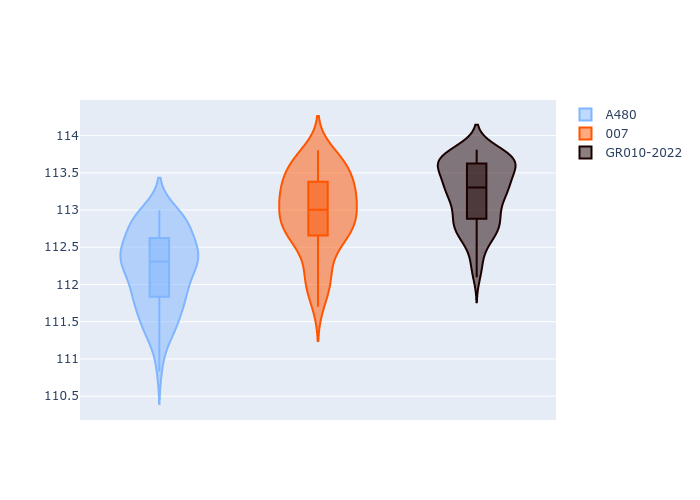
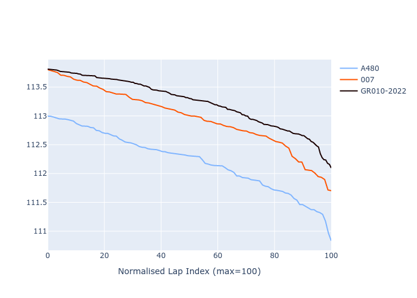

# Combined Plots

## Metadata

- BoP Accuracy: 87.14%
- Overall BoP Grade: B1
- Track: SEBRING
- Threshhold: 0.0kph

## BoP Table
| Manufacturer   | Car   | Weight   | Power   | PINC   | E/Stint   | FDS   |
|:---------------|:------|:---------|:--------|:-------|:----------|:------|
| Alpine         | A480  | 1052kg   | 430.0kw | -      | 797MJ     | -     |
| Glickenhaus    | 007   | 1030kg   | 520.0kw | -      | 910MJ     | -     |

## Performance Table
| Manufacturer   | Car   | RP      | QP      | Vavg      |   RDLC | BOP-Grade   | Match   |
|:---------------|:------|:--------|:--------|:----------|-------:|:------------|:--------|
| Alpine         | A480  | 1:50.42 | 1:48.31 | 280.24kph |   1.02 | ~A1         | 97.00%  |
| Glickenhaus    | 007   | 1:51.16 | 1:49.70 | 291.92kph |   1.01 | +C1         | 77.27%  |

## Race Laptimes

## Quali Laptimes

## Topspeeds

## Laptimes Lineplot

