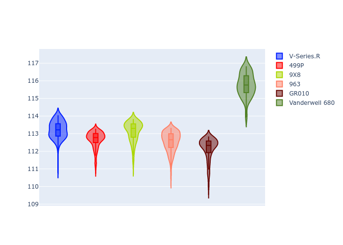
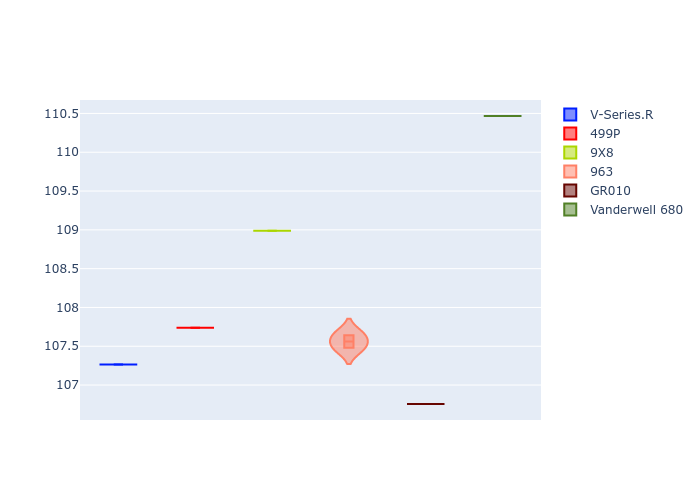
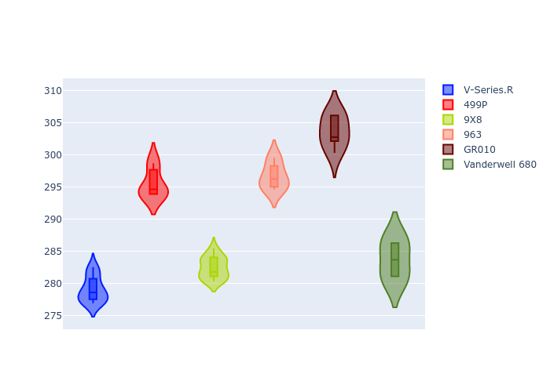
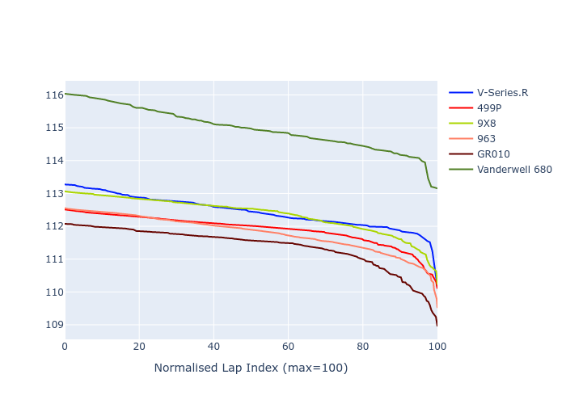

# Combined Plots

## Metadata

- BoP Accuracy: 81.00%
- Overall BoP Grade: B2
- Track: SEBRING
- Threshhold: 210.0kph

## BoP Table
| Manufacturer   | Car            | Weight   | Power   | PINC   | E/Stint   | FDS    |
|:---------------|:---------------|:---------|:--------|:-------|:----------|:-------|
| Cadillac       | V-Series.R     | 1038kg   | 513.0kw | -      | 905MJ     | -      |
| Ferrari        | 499P           | 1057kg   | 515.0kw | -      | 908MJ     | 190kph |
| Peugeot        | 9X8            | 1049kg   | 518.0kw | -      | 909MJ     | 150kph |
| Porsche        | 963            | 1048kg   | 517.0kw | -      | 912MJ     | -      |
| Toyota         | GR010          | 1062kg   | 517.0kw | -      | 913MJ     | 190kph |
| Vanwall        | Vanderwell 680 | 1030kg   | 511.0kw | -      | 900MJ     | -      |

## Performance Table
| Manufacturer   | Car            | RP      | QP      | Vavg      |   RDLC | BOP-Grade   | Match   |
|:---------------|:---------------|:--------|:--------|:----------|-------:|:------------|:--------|
| Cadillac       | V-Series.R     | 1:52.44 | 1:46.07 | 269.82kph |   1.06 | ~A1         | 95.97%  |
| Ferrari        | 499P           | 1:51.90 | 1:46.47 | 285.70kph |   1.05 | ~A1         | 99.30%  |
| Peugeot        | 9X8            | 1:52.36 | 1:47.71 | 273.11kph |   1.04 | ~A1         | 99.66%  |
| Porsche        | 963            | 1:51.79 | 1:46.48 | 286.84kph |   1.05 | ~A1         | 98.37%  |
| Toyota         | GR010          | 1:51.38 | 1:45.46 | 293.56kph |   1.06 | -A2         | 90.24%  |
| Vanwall        | Vanderwell 680 | 1:54.98 | 1:49.23 | 274.30kph |   1.05 | +Ω1         | 2.48%   |

## Race Laptimes

## Quali Laptimes

## Topspeeds

## Laptimes Lineplot

