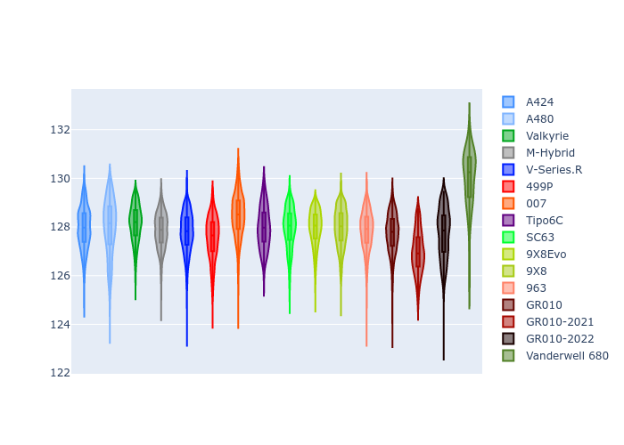
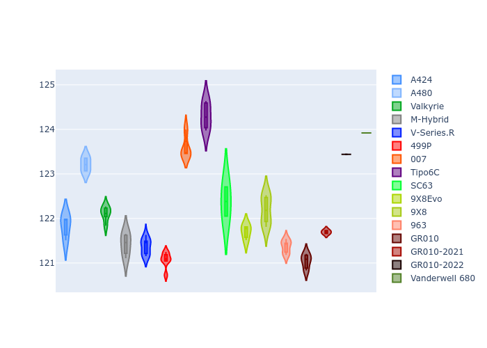
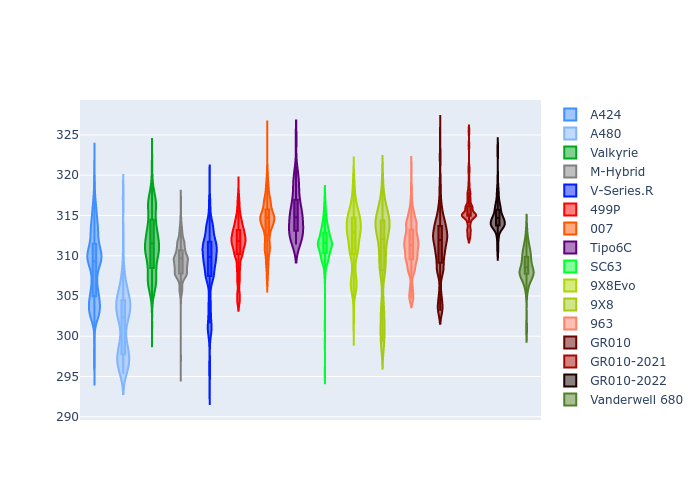
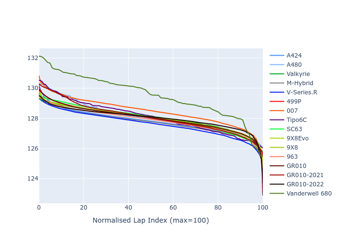

# Combined Plots

## Metadata

- BoP Accuracy: 93.87%
- Overall BoP Grade: A2
- Track: SPA
- Threshhold: 250.0kph
- Average Laptime: 2:08.65
- Average Quali Laptime: 2:02.88
- Laptime Std Dev: 0.76 seconds
- Filtered Average Topspeed: 310.19kph

## BoP Table
| Manufacturer     | Car            | Weight   | Power   | PINC   | E/Stint   | FDS    | RDP    | QDP    | TDP    |
|:-----------------|:---------------|:---------|:--------|:-------|:----------|:-------|:-------|:-------|:-------|
| Alpine           | A424           | 1066kg   | 511.0kw | +0.10% | 907MJ     | -      | 51.45% | 55.09% | 24.89% |
| Alpine           | A480           | 988kg    | 422.0kw | +0.10% | 813MJ     | -      | 54.77% | 76.19% | 54.04% |
| Aston Martin     | Valkyrie       | 1035kg   | 500.0kw | -      | 897MJ     | -      | 53.07% | 48.70% | 24.00% |
| BMW              | M-Hybrid       | 1060kg   | 513.0kw | +0.10% | 915MJ     | -      | 52.63% | 52.34% | 34.06% |
| Cadillac         | V-Series.R     | 1057kg   | 519.0kw | -      | 915MJ     | -      | 48.80% | 57.26% | 18.10% |
| Ferrari          | 499P           | 1072kg   | 503.0kw | -0.10% | 903MJ     | 190kph | 51.39% | 44.34% | 9.89%  |
| Glickenhaus      | 007            | 1031kg   | 503.0kw | -      | 898MJ     | -      | 46.14% | 49.30% | 41.45% |
| Isotta Fraschini | Tipo6C         | 1032kg   | 499.0kw | -      | 895MJ     | 190kph | 43.95% | 47.22% | 31.53% |
| Lamborghini      | SC63           | 1050kg   | 520.0kw | +0.10% | 915MJ     | -      | 48.32% | 60.95% | 28.65% |
| Peugeot          | 9X8Evo         | 1062kg   | 518.0kw | -0.10% | 912MJ     | 190kph | 49.16% | 50.25% | 18.00% |
| Peugeot          | 9X8            | 1056kg   | 524.0kw | -      | 917MJ     | 150kph | 54.54% | 58.39% | 9.69%  |
| Porsche          | 963            | 1066kg   | 511.0kw | +0.10% | 914MJ     | -      | 50.61% | 41.90% | 27.68% |
| Toyota           | GR010          | 1081kg   | 502.0kw | +0.10% | 908MJ     | 190kph | 51.33% | 51.71% | 14.89% |
| Toyota           | GR010-2021     | 1065kg   | 509.0kw | -0.10% | 956MJ     | 150kph | 54.02% | 52.67% | 26.37% |
| Toyota           | GR010-2022     | 1070kg   | 503.0kw | -0.10% | 895MJ     | 190kph | 53.24% | 64.49% | 9.72%  |
| Vanwall          | Vanderwell 680 | 1030kg   | 520.0kw | -      | 908MJ     | -      | 50.86% | 59.83% | 31.84% |

## Performance Table
| Manufacturer     | Car            | RP      | QP      | Vavg      |   RDLC | BOP-Grade   | Match   |
|:-----------------|:---------------|:--------|:--------|:----------|-------:|:------------|:--------|
| Alpine           | A424           | 2:08.30 | 2:02.11 | 308.98kph |   1.05 | ~A1         | 99.93%  |
| Alpine           | A480           | 2:09.65 | 2:04.34 | 302.09kph |   1.04 | +B1         | 87.35%  |
| Aston Martin     | Valkyrie       | 2:09.65 | 2:03.57 | 308.26kph |   1.05 | +B1         | 88.55%  |
| BMW              | M-Hybrid       | 2:08.05 | 2:01.59 | 309.49kph |   1.05 | ~A1         | 99.98%  |
| Cadillac         | V-Series.R     | 2:07.95 | 2:01.46 | 308.85kph |   1.05 | ~A1         | 99.83%  |
| Ferrari          | 499P           | 2:08.24 | 2:01.60 | 311.40kph |   1.05 | ~A1         | 99.92%  |
| Glickenhaus      | 007            | 2:09.65 | 2:04.75 | 310.32kph |   1.04 | +B2         | 84.39%  |
| Isotta Fraschini | Tipo6C         | 2:09.65 | 2:05.95 | 310.32kph |   1.03 | +B2         | 82.09%  |
| Lamborghini      | SC63           | 2:08.12 | 2:02.65 | 310.78kph |   1.04 | ~A1         | 100.00% |
| Peugeot          | 9X8Evo         | 2:08.14 | 2:01.95 | 312.59kph |   1.05 | ~A1         | 99.84%  |
| Peugeot          | 9X8            | 2:07.95 | 2:02.34 | 310.49kph |   1.05 | ~A1         | 99.92%  |
| Porsche          | 963            | 2:08.15 | 2:01.98 | 310.98kph |   1.05 | ~A1         | 99.82%  |
| Toyota           | GR010          | 2:08.47 | 2:01.56 | 310.60kph |   1.06 | ~A1         | 99.78%  |
| Toyota           | GR010-2021     | 2:07.81 | 2:01.98 | 314.58kph |   1.05 | ~A1         | 100.00% |
| Toyota           | GR010-2022     | 2:08.51 | 2:04.13 | 314.84kph |   1.04 | ~A1         | 99.55%  |
| Vanwall          | Vanderwell 680 | 2:10.11 | 2:04.18 | 308.46kph |   1.05 | +D2         | 60.99%  |

## Race Laptimes

## Quali Laptimes

## Topspeeds

## Laptimes Lineplot

