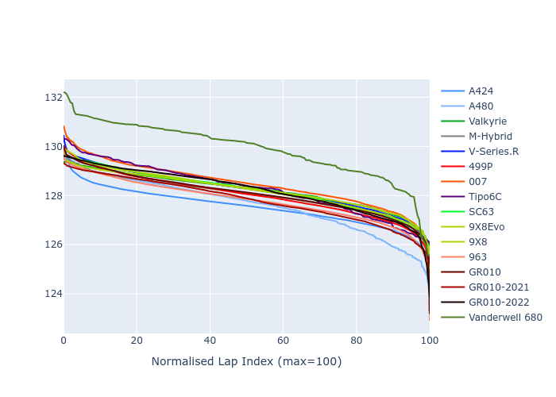

# Combined Plots

## Metadata

- BoP Accuracy: 93.28%
- Overall BoP Grade: A2
- Track: SPA
- Threshhold: 210.0kph

## BoP Table
| Manufacturer     | Car            | Weight   | Power   | PINC   | E/Stint   | FDS    |
|:-----------------|:---------------|:---------|:--------|:-------|:----------|:-------|
| Alpine           | A424           | 1067kg   | 520.0kw | -1.00% | 913MJ     | -      |
| Alpine           | A480           | 1052kg   | 432.0kw | +1.00% | 820MJ     | -      |
| Aston Martin     | Valkyrie       | 1062kg   | 504.0kw | +1.00% | 905MJ     | -      |
| BMW              | M-Hybrid       | 1061kg   | 512.0kw | -1.00% | 912MJ     | -      |
| Cadillac         | V-Series.R     | 1054kg   | 510.0kw | +1.00% | 909MJ     | -      |
| Ferrari          | 499P           | 1083kg   | 508.0kw | -1.00% | 907MJ     | 190kph |
| Glickenhaus      | 007            | 1050kg   | 520.0kw | -      | 915MJ     | -      |
| Isotta Fraschini | Tipo6C         | 1059kg   | 520.0kw | -      | 917MJ     | 190kph |
| Lamborghini      | SC63           | 1062kg   | 519.0kw | -1.00% | 914MJ     | -      |
| Peugeot          | 9X8Evo         | 1070kg   | 510.0kw | -1.00% | 904MJ     | 190kph |
| Peugeot          | 9X8            | 1050kg   | 520.0kw | -      | 912MJ     | 150kph |
| Porsche          | 963            | 1067kg   | 516.0kw | -1.00% | 917MJ     | -      |
| Toyota           | GR010          | 1100kg   | 512.0kw | -1.00% | 918MJ     | 190kph |
| Toyota           | GR010OLD       | 1085kg   | 513.0kw | +1.00% | 964MJ     | 150kph |
| Vanwall          | Vanderwell 680 | 1030kg   | 520.0kw | -      | 908MJ     | -      |

## Performance Table
| Manufacturer     | Car            | RP      | QP      | Vavg      |   RDLC | BOP-Grade   | Match   |
|:-----------------|:---------------|:--------|:--------|:----------|-------:|:------------|:--------|
| Alpine           | A424           | 2:05.71 | 1:59.95 | 308.14kph |   1.05 | ~A1         | 99.69%  |
| Alpine           | A480           | 2:05.54 | 2:01.03 | 300.31kph |   1.04 | ~A1         | 98.94%  |
| Aston Martin     | Valkyrie       | 2:07.37 | 2:00.63 | 305.71kph |   1.06 | ~A1         | 97.49%  |
| BMW              | M-Hybrid       | 2:06.14 | 1:59.95 | 305.94kph |   1.05 | ~A1         | 99.92%  |
| Cadillac         | V-Series.R     | 2:06.32 | 2:00.23 | 304.37kph |   1.05 | ~A1         | 99.96%  |
| Ferrari          | 499P           | 2:05.81 | 1:59.56 | 306.55kph |   1.05 | ~A1         | 99.14%  |
| Glickenhaus      | 007            | 2:07.04 | 2:02.10 | 305.54kph |   1.04 | +A2         | 91.44%  |
| Isotta Fraschini | Tipo6C         | 2:07.58 | 2:03.79 | 307.46kph |   1.03 | +B1         | 88.81%  |
| Lamborghini      | SC63           | 2:07.24 | 2:01.99 | 306.18kph |   1.04 | ~A1         | 96.02%  |
| Peugeot          | 9X8Evo         | 2:06.63 | 2:00.43 | 307.59kph |   1.05 | ~A1         | 98.16%  |
| Peugeot          | 9X8            | 2:06.67 | 2:00.90 | 301.67kph |   1.05 | ~A1         | 99.96%  |
| Porsche          | 963            | 2:05.98 | 1:59.89 | 306.36kph |   1.05 | ~A1         | 99.82%  |
| Toyota           | GR010          | 2:05.98 | 1:59.61 | 306.22kph |   1.05 | ~A1         | 99.75%  |
| Toyota           | GR010OLD       | 2:04.87 | 2:00.04 | 303.71kph |   1.04 | -A2         | 92.81%  |
| Vanwall          | Vanderwell 680 | 2:09.03 | 2:02.39 | 301.63kph |   1.05 | +Ω1         | 37.35%  |

## Race Laptimes

## Quali Laptimes

## Topspeeds

## Laptimes Lineplot

