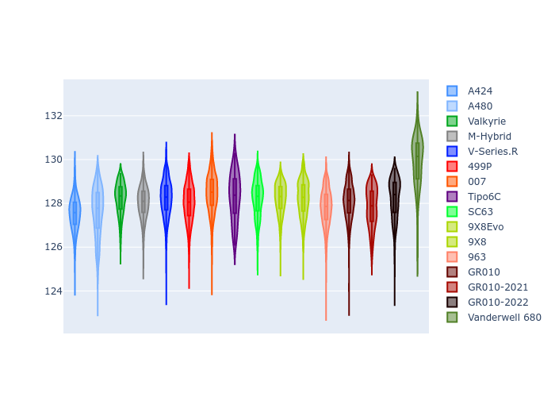
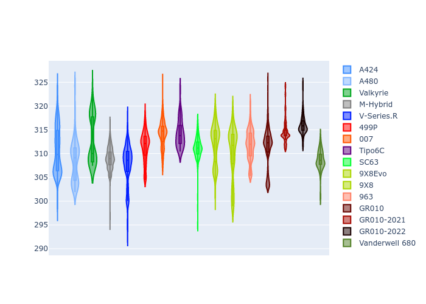

# Combined Plots

## Metadata

- BoP Accuracy: 92.65%
- Overall BoP Grade: A2
- Track: SPA
- Threshhold: 250.0kph

## BoP Table
| Manufacturer     | Car            | Weight   | Power   | PINC   | E/Stint   | FDS    | RDP    | QDP    | TDP    |
|:-----------------|:---------------|:---------|:--------|:-------|:----------|:-------|:-------|:-------|:-------|
| Alpine           | A424           | 1067kg   | 520.0kw | -0.10% | 914MJ     | -      | 52.35% | 61.85% | 27.84% |
| Alpine           | A480           | 952kg    | 432.0kw | +0.10% | 818MJ     | -      | 54.51% | 76.19% | 54.04% |
| Aston Martin     | Valkyrie       | 1054kg   | 504.0kw | +0.10% | 902MJ     | -      | 53.59% | 53.33% | 21.51% |
| BMW              | M-Hybrid       | 1061kg   | 512.0kw | -0.10% | 913MJ     | -      | 53.26% | 57.23% | 34.54% |
| Cadillac         | V-Series.R     | 1054kg   | 510.0kw | +0.10% | 907MJ     | -      | 47.80% | 56.73% | 19.63% |
| Ferrari          | 499P           | 1083kg   | 508.0kw | -0.10% | 909MJ     | 190kph | 53.02% | 42.32% | 9.88%  |
| Glickenhaus      | 007            | 1050kg   | 520.0kw | -      | 915MJ     | -      | 46.49% | 46.07% | 47.78% |
| Isotta Fraschini | Tipo6C         | 1059kg   | 520.0kw | -      | 917MJ     | 190kph | 43.95% | 47.22% | 31.53% |
| Lamborghini      | SC63           | 1062kg   | 519.0kw | -0.10% | 915MJ     | -      | 46.33% | 59.50% | 29.33% |
| Peugeot          | 9X8Evo         | 1070kg   | 510.0kw | -0.10% | 906MJ     | 190kph | 48.47% | 51.26% | 16.02% |
| Peugeot          | 9X8            | 1050kg   | 520.0kw | -      | 912MJ     | 150kph | 54.07% | 57.08% | 10.80% |
| Porsche          | 963            | 1067kg   | 516.0kw | -0.10% | 918MJ     | -      | 50.87% | 45.25% | 30.77% |
| Toyota           | GR010          | 1100kg   | 512.0kw | -0.10% | 919MJ     | 190kph | 52.43% | 57.12% | 12.82% |
| Toyota           | GR010-2021     | 1085kg   | 513.0kw | +0.10% | 963MJ     | 150kph | 54.09% | 52.67% | 26.37% |
| Toyota           | GR010-2022     | 1100kg   | 512.0kw | +0.10% | 907MJ     | 190kph | 53.48% | 69.44% | 7.86%  |
| Vanwall          | Vanderwell 680 | 1030kg   | 520.0kw | -      | 908MJ     | -      | 53.41% | 56.28% | 29.85% |

## Performance Table
| Manufacturer     | Car            | RP      | QP      | Vavg      |   RDLC | BOP-Grade   | Match   |
|:-----------------|:---------------|:--------|:--------|:----------|-------:|:------------|:--------|
| Alpine           | A424           | 2:06.20 | 2:00.24 | 308.63kph |   1.05 | ~A1         | 99.30%  |
| Alpine           | A480           | 2:04.67 | 1:59.92 | 301.42kph |   1.04 | -C2         | 71.23%  |
| Aston Martin     | Valkyrie       | 2:07.92 | 2:01.11 | 305.86kph |   1.06 | ~A1         | 97.34%  |
| BMW              | M-Hybrid       | 2:06.69 | 2:00.26 | 306.58kph |   1.05 | ~A1         | 100.00% |
| Cadillac         | V-Series.R     | 2:06.94 | 2:00.53 | 303.45kph |   1.05 | ~A1         | 99.87%  |
| Ferrari          | 499P           | 2:06.34 | 1:59.38 | 307.16kph |   1.06 | ~A1         | 99.10%  |
| Glickenhaus      | 007            | 2:07.31 | 2:02.35 | 305.54kph |   1.04 | +A2         | 92.09%  |
| Isotta Fraschini | Tipo6C         | 2:07.93 | 2:04.24 | 307.46kph |   1.03 | +B2         | 84.33%  |
| Lamborghini      | SC63           | 2:07.69 | 2:02.33 | 306.87kph |   1.04 | ~A1         | 95.66%  |
| Peugeot          | 9X8Evo         | 2:07.28 | 2:01.00 | 308.29kph |   1.05 | ~A1         | 97.78%  |
| Peugeot          | 9X8            | 2:06.42 | 2:00.27 | 300.23kph |   1.05 | ~A1         | 99.33%  |
| Porsche          | 963            | 2:06.53 | 2:00.19 | 307.42kph |   1.05 | ~A1         | 99.77%  |
| Toyota           | GR010          | 2:06.39 | 1:59.31 | 307.34kph |   1.06 | ~A1         | 99.65%  |
| Toyota           | GR010-2021     | 2:06.43 | 2:00.50 | 299.55kph |   1.05 | ~A1         | 99.78%  |
| Toyota           | GR010-2022     | 2:06.49 | 2:01.46 | 305.21kph |   1.04 | ~A1         | 100.00% |
| Vanwall          | Vanderwell 680 | 2:08.98 | 2:02.39 | 301.63kph |   1.05 | +Ω1         | 47.17%  |

## Race Laptimes

## Quali Laptimes

## Topspeeds

## Laptimes Lineplot

