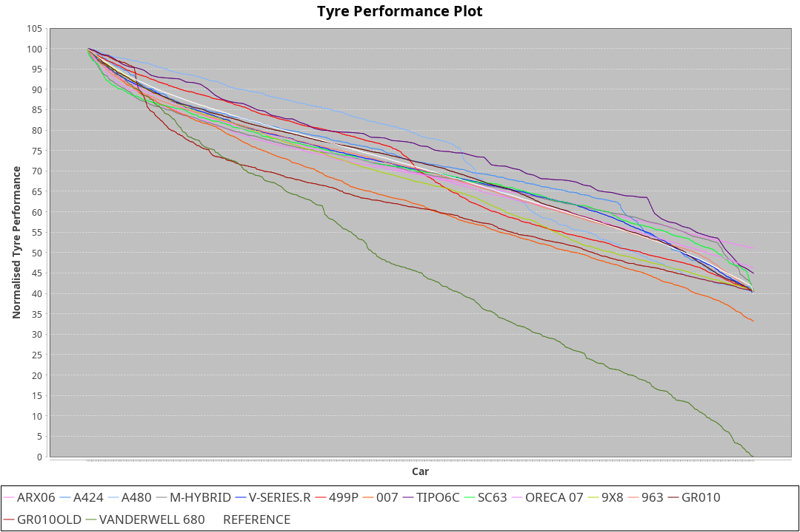

| Manufacturer     | Car            | Weight | Power | PINC    | E/Stint | FDS     |
|:-|:-|:-|:-|:-|:-|:-|
| Acura            | ARX06          | 1075kg | 506kw |    -    | 907MJ   |    -    |
| Alpine           | A424           | 1068kg | 510kw |    -    | 909MJ   |    -    |
| Alpine           | A480           | 952kg  | 410kw |    -    | 747MJ   |    -    |
| BMW              | M-Hybrid       | 1053kg | 505kw |    -    | 900MJ   |    -    |
| Cadillac         | V-Series.R     | 1044kg | 502kw |    -    | 892MJ   |    -    |
| Ferrari          | 499P           | 1074kg | 503kw |    -    | 896MJ   | 190kph  |
| Glickenhaus      | 007            | 1038kg | 483kw |    -    | 878MJ   |    -    |
| Isotta Fraschini | Tipo6C         | 1038kg | 487kw |    -    | 888MJ   | 190kph  |
| Lamborghini      | SC63           | 1055kg | 506kw |    -    | 900MJ   |    -    |
| Peugeot          | 9X8            | 1040kg | 517kw |    -    | 902MJ   | 150kph  |
| Porsche          | 963            | 1058kg | 507kw |    -    | 895MJ   |    -    |
| Toyota           | GR010          | 1078kg | 507kw |    -    | 900MJ   | 190kph  |
| Toyota           | GR010OLD       | 1074kg | 510kw |    -    | 904MJ   | 190kph  |
| Vanwall          | Vanderwell 680 | 1031kg | 502kw |    -    | 887MJ   |    -    |

### BoP Accuracy: 68.42%; Overall BoP Grade: D1
| Manufacturer     | Car            | Type  | RP      | QP      | Weight | Power¹ | Threshhold | PINC    | Power² | E/Stint | AVG Vmax  | FDS     | RDLC | L/Stint | BOP-Grade | Model Accuracy | Model Points | Match%  |
|:-|:-|:-|:-|:-|:-|:-|:-|:-|:-|:-|:-|:-|:-|:-|:-|:-|:-|:-|
| Acura            | ARX06          | LMDH  | 2:11.34 | 2:04.74 | 1075kg | 506kw  | 210.0kph   |    -    | 506kw  |  907MJ  | 298.09kph |    -    | 0.99 | 25      | +C2       | 100.00%        | 995          | 71.22%  |
| Alpine           | A424           | LMDH  | 2:11.44 | 2:07.00 | 1068kg | 510kw  | 210.0kph   |    -    | 510kw  |  909MJ  | 299.13kph |    -    | 1.00 | 25      | +Ω1       | 100.00%        | 642          | 49.13%  |
| Alpine           | A480           | LMP1  | 2:11.19 | 2:06.89 |  952kg | 410kw  | 210.0kph   |    -    | 410kw  |  747MJ  | 292.36kph |    -    | 0.97 | 23      | ~A1       | 60.26%         | 849          | 100.00% |
| BMW              | M-Hybrid       | LMDH  | 2:09.63 | 2:04.17 | 1053kg | 505kw  | 210.0kph   |    -    | 505kw  |  900MJ  | 295.62kph |    -    | 1.02 | 25      | -E1       | 100.00%        | 1714         | 58.22%  |
| Cadillac         | V-Series.R     | LMDH  | 2:08.88 | 2:03.12 | 1044kg | 502kw  | 210.0kph   |    -    | 502kw  |  892MJ  | 299.90kph |    -    | 1.02 | 25      | -Ω1       | 98.95%         | 2271         | 33.03%  |
| Ferrari          | 499P           | LMHHU | 2:11.38 | 2:05.38 | 1074kg | 503kw  | 210.0kph   |    -    | 503kw  |  896MJ  | 300.36kph | 190kph  | 1.02 | 25      | +B2       | 99.93%         | 2718         | 82.83%  |
| Glickenhaus      | 007            | LMHNH | 2:11.40 | 2:06.40 | 1038kg | 483kw  | 210.0kph   |    -    | 483kw  |  878MJ  | 297.30kph |    -    | 0.95 | 25      | +B2       | 96.34%         | 1634         | 83.86%  |
| Isotta Fraschini | Tipo6C         | LMHHU | 2:11.40 | 2:07.61 | 1038kg | 487kw  | 210.0kph   |    -    | 487kw  |  888MJ  | 297.12kph | 190kph  | 1.07 | 25      | +Ω1       | 92.36%         | 133          | 47.25%  |
| Lamborghini      | SC63           | LMDH  | 2:10.44 | 2:07.85 | 1055kg | 506kw  | 210.0kph   |    -    | 506kw  |  900MJ  | 297.26kph |    -    | 1.04 | 25      | -A2       | 96.54%         | 418          | 94.17%  |
| Peugeot          | 9X8            | LMHHE | 2:08.26 | 2:03.24 | 1040kg | 517kw  | 210.0kph   |    -    | 517kw  |  902MJ  | 302.12kph | 150kph  | 1.03 | 25      | -Ω1       | 88.68%         | 2617         | 9.77%   |
| Porsche          | 963            | LMDH  | 2:10.16 | 2:04.24 | 1058kg | 507kw  | 210.0kph   |    -    | 507kw  |  895MJ  | 300.00kph |    -    | 1.01 | 25      | -B2       | 99.98%         | 6168         | 81.14%  |
| Toyota           | GR010          | LMHHU | 2:11.40 | 2:05.40 | 1078kg | 507kw  | 210.0kph   |    -    | 507kw  |  900MJ  | 300.68kph | 190kph  | 1.01 | 25      | +B2       | 98.53%         | 3557         | 80.47%  |
| Toyota           | GR010OLD       | LMHHE | 2:11.16 | 2:05.38 | 1074kg | 510kw  | 210.0kph   |    -    | 510kw  |  904MJ  | 303.18kph | 190kph  | 1.01 | 25      | +A2       | 92.01%         | 1427         | 93.78%  |
| Vanwall          | Vanderwell 680 | LMHNH | 2:11.40 | 2:05.33 | 1031kg | 502kw  | 210.0kph   |    -    | 502kw  |  887MJ  | 296.03kph |    -    | 1.00 | 25      | +C2       | 94.62%         | 633          | 73.04%  |

## Power below Threshhold
| N/Nmax    | ARX06   | A424    | M-HYBRID | V-SERIES.R | 499P    | 007     | TIPO6C  | SC63    | 9X8     | 963     | GR010   | GR010OLD | VANDERWELL 680 | ​     | RPM      | A480    |
|:-|:-|:-|:-|:-|:-|:-|:-|:-|:-|:-|:-|:-|:-|:-|:-|:-|
|  0.550    |  249    |  251    |  249     |  247       |  248    |  238    |  240    |  249    |  255    |  250    |  250    |  251     |  247           |  ​    |   --     |   -     |
|  0.575    |  272    |  274    |  272     |  270       |  271    |  260    |  262    |  272    |  278    |  273    |  273    |  274     |  270           |  ​    |   --     |   -     |
|  0.600    |  292    |  295    |  292     |  290       |  291    |  279    |  281    |  292    |  298    |  293    |  293    |  295     |  290           |  ​    |   --     |   -     |
|  0.625    |  313    |  316    |  312     |  310       |  311    |  299    |  301    |  313    |  320    |  314    |  314    |  316     |  310           |  ​    |   --     |   -     |
|  0.650    |  334    |  337    |  333     |  331       |  332    |  319    |  322    |  334    |  341    |  335    |  335    |  337     |  331           |  ​    |   --     |   -     |
|  0.675    |  355    |  358    |  355     |  352       |  353    |  339    |  342    |  355    |  363    |  356    |  356    |  358     |  352           |  ​    |   --     |   -     |
|  0.700    |  377    |  380    |  376     |  374       |  374    |  360    |  363    |  377    |  385    |  377    |  377    |  380     |  374           |  ​    |   --     |   -     |
|  0.725    |  398    |  401    |  397     |  395       |  395    |  380    |  383    |  398    |  407    |  399    |  399    |  401     |  395           |  ​    |   --     |   -     |
|  0.750    |  418    |  422    |  417     |  415       |  416    |  399    |  403    |  418    |  427    |  419    |  419    |  422     |  415           |  ​    |   --     |   -     |
|  0.775    |  437    |  441    |  436     |  434       |  435    |  418    |  421    |  437    |  446    |  438    |  438    |  441     |  434           |  ​    |  5000    |  241    |
|  0.800    |  454    |  458    |  454     |  451       |  452    |  434    |  437    |  454    |  464    |  455    |  455    |  458     |  451           |  ​    |  5500    |  284    |
|  0.825    |  469    |  473    |  469     |  466       |  467    |  448    |  452    |  469    |  479    |  470    |  470    |  473     |  466           |  ​    |  6000    |  318    |
|  0.850    |  481    |  485    |  480     |  477       |  478    |  459    |  463    |  481    |  491    |  482    |  482    |  485     |  477           |  ​    |  6500    |  359    |
|  0.875    |  491    |  495    |  490     |  487       |  488    |  469    |  473    |  491    |  502    |  492    |  492    |  495     |  487           |  ​    |  7000    |  401    |
|  0.900    |  498    |  502    |  497     |  494       |  495    |  475    |  479    |  498    |  509    |  499    |  499    |  502     |  494           |  ​    |  7500    |  411    |
|  0.925    |  503    |  507    |  502     |  499       |  500    |  480    |  484    |  503    |  514    |  504    |  504    |  507     |  499           |  ​    |  8000    |  407    |
| **0.950** | **506** | **510** | **505**  | **502**    | **503** | **483** | **487** | **506** | **517** | **507** | **507** | **510**  | **502**        | **​** | **8500** | **410** |
|  0.975    |  504    |  508    |  503     |  500       |  501    |  481    |  485    |  504    |  515    |  505    |  505    |  508     |  500           |  ​    |  9000    |  205    |
|  1.000    |  501    |  505    |  500     |  497       |  498    |  478    |  482    |  501    |  511    |  502    |  502    |  505     |  497           |  ​    |   --     |   -     |
|  1.025    |  432    |  436    |  431     |  429       |  430    |  413    |  416    |  432    |  441    |  433    |  433    |  436     |  429           |  ​    |   --     |   -     |

## Power above Threshhold
| N/Nmax    | ARX06   | A424    | M-HYBRID | V-SERIES.R | 499P    | 007     | TIPO6C  | SC63    | 9X8     | 963     | GR010   | GR010OLD | VANDERWELL 680 | ​     | RPM      | A480    |
|:-|:-|:-|:-|:-|:-|:-|:-|:-|:-|:-|:-|:-|:-|:-|:-|:-|
|  0.550    |  249    |  251    |  249     |  247       |  248    |  238    |  240    |  249    |  255    |  250    |  250    |  251     |  247           |  ​    |   --     |   -     |
|  0.575    |  272    |  274    |  272     |  270       |  271    |  260    |  262    |  272    |  278    |  273    |  273    |  274     |  270           |  ​    |   --     |   -     |
|  0.600    |  292    |  295    |  292     |  290       |  291    |  279    |  281    |  292    |  298    |  293    |  293    |  295     |  290           |  ​    |   --     |   -     |
|  0.625    |  313    |  316    |  312     |  310       |  311    |  299    |  301    |  313    |  320    |  314    |  314    |  316     |  310           |  ​    |   --     |   -     |
|  0.650    |  334    |  337    |  333     |  331       |  332    |  319    |  322    |  334    |  341    |  335    |  335    |  337     |  331           |  ​    |   --     |   -     |
|  0.675    |  355    |  358    |  355     |  352       |  353    |  339    |  342    |  355    |  363    |  356    |  356    |  358     |  352           |  ​    |   --     |   -     |
|  0.700    |  377    |  380    |  376     |  374       |  374    |  360    |  363    |  377    |  385    |  377    |  377    |  380     |  374           |  ​    |   --     |   -     |
|  0.725    |  398    |  401    |  397     |  395       |  395    |  380    |  383    |  398    |  407    |  399    |  399    |  401     |  395           |  ​    |   --     |   -     |
|  0.750    |  418    |  422    |  417     |  415       |  416    |  399    |  403    |  418    |  427    |  419    |  419    |  422     |  415           |  ​    |   --     |   -     |
|  0.775    |  437    |  441    |  436     |  434       |  435    |  418    |  421    |  437    |  446    |  438    |  438    |  441     |  434           |  ​    |  5000    |  241    |
|  0.800    |  454    |  458    |  454     |  451       |  452    |  434    |  437    |  454    |  464    |  455    |  455    |  458     |  451           |  ​    |  5500    |  284    |
|  0.825    |  469    |  473    |  469     |  466       |  467    |  448    |  452    |  469    |  479    |  470    |  470    |  473     |  466           |  ​    |  6000    |  318    |
|  0.850    |  481    |  485    |  480     |  477       |  478    |  459    |  463    |  481    |  491    |  482    |  482    |  485     |  477           |  ​    |  6500    |  359    |
|  0.875    |  491    |  495    |  490     |  487       |  488    |  469    |  473    |  491    |  502    |  492    |  492    |  495     |  487           |  ​    |  7000    |  401    |
|  0.900    |  498    |  502    |  497     |  494       |  495    |  475    |  479    |  498    |  509    |  499    |  499    |  502     |  494           |  ​    |  7500    |  411    |
|  0.925    |  503    |  507    |  502     |  499       |  500    |  480    |  484    |  503    |  514    |  504    |  504    |  507     |  499           |  ​    |  8000    |  407    |
| **0.950** | **506** | **510** | **505**  | **502**    | **503** | **483** | **487** | **506** | **517** | **507** | **507** | **510**  | **502**        | **​** | **8500** | **410** |
|  0.975    |  504    |  508    |  503     |  500       |  501    |  481    |  485    |  504    |  515    |  505    |  505    |  508     |  500           |  ​    |  9000    |  205    |
|  1.000    |  501    |  505    |  500     |  497       |  498    |  478    |  482    |  501    |  511    |  502    |  502    |  505     |  497           |  ​    |   --     |   -     |
|  1.025    |  432    |  436    |  431     |  429       |  430    |  413    |  416    |  432    |  441    |  433    |  433    |  436     |  429           |  ​    |   --     |   -     |
