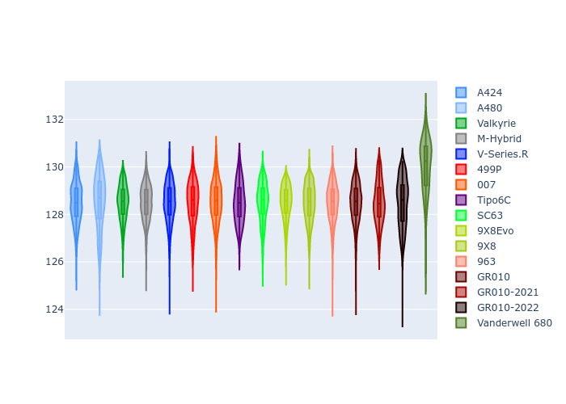
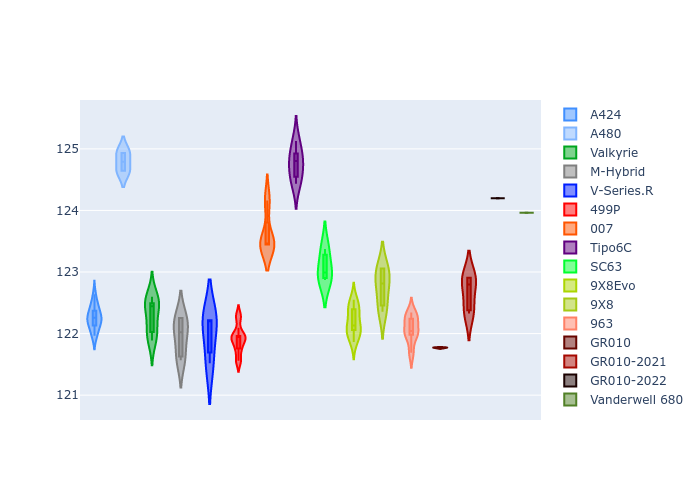
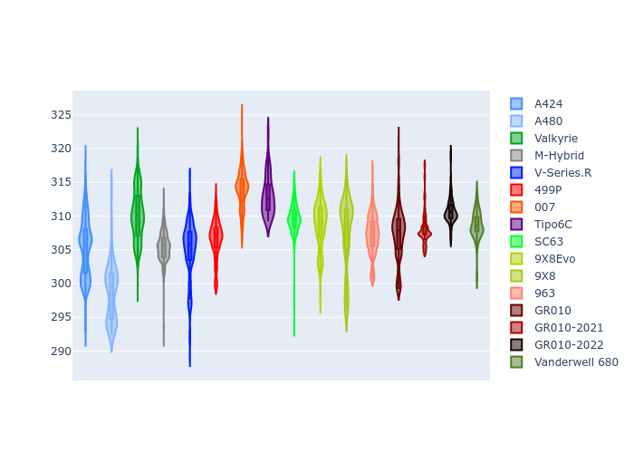
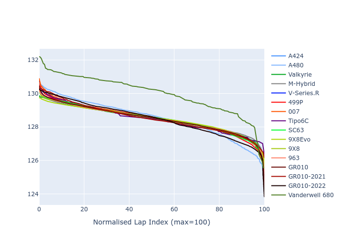

# Combined Plots

## Metadata

- BoP Accuracy: 96.23%
- Overall BoP Grade: A1
- Track: SPA
- Threshhold: 0.0kph
- Average Laptime: 2:07.66
- Average Quali Laptime: 2:01.88
- Average Topspeed: 312.50kph

## BoP Table
| Manufacturer     | Car            | Weight   | Power   | PINC   | E/Stint   | FDS    | RDP    | QDP    | TDP    |
|:-----------------|:---------------|:---------|:--------|:-------|:----------|:-------|:-------|:-------|:-------|
| Alpine           | A424           | 1036kg   | 507.0kw | -      | 900MJ     | -      | 51.64% | 59.31% | 26.80% |
| Alpine           | A480           | 952kg    | 410.0kw | -      | 797MJ     | -      | 54.81% | 80.56% | 55.69% |
| Aston Martin     | Valkyrie       | 1030kg   | 520.0kw | -      | 914MJ     | -      | 53.50% | 53.33% | 21.51% |
| BMW              | M-Hybrid       | 1038kg   | 511.0kw | -      | 910MJ     | -      | 52.89% | 56.22% | 33.41% |
| Cadillac         | V-Series.R     | 1042kg   | 519.0kw | -      | 913MJ     | -      | 48.63% | 60.80% | 19.01% |
| Ferrari          | 499P           | 1059kg   | 505.0kw | -      | 903MJ     | 190kph | 51.38% | 44.98% | 9.83%  |
| Glickenhaus      | 007            | 1030kg   | 520.0kw | -      | 913MJ     | -      | 46.15% | 49.30% | 41.45% |
| Isotta Fraschini | Tipo6C         | 1030kg   | 520.0kw | -      | 914MJ     | 160kph | 43.95% | 47.22% | 31.53% |
| Lamborghini      | SC63           | 1030kg   | 520.0kw | -      | 913MJ     | -      | 48.33% | 60.95% | 28.65% |
| Peugeot          | 9X8Evo         | 1032kg   | 510.0kw | -      | 902MJ     | 190kph | 48.87% | 52.78% | 15.41% |
| Peugeot          | 9X8            | 1031kg   | 520.0kw | -      | 910MJ     | 150kph | 54.54% | 58.39% | 9.69%  |
| Porsche          | 963            | 1034kg   | 506.0kw | -      | 906MJ     | -      | 50.70% | 44.30% | 29.51% |
| Toyota           | GR010          | 1057kg   | 504.0kw | -      | 907MJ     | 190kph | 51.09% | 52.71% | 11.46% |
| Toyota           | GR010-2021     | 1057kg   | 516.0kw | -      | 962MJ     | 150kph | 53.89% | 50.91% | 25.87% |
| Toyota           | GR010-2022     | 1052kg   | 508.0kw | -      | 898MJ     | 190kph | 53.24% | 64.49% | 9.72%  |
| Vanwall          | Vanderwell 680 | 1030kg   | 520.0kw | -      | 908MJ     | -      | 35.83% | 59.29% | 34.15% |

## Performance Table
| Manufacturer     | Car            | RP      | QP      | Vavg      |   RDLC | BOP-Grade   | Match   |
|:-----------------|:---------------|:--------|:--------|:----------|-------:|:------------|:--------|
| Alpine           | A424           | 2:07.43 | 2:01.29 | 311.11kph |   1.05 | ~A1         | 99.69%  |
| Alpine           | A480           | 2:07.42 | 2:02.87 | 301.81kph |   1.04 | ~A1         | 100.00% |
| Aston Martin     | Valkyrie       | 2:07.67 | 2:00.94 | 314.08kph |   1.06 | ~A1         | 100.00% |
| BMW              | M-Hybrid       | 2:07.44 | 2:00.85 | 311.17kph |   1.05 | ~A1         | 100.00% |
| Cadillac         | V-Series.R     | 2:07.43 | 2:00.89 | 309.93kph |   1.05 | ~A1         | 99.89%  |
| Ferrari          | 499P           | 2:07.45 | 2:00.61 | 313.25kph |   1.06 | ~A1         | 99.93%  |
| Glickenhaus      | 007            | 2:08.46 | 2:03.58 | 314.19kph |   1.04 | -A2         | 93.08%  |
| Isotta Fraschini | Tipo6C         | 2:07.49 | 2:03.93 | 315.21kph |   1.03 | ~A1         | 97.01%  |
| Lamborghini      | SC63           | 2:07.64 | 2:02.20 | 312.87kph |   1.04 | ~A1         | 100.00% |
| Peugeot          | 9X8Evo         | 2:07.44 | 2:01.17 | 313.98kph |   1.05 | ~A1         | 100.00% |
| Peugeot          | 9X8            | 2:07.44 | 2:01.87 | 312.33kph |   1.05 | ~A1         | 99.92%  |
| Porsche          | 963            | 2:07.46 | 2:01.10 | 313.23kph |   1.05 | ~A1         | 99.88%  |
| Toyota           | GR010          | 2:07.44 | 2:00.59 | 314.01kph |   1.06 | ~A1         | 99.62%  |
| Toyota           | GR010-2021     | 2:07.45 | 2:01.30 | 316.84kph |   1.05 | ~A1         | 100.00% |
| Toyota           | GR010-2022     | 2:07.44 | 2:03.09 | 318.01kph |   1.04 | ~A1         | 99.63%  |
| Vanwall          | Vanderwell 680 | 2:09.45 | 2:03.82 | 308.02kph |   1.05 | +E2         | 50.98%  |

## Race Laptimes

## Quali Laptimes

## Topspeeds

## Laptimes Lineplot

