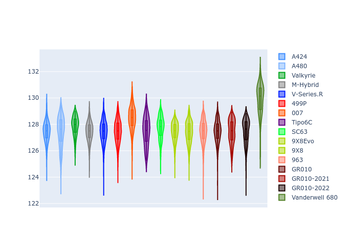

# Combined Plots

## Metadata

- BoP Accuracy: 95.23%
- Overall BoP Grade: A1
- Track: SPA
- Threshhold: 0.0kph
- Average Laptime: 2:07.71
- Average Quali Laptime: 2:01.93
- Average Topspeed: 313.28kph

## BoP Table
| Manufacturer     | Car            | Weight   | Power   | PINC   | E/Stint   | FDS    | RDP    | QDP    | TDP    |
|:-----------------|:---------------|:---------|:--------|:-------|:----------|:-------|:-------|:-------|:-------|
| Alpine           | A424           | 1036kg   | 509.0kw | -      | 902MJ     | -      | 51.64% | 59.31% | 26.80% |
| Alpine           | A480           | 930kg    | 426.0kw | -      | 810MJ     | -      | 53.05% | 74.07% | 48.97% |
| Aston Martin     | Valkyrie       | 1030kg   | 520.0kw | -      | 914MJ     | -      | 53.50% | 53.33% | 21.51% |
| BMW              | M-Hybrid       | 1038kg   | 512.0kw | -      | 911MJ     | -      | 52.89% | 56.22% | 33.41% |
| Cadillac         | V-Series.R     | 1042kg   | 520.0kw | -      | 914MJ     | -      | 48.63% | 60.80% | 19.01% |
| Ferrari          | 499P           | 1060kg   | 508.0kw | -      | 906MJ     | 190kph | 51.38% | 44.98% | 9.83%  |
| Glickenhaus      | 007            | 1030kg   | 520.0kw | -      | 913MJ     | -      | 46.15% | 49.30% | 41.45% |
| Isotta Fraschini | Tipo6C         | 1030kg   | 520.0kw | -      | 914MJ     | 150kph | 43.95% | 47.22% | 31.53% |
| Lamborghini      | SC63           | 1030kg   | 520.0kw | -      | 913MJ     | -      | 48.33% | 60.95% | 28.65% |
| Peugeot          | 9X8Evo         | 1030kg   | 514.0kw | -      | 905MJ     | 190kph | 48.87% | 52.78% | 15.41% |
| Peugeot          | 9X8            | 1030kg   | 520.0kw | -      | 910MJ     | 140kph | 54.54% | 58.39% | 9.69%  |
| Porsche          | 963            | 1034kg   | 508.0kw | -      | 907MJ     | -      | 50.70% | 44.30% | 29.51% |
| Toyota           | GR010          | 1058kg   | 506.0kw | -      | 909MJ     | 190kph | 51.09% | 52.71% | 11.46% |
| Toyota           | GR010-2021     | 1055kg   | 507.0kw | -      | 954MJ     | 150kph | 54.08% | 54.81% | 9.72%  |
| Toyota           | GR010-2022     | 1054kg   | 513.0kw | -      | 902MJ     | 190kph | 53.45% | 68.83% | 9.58%  |
| Vanwall          | Vanderwell 680 | 1030kg   | 520.0kw | -      | 908MJ     | -      | 49.68% | 60.93% | 34.43% |

## Performance Table
| Manufacturer     | Car            | RP      | QP      | Vavg      |   RDLC | BOP-Grade   | Match   |
|:-----------------|:---------------|:--------|:--------|:----------|-------:|:------------|:--------|
| Alpine           | A424           | 2:07.45 | 2:01.27 | 311.55kph |   1.05 | ~A1         | 99.57%  |
| Alpine           | A480           | 2:07.45 | 2:02.92 | 309.39kph |   1.04 | ~A1         | 99.73%  |
| Aston Martin     | Valkyrie       | 2:07.87 | 2:01.10 | 314.08kph |   1.06 | ~A1         | 100.00% |
| BMW              | M-Hybrid       | 2:07.45 | 2:00.85 | 311.40kph |   1.05 | ~A1         | 100.00% |
| Cadillac         | V-Series.R     | 2:07.44 | 2:00.90 | 310.14kph |   1.05 | ~A1         | 99.86%  |
| Ferrari          | 499P           | 2:07.46 | 2:00.81 | 313.82kph |   1.06 | ~A1         | 99.94%  |
| Glickenhaus      | 007            | 2:08.45 | 2:03.57 | 314.19kph |   1.04 | +B1         | 89.96%  |
| Isotta Fraschini | Tipo6C         | 2:07.43 | 2:03.76 | 315.21kph |   1.03 | ~A1         | 100.00% |
| Lamborghini      | SC63           | 2:07.72 | 2:02.26 | 312.87kph |   1.04 | ~A1         | 100.00% |
| Peugeot          | 9X8Evo         | 2:07.44 | 2:01.12 | 315.09kph |   1.05 | ~A1         | 100.00% |
| Peugeot          | 9X8            | 2:07.42 | 2:01.87 | 312.44kph |   1.05 | ~A1         | 99.96%  |
| Porsche          | 963            | 2:07.46 | 2:01.29 | 313.68kph |   1.05 | ~A1         | 99.84%  |
| Toyota           | GR010          | 2:07.46 | 2:00.65 | 314.35kph |   1.06 | ~A1         | 99.76%  |
| Toyota           | GR010-2021     | 2:07.44 | 2:01.73 | 316.54kph |   1.05 | ~A1         | 100.00% |
| Toyota           | GR010-2022     | 2:07.46 | 2:02.99 | 319.08kph |   1.04 | ~A1         | 99.49%  |
| Vanwall          | Vanderwell 680 | 2:09.89 | 2:03.84 | 308.65kph |   1.05 | +Ω1         | 35.55%  |

## Race Laptimes

## Quali Laptimes

## Topspeeds

## Laptimes Lineplot

