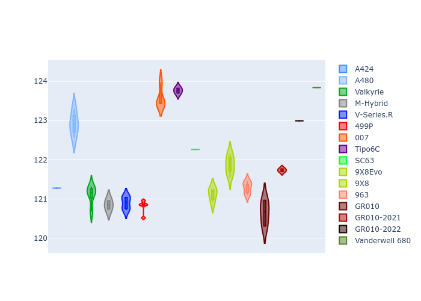

# Combined Plots

## Metadata

- BoP Accuracy: 98.46%
- Overall BoP Grade: A1
- Track: SPA
- Threshhold: 0.0kph

## BoP Table
| Manufacturer     | Car            | Weight   | Power   | PINC   | E/Stint   | FDS    |
|:-----------------|:---------------|:---------|:--------|:-------|:----------|:-------|
| Alpine           | A424           | 1088kg   | 480.0kw | -      | 881MJ     | -      |
| Alpine           | A480           | 1052kg   | 410.0kw | -      | 797MJ     | -      |
| Aston Martin     | Valkyrie       | 1030kg   | 482.0kw | -      | 879MJ     | -      |
| BMW              | M-Hybrid       | 1079kg   | 480.0kw | -      | 887MJ     | -      |
| Cadillac         | V-Series.R     | 1056kg   | 480.0kw | -      | 880MJ     | -      |
| Ferrari          | 499P           | 1100kg   | 480.0kw | -      | 885MJ     | 200kph |
| Glickenhaus      | 007            | 1030kg   | 491.0kw | -      | 887MJ     | -      |
| Isotta Fraschini | Tipo6C         | 1084kg   | 520.0kw | -      | 920MJ     | 190kph |
| Lamborghini      | SC63           | 1064kg   | 502.0kw | -      | 900MJ     | -      |
| Peugeot          | 9X8Evo         | 1068kg   | 480.0kw | -      | 879MJ     | 190kph |
| Peugeot          | 9X8            | 1045kg   | 492.0kw | -      | 887MJ     | 150kph |
| Porsche          | 963            | 1084kg   | 480.0kw | -      | 888MJ     | -      |
| Toyota           | GR010          | 1100kg   | 480.0kw | -      | 890MJ     | 200kph |
| Toyota           | GR010OLD       | 1100kg   | 480.0kw | -      | 933MJ     | 200kph |
| Vanwall          | Vanderwell 680 | 1030kg   | 520.0kw | -      | 908MJ     | -      |

## Performance Table
| Manufacturer     | Car            | RP      | QP      | Vavg      |   RDLC | BOP-Grade   | Match   |
|:-----------------|:---------------|:--------|:--------|:----------|-------:|:------------|:--------|
| Alpine           | A424           | 2:08.08 | 2:02.14 | 297.98kph |   1.05 | ~A1         | 99.19%  |
| Alpine           | A480           | 2:06.96 | 2:02.38 | 293.94kph |   1.04 | ~A1         | 98.94%  |
| Aston Martin     | Valkyrie       | 2:08.08 | 2:01.28 | 303.40kph |   1.06 | ~A1         | 100.00% |
| BMW              | M-Hybrid       | 2:08.07 | 2:01.73 | 297.80kph |   1.05 | ~A1         | 100.00% |
| Cadillac         | V-Series.R     | 2:08.08 | 2:01.85 | 296.81kph |   1.05 | ~A1         | 99.87%  |
| Ferrari          | 499P           | 2:07.65 | 2:01.25 | 299.38kph |   1.05 | ~A1         | 99.86%  |
| Glickenhaus      | 007            | 2:08.07 | 2:03.07 | 301.35kph |   1.04 | ~A1         | 96.77%  |
| Isotta Fraschini | Tipo6C         | 2:08.07 | 2:04.26 | 304.87kph |   1.03 | ~A1         | 100.00% |
| Lamborghini      | SC63           | 2:08.08 | 2:02.78 | 303.06kph |   1.04 | ~A1         | 99.16%  |
| Peugeot          | 9X8Evo         | 2:08.07 | 2:01.76 | 301.88kph |   1.05 | ~A1         | 98.37%  |
| Peugeot          | 9X8            | 2:08.07 | 2:02.20 | 296.19kph |   1.05 | ~A1         | 99.96%  |
| Porsche          | 963            | 2:08.08 | 2:01.83 | 297.48kph |   1.05 | ~A1         | 99.89%  |
| Toyota           | GR010          | 2:07.71 | 2:01.19 | 299.90kph |   1.05 | ~A1         | 99.93%  |
| Toyota           | GR010OLD       | 2:07.78 | 2:02.77 | 294.27kph |   1.04 | ~A1         | 100.00% |
| Vanwall          | Vanderwell 680 | 2:09.03 | 2:02.39 | 301.63kph |   1.05 | +B2         | 84.97%  |

## Race Laptimes

## Quali Laptimes

## Topspeeds

## Laptimes Lineplot

