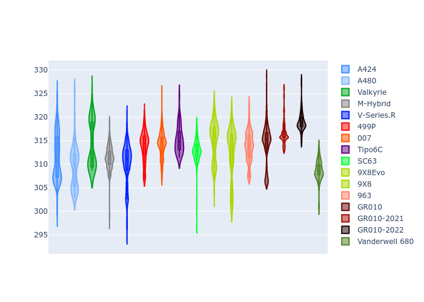

# Combined Plots

## Metadata

- BoP Accuracy: 97.32%
- Overall BoP Grade: A1
- Track: SPA
- Threshhold: 0.0kph

## BoP Table
| Manufacturer     | Car            | Weight   | Power   | PINC   | E/Stint   | FDS    | RDP    | QDP    | TDP    |
|:-----------------|:---------------|:---------|:--------|:-------|:----------|:-------|:-------|:-------|:-------|
| Alpine           | A424           | 1056kg   | 480.0kw | -      | 877MJ     | -      | 52.35% | 61.85% | 27.84% |
| Alpine           | A480           | 952kg    | 410.0kw | -      | 797MJ     | -      | 54.51% | 76.19% | 54.04% |
| Aston Martin     | Valkyrie       | 1032kg   | 484.0kw | -      | 882MJ     | -      | 53.59% | 53.33% | 21.51% |
| BMW              | M-Hybrid       | 1052kg   | 480.0kw | -      | 884MJ     | -      | 53.26% | 57.23% | 34.54% |
| Cadillac         | V-Series.R     | 1047kg   | 483.0kw | -      | 882MJ     | -      | 47.80% | 56.73% | 19.63% |
| Ferrari          | 499P           | 1096kg   | 480.0kw | -      | 885MJ     | 190kph | 53.02% | 42.32% | 9.88%  |
| Glickenhaus      | 007            | 1032kg   | 490.0kw | -      | 886MJ     | -      | 46.49% | 46.07% | 47.78% |
| Isotta Fraschini | Tipo6C         | 1085kg   | 520.0kw | -      | 920MJ     | 190kph | 43.95% | 47.22% | 31.53% |
| Lamborghini      | SC63           | 1064kg   | 505.0kw | -      | 903MJ     | -      | 46.33% | 59.50% | 29.33% |
| Peugeot          | 9X8Evo         | 1047kg   | 480.0kw | -      | 876MJ     | 190kph | 48.47% | 51.26% | 16.02% |
| Peugeot          | 9X8            | 1049kg   | 488.0kw | -      | 884MJ     | 150kph | 54.07% | 57.08% | 10.80% |
| Porsche          | 963            | 1054kg   | 480.0kw | -      | 885MJ     | -      | 50.87% | 45.25% | 30.77% |
| Toyota           | GR010          | 1100kg   | 480.0kw | -      | 890MJ     | 190kph | 52.43% | 57.12% | 12.82% |
| Toyota           | GR010-2021     | 1082kg   | 481.0kw | -      | 932MJ     | 150kph | 54.09% | 52.67% | 26.37% |
| Toyota           | GR010-2022     | 1097kg   | 480.0kw | -      | 877MJ     | 190kph | 53.48% | 69.44% | 7.86%  |
| Vanwall          | Vanderwell 680 | 1030kg   | 520.0kw | -      | 908MJ     | -      | 53.41% | 56.28% | 29.85% |

## Performance Table
| Manufacturer     | Car            | RP      | QP      | Vavg      |   RDLC | BOP-Grade   | Match   |
|:-----------------|:---------------|:--------|:--------|:----------|-------:|:------------|:--------|
| Alpine           | A424           | 2:08.75 | 2:02.59 | 301.01kph |   1.05 | ~A1         | 99.30%  |
| Alpine           | A480           | 2:06.48 | 2:01.63 | 295.69kph |   1.04 | -C2         | 73.81%  |
| Aston Martin     | Valkyrie       | 2:08.75 | 2:01.87 | 303.64kph |   1.06 | ~A1         | 100.00% |
| BMW              | M-Hybrid       | 2:08.75 | 2:02.15 | 300.51kph |   1.05 | ~A1         | 99.56%  |
| Cadillac         | V-Series.R     | 2:08.76 | 2:02.20 | 298.17kph |   1.05 | ~A1         | 99.79%  |
| Ferrari          | 499P           | 2:08.77 | 2:01.59 | 299.70kph |   1.06 | ~A1         | 99.83%  |
| Glickenhaus      | 007            | 2:08.77 | 2:03.72 | 300.91kph |   1.04 | ~A1         | 95.91%  |
| Isotta Fraschini | Tipo6C         | 2:08.75 | 2:05.02 | 304.77kph |   1.03 | ~A1         | 95.52%  |
| Lamborghini      | SC63           | 2:08.77 | 2:03.34 | 303.72kph |   1.04 | ~A1         | 100.00% |
| Peugeot          | 9X8Evo         | 2:08.75 | 2:02.36 | 304.06kph |   1.05 | ~A1         | 98.95%  |
| Peugeot          | 9X8            | 2:08.76 | 2:02.42 | 293.50kph |   1.05 | ~A1         | 99.94%  |
| Porsche          | 963            | 2:08.74 | 2:02.22 | 300.88kph |   1.05 | ~A1         | 99.84%  |
| Toyota           | GR010          | 2:08.70 | 2:01.40 | 300.32kph |   1.06 | ~A1         | 99.71%  |
| Toyota           | GR010-2021     | 2:08.75 | 2:02.65 | 292.86kph |   1.05 | ~A1         | 99.12%  |
| Toyota           | GR010-2022     | 2:08.75 | 2:03.59 | 298.37kph |   1.04 | ~A1         | 100.00% |
| Vanwall          | Vanderwell 680 | 2:08.98 | 2:02.39 | 301.63kph |   1.05 | ~A1         | 95.83%  |

## Race Laptimes

## Quali Laptimes

## Topspeeds

## Laptimes Lineplot

