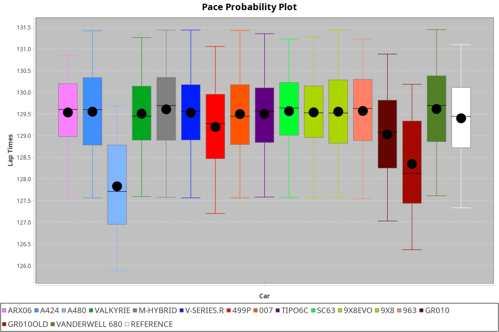
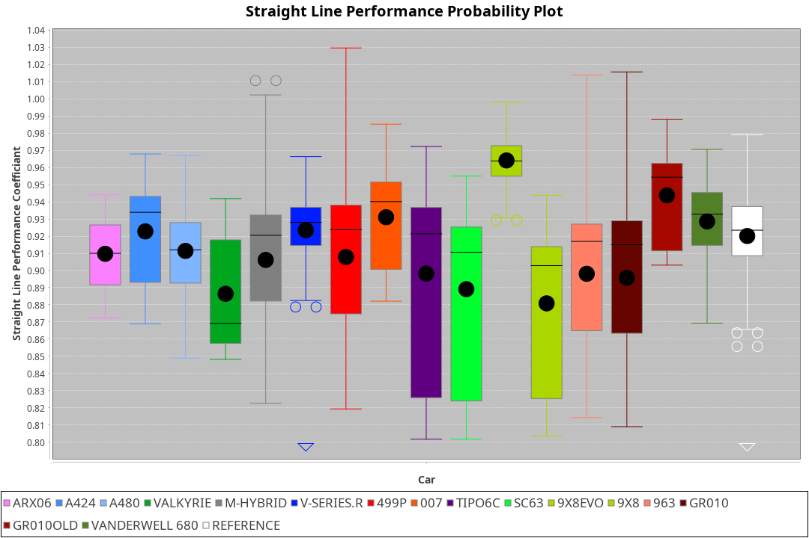
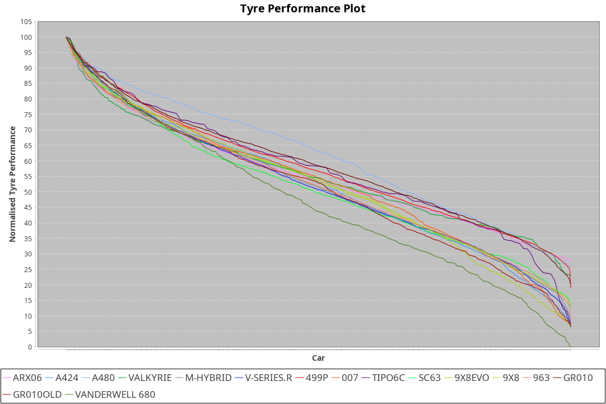

| Manufacturer     | Car            | Weight | Power   | PINC    | E/Stint | FDS     |
|:-|:-|:-|:-|:-|:-|:-|
| Acura            | ARX06          | 1064kg | 480.0kw |    -    | 882MJ   |    -    |
| Alpine           | A424           | 1038kg | 480.0kw |    -    | 882MJ   |    -    |
| Alpine           | A480           | 952kg  | 410.0kw |    -    | 797MJ   |    -    |
| Aston Martin     | Valkyrie       | 1030kg | 520.0kw |    -    | 911MJ   |    -    |
| BMW              | M-Hybrid       | 1041kg | 481.0kw |    -    | 881MJ   |    -    |
| Cadillac         | V-Series.R     | 1050kg | 480.0kw |    -    | 879MJ   |    -    |
| Ferrari          | 499P           | 1085kg | 480.0kw |    -    | 880MJ   | 190kph  |
| Glickenhaus      | 007            | 1030kg | 490.0kw |    -    | 886MJ   |    -    |
| Isotta Fraschini | Tipo6C         | 1087kg | 520.0kw |    -    | 920MJ   | 190kph  |
| Lamborghini      | SC63           | 1068kg | 504.0kw |    -    | 903MJ   |    -    |
| Peugeot          | 9X8Evo         | 1059kg | 480.0kw |    -    | 884MJ   | 190kph  |
| Peugeot          | 9X8            | 1042kg | 495.0kw |    -    | 889MJ   | 150kph  |
| Porsche          | 963            | 1053kg | 480.0kw |    -    | 881MJ   |    -    |
| Toyota           | GR010          | 1091kg | 480.0kw |    -    | 888MJ   | 190kph  |
| Toyota           | GR010OLD       | 1100kg | 480.0kw |    -    | 933MJ   | 150kph  |
| Vanwall          | Vanderwell 680 | 1030kg | 520.0kw |    -    | 908MJ   |    -    |

### BoP Accuracy: 90.76%; Overall BoP Grade: A2
| Manufacturer     | Car            | Type  | RP      | QP      | Weight | Power¹  | Threshhold | PINC    | Power²   | E/Stint | AVG Vmax  | FDS     | RDLC | L/Stint | BOP-Grade | Model Accuracy | Model Points | Match%  | SimDiff |
|:-|:-|:-|:-|:-|:-|:-|:-|:-|:-|:-|:-|:-|:-|:-|:-|:-|:-|:-|:-|
| Acura            | ARX06          | LMDH  | 2:09.30 | 2:03.44 | 1064kg | 480.0kw | 0.0kph     |    -    | 480.00kw |  882MJ  | 291.08kph |    -    | 1.01 | 25      | +B2       | 100.00%        | 996          | 82.84%  | #       |
| Alpine           | A424           | LMDH  | 2:09.27 | 2:04.61 | 1038kg | 480.0kw | 0.0kph     |    -    | 480.00kw |  882MJ  | 304.58kph |    -    | 1.01 | 25      | ~A1       | 99.49%         | 1360         | 100.00% | #       |
| Alpine           | A480           | LMP1  | 2:07.94 | 2:03.95 |  952kg | 410.0kw | 0.0kph     |    -    | 410.00kw |  797MJ  | 292.89kph |    -    | 0.97 | 23      | -Ω1       | 97.75%         | 1567         | 48.48%  | -0.69   |
| Aston Martin     | Valkyrie       | LMHNH | 2:09.85 | 2:04.28 | 1030kg | 520.0kw | 0.0kph     |    -    | 520.00kw |  911MJ  | 304.35kph |    -    | 1.04 | 25      | +A2       | 100.00%        | 312          | 91.43%  | #       |
| BMW              | M-Hybrid       | LMDH  | 2:09.30 | 2:03.52 | 1041kg | 481.0kw | 0.0kph     |    -    | 481.00kw |  881MJ  | 303.22kph |    -    | 1.01 | 25      | ~A1       | 98.62%         | 2363         | 100.00% | #       |
| Cadillac         | V-Series.R     | LMDH  | 2:09.30 | 2:03.97 | 1050kg | 480.0kw | 0.0kph     |    -    | 480.00kw |  879MJ  | 297.50kph |    -    | 1.01 | 25      | +A2       | 98.50%         | 4201         | 92.29%  | #       |
| Ferrari          | 499P           | LMHHU | 2:09.28 | 2:03.76 | 1085kg | 480.0kw | 0.0kph     |    -    | 480.00kw |  880MJ  | 300.48kph | 190kph  | 1.01 | 25      | ~A1       | 100.00%        | 4441         | 100.00% | #       |
| Glickenhaus      | 007            | LMHNH | 2:09.28 | 2:04.81 | 1030kg | 490.0kw | 0.0kph     |    -    | 490.00kw |  886MJ  | 298.02kph |    -    | 0.97 | 25      | +A2       | 94.07%         | 2174         | 94.23%  | +1.33   |
| Isotta Fraschini | Tipo6C         | LMHHU | 2:09.28 | 2:05.78 | 1087kg | 520.0kw | 0.0kph     |    -    | 520.00kw |  920MJ  | 303.28kph | 190kph  | 1.02 | 25      | +C1       | 98.48%         | 130          | 77.75%  | +1.95   |
| Lamborghini      | SC63           | LMDH  | 2:09.28 | 2:04.73 | 1068kg | 504.0kw | 0.0kph     |    -    | 504.00kw |  903MJ  | 300.89kph |    -    | 1.02 | 25      | ~A1       | 100.00%        | 784          | 99.74%  | +1.99   |
| Peugeot          | 9X8Evo         | LMHHU | 2:09.30 | 2:04.25 | 1059kg | 480.0kw | 0.0kph     |    -    | 480.00kw |  884MJ  | 302.77kph | 190kph  | 0.99 | 25      | +B1       | 100.00%        | 808          | 85.01%  | #       |
| Peugeot          | 9X8            | LMHHE | 2:09.30 | 2:04.05 | 1042kg | 495.0kw | 0.0kph     |    -    | 495.00kw |  889MJ  | 299.08kph | 150kph  | 1.02 | 25      | ~A1       | 98.79%         | 5064         | 99.02%  | +0.45   |
| Porsche          | 963            | LMDH  | 2:09.27 | 2:03.46 | 1053kg | 480.0kw | 0.0kph     |    -    | 480.00kw |  881MJ  | 300.65kph |    -    | 1.00 | 25      | ~A1       | 99.87%         | 12613        | 100.00% | #       |
| Toyota           | GR010          | LMHHU | 2:09.29 | 2:03.54 | 1091kg | 480.0kw | 0.0kph     |    -    | 480.00kw |  888MJ  | 297.40kph | 190kph  | 1.00 | 25      | ~A1       | 99.73%         | 2956         | 95.55%  | #       |
| Toyota           | GR010OLD       | LMHHE | 2:09.29 | 2:05.04 | 1100kg | 480.0kw | 0.0kph     |    -    | 480.00kw |  933MJ  | 293.87kph | 150kph  | 1.00 | 25      | +B1       | 94.62%         | 880          | 85.81%  | +1.17   |
| Vanwall          | Vanderwell 680 | LMHNH | 2:09.37 | 2:03.54 | 1030kg | 520.0kw | 0.0kph     |    -    | 520.00kw |  908MJ  | 301.03kph |    -    | 1.01 | 25      | ~A1       | 99.09%         | 544          | 100.00% | +0.22   |

## Power below Threshhold
| N/Nmax    | ARX06   | A424    | VALKYRIE | M-HYBRID | V-SERIES.R | 499P    | 007     | TIPO6C  | SC63    | 9X8EVO  | 9X8     | 963     | GR010   | GR010OLD | VANDERWELL 680 | ​     | RPM      | A480    |
|:-|:-|:-|:-|:-|:-|:-|:-|:-|:-|:-|:-|:-|:-|:-|:-|:-|:-|:-|
|  0.550    |  236    |  236    |  256     |  237     |  236       |  236    |  241    |  256    |  248    |  236    |  244    |  236    |  236    |  236     |  256           |  ​    |   --     |   -     |
|  0.575    |  258    |  258    |  279     |  259     |  258       |  258    |  264    |  279    |  271    |  258    |  266    |  258    |  258    |  258     |  279           |  ​    |   --     |   -     |
|  0.600    |  277    |  277    |  300     |  278     |  277       |  277    |  283    |  300    |  291    |  277    |  286    |  277    |  277    |  277     |  300           |  ​    |   --     |   -     |
|  0.625    |  297    |  297    |  322     |  298     |  297       |  297    |  303    |  322    |  312    |  297    |  306    |  297    |  297    |  297     |  322           |  ​    |   --     |   -     |
|  0.650    |  317    |  317    |  343     |  318     |  317       |  317    |  324    |  343    |  333    |  317    |  327    |  317    |  317    |  317     |  343           |  ​    |   --     |   -     |
|  0.675    |  337    |  337    |  365     |  338     |  337       |  337    |  344    |  365    |  354    |  337    |  348    |  337    |  337    |  337     |  365           |  ​    |   --     |   -     |
|  0.700    |  358    |  358    |  387     |  359     |  358       |  358    |  365    |  387    |  375    |  358    |  369    |  358    |  358    |  358     |  387           |  ​    |   --     |   -     |
|  0.725    |  378    |  378    |  409     |  379     |  378       |  378    |  386    |  409    |  396    |  378    |  389    |  378    |  378    |  378     |  409           |  ​    |   --     |   -     |
|  0.750    |  397    |  397    |  430     |  398     |  397       |  397    |  405    |  430    |  416    |  397    |  409    |  397    |  397    |  397     |  430           |  ​    |   --     |   -     |
|  0.775    |  415    |  415    |  449     |  416     |  415       |  415    |  424    |  449    |  435    |  415    |  428    |  415    |  415    |  415     |  449           |  ​    |  5000    |  241    |
|  0.800    |  431    |  431    |  467     |  432     |  431       |  431    |  440    |  467    |  453    |  431    |  445    |  431    |  431    |  431     |  467           |  ​    |  5500    |  284    |
|  0.825    |  445    |  445    |  482     |  446     |  445       |  445    |  455    |  482    |  468    |  445    |  459    |  445    |  445    |  445     |  482           |  ​    |  6000    |  318    |
|  0.850    |  456    |  456    |  494     |  457     |  456       |  456    |  466    |  494    |  479    |  456    |  470    |  456    |  456    |  456     |  494           |  ​    |  6500    |  359    |
|  0.875    |  466    |  466    |  505     |  467     |  466       |  466    |  476    |  505    |  489    |  466    |  480    |  466    |  466    |  466     |  505           |  ​    |  7000    |  401    |
|  0.900    |  472    |  472    |  512     |  473     |  472       |  472    |  482    |  512    |  496    |  472    |  487    |  472    |  472    |  472     |  512           |  ​    |  7500    |  411    |
|  0.925    |  477    |  477    |  517     |  478     |  477       |  477    |  487    |  517    |  501    |  477    |  492    |  477    |  477    |  477     |  517           |  ​    |  8000    |  407    |
| **0.950** | **480** | **480** | **520**  | **481**  | **480**    | **480** | **490** | **520** | **504** | **480** | **495** | **480** | **480** | **480**  | **520**        | **​** | **8500** | **410** |
|  0.975    |  478    |  478    |  518     |  479     |  478       |  478    |  488    |  518    |  502    |  478    |  493    |  478    |  478    |  478     |  518           |  ​    |  9000    |  205    |
|  1.000    |  475    |  475    |  514     |  476     |  475       |  475    |  485    |  514    |  499    |  475    |  490    |  475    |  475    |  475     |  514           |  ​    |   --     |   -     |
|  1.025    |  410    |  410    |  444     |  411     |  410       |  410    |  419    |  444    |  430    |  410    |  423    |  410    |  410    |  410     |  444           |  ​    |   --     |   -     |

## Power above Threshhold
| N/Nmax    | ARX06   | A424    | VALKYRIE | M-HYBRID | V-SERIES.R | 499P    | 007     | TIPO6C  | SC63    | 9X8EVO  | 9X8     | 963     | GR010   | GR010OLD | VANDERWELL 680 | ​     | RPM      | A480    |
|:-|:-|:-|:-|:-|:-|:-|:-|:-|:-|:-|:-|:-|:-|:-|:-|:-|:-|:-|
|  0.550    |  236    |  236    |  256     |  237     |  236       |  236    |  241    |  256    |  248    |  236    |  244    |  236    |  236    |  236     |  256           |  ​    |   --     |   -     |
|  0.575    |  258    |  258    |  279     |  259     |  258       |  258    |  264    |  279    |  271    |  258    |  266    |  258    |  258    |  258     |  279           |  ​    |   --     |   -     |
|  0.600    |  277    |  277    |  300     |  278     |  277       |  277    |  283    |  300    |  291    |  277    |  286    |  277    |  277    |  277     |  300           |  ​    |   --     |   -     |
|  0.625    |  297    |  297    |  322     |  298     |  297       |  297    |  303    |  322    |  312    |  297    |  306    |  297    |  297    |  297     |  322           |  ​    |   --     |   -     |
|  0.650    |  317    |  317    |  343     |  318     |  317       |  317    |  324    |  343    |  333    |  317    |  327    |  317    |  317    |  317     |  343           |  ​    |   --     |   -     |
|  0.675    |  337    |  337    |  365     |  338     |  337       |  337    |  344    |  365    |  354    |  337    |  348    |  337    |  337    |  337     |  365           |  ​    |   --     |   -     |
|  0.700    |  358    |  358    |  387     |  359     |  358       |  358    |  365    |  387    |  375    |  358    |  369    |  358    |  358    |  358     |  387           |  ​    |   --     |   -     |
|  0.725    |  378    |  378    |  409     |  379     |  378       |  378    |  386    |  409    |  396    |  378    |  389    |  378    |  378    |  378     |  409           |  ​    |   --     |   -     |
|  0.750    |  397    |  397    |  430     |  398     |  397       |  397    |  405    |  430    |  416    |  397    |  409    |  397    |  397    |  397     |  430           |  ​    |   --     |   -     |
|  0.775    |  415    |  415    |  449     |  416     |  415       |  415    |  424    |  449    |  435    |  415    |  428    |  415    |  415    |  415     |  449           |  ​    |  5000    |  241    |
|  0.800    |  431    |  431    |  467     |  432     |  431       |  431    |  440    |  467    |  453    |  431    |  445    |  431    |  431    |  431     |  467           |  ​    |  5500    |  284    |
|  0.825    |  445    |  445    |  482     |  446     |  445       |  445    |  455    |  482    |  468    |  445    |  459    |  445    |  445    |  445     |  482           |  ​    |  6000    |  318    |
|  0.850    |  456    |  456    |  494     |  457     |  456       |  456    |  466    |  494    |  479    |  456    |  470    |  456    |  456    |  456     |  494           |  ​    |  6500    |  359    |
|  0.875    |  466    |  466    |  505     |  467     |  466       |  466    |  476    |  505    |  489    |  466    |  480    |  466    |  466    |  466     |  505           |  ​    |  7000    |  401    |
|  0.900    |  472    |  472    |  512     |  473     |  472       |  472    |  482    |  512    |  496    |  472    |  487    |  472    |  472    |  472     |  512           |  ​    |  7500    |  411    |
|  0.925    |  477    |  477    |  517     |  478     |  477       |  477    |  487    |  517    |  501    |  477    |  492    |  477    |  477    |  477     |  517           |  ​    |  8000    |  407    |
| **0.950** | **480** | **480** | **520**  | **481**  | **480**    | **480** | **490** | **520** | **504** | **480** | **495** | **480** | **480** | **480**  | **520**        | **​** | **8500** | **410** |
|  0.975    |  478    |  478    |  518     |  479     |  478       |  478    |  488    |  518    |  502    |  478    |  493    |  478    |  478    |  478     |  518           |  ​    |  9000    |  205    |
|  1.000    |  475    |  475    |  514     |  476     |  475       |  475    |  485    |  514    |  499    |  475    |  490    |  475    |  475    |  475     |  514           |  ​    |   --     |   -     |
|  1.025    |  410    |  410    |  444     |  411     |  410       |  410    |  419    |  444    |  430    |  410    |  423    |  410    |  410    |  410     |  444           |  ​    |   --     |   -     |
