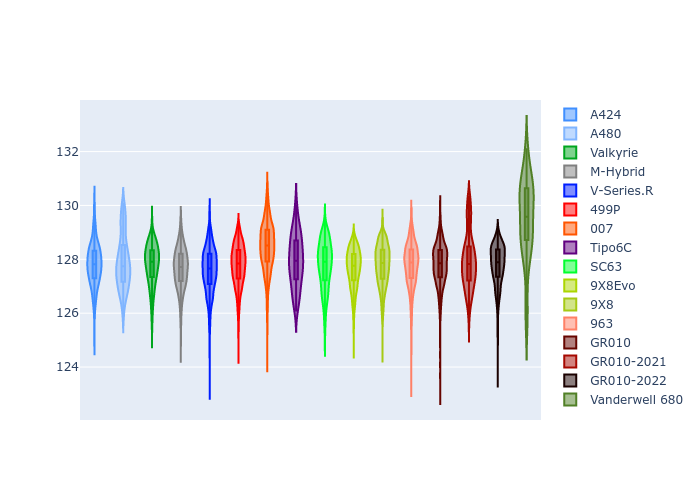
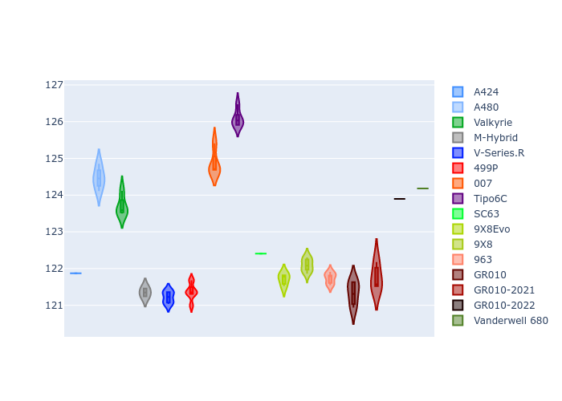
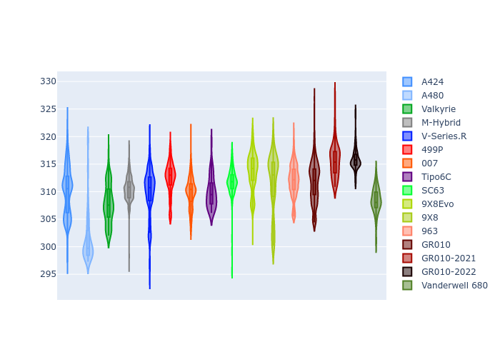
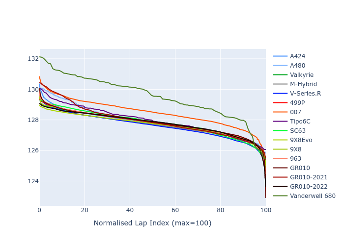

# Combined Plots

## Metadata

- BoP Accuracy: 91.23%
- Overall BoP Grade: A2
- Track: SPA
- Threshhold: 250.0kph
- Average Laptime: 2:08.51
- Average Quali Laptime: 2:02.75
- Laptime Std Dev: 0.92 seconds
- Filtered Average Topspeed: 310.81kph

## BoP Table
| Manufacturer     | Car            | Weight   | Power   | PINC   | E/Stint   | FDS    | RDP    | QDP    | TDP    |
|:-----------------|:---------------|:---------|:--------|:-------|:----------|:-------|:-------|:-------|:-------|
| Alpine           | A424           | 1056kg   | 511.0kw | +0.10% | 906MJ     | -      | 51.45% | 55.09% | 24.89% |
| Alpine           | A480           | 990kg    | 421.0kw | +0.10% | 812MJ     | -      | 54.77% | 76.19% | 54.04% |
| Aston Martin     | Valkyrie       | 1038kg   | 499.0kw | -      | 896MJ     | -      | 53.07% | 48.70% | 24.00% |
| BMW              | M-Hybrid       | 1050kg   | 513.0kw | +0.10% | 913MJ     | -      | 52.63% | 52.34% | 34.06% |
| Cadillac         | V-Series.R     | 1047kg   | 519.0kw | -      | 914MJ     | -      | 48.80% | 57.26% | 18.10% |
| Ferrari          | 499P           | 1062kg   | 503.0kw | -0.10% | 901MJ     | 190kph | 51.39% | 44.34% | 9.89%  |
| Glickenhaus      | 007            | 1033kg   | 502.0kw | -      | 897MJ     | -      | 46.14% | 49.30% | 41.45% |
| Isotta Fraschini | Tipo6C         | 1034kg   | 498.0kw | -      | 895MJ     | 190kph | 43.95% | 47.22% | 31.53% |
| Lamborghini      | SC63           | 1040kg   | 520.0kw | +0.10% | 914MJ     | -      | 48.32% | 60.95% | 28.65% |
| Peugeot          | 9X8Evo         | 1052kg   | 518.0kw | -0.10% | 911MJ     | 190kph | 49.16% | 50.25% | 18.00% |
| Peugeot          | 9X8            | 1046kg   | 524.0kw | -      | 915MJ     | 150kph | 54.54% | 58.39% | 9.69%  |
| Porsche          | 963            | 1056kg   | 511.0kw | +0.10% | 913MJ     | -      | 50.61% | 41.90% | 27.68% |
| Toyota           | GR010          | 1071kg   | 502.0kw | +0.10% | 907MJ     | 190kph | 51.33% | 51.71% | 14.89% |
| Toyota           | GR010-2021     | 1055kg   | 509.0kw | -0.10% | 955MJ     | 150kph | 54.02% | 52.67% | 26.37% |
| Toyota           | GR010-2022     | 1060kg   | 503.0kw | -0.10% | 894MJ     | 190kph | 53.24% | 64.49% | 9.72%  |
| Vanwall          | Vanderwell 680 | 1030kg   | 520.0kw | -      | 908MJ     | -      | 50.86% | 59.83% | 31.84% |

## Performance Table
| Manufacturer     | Car            | RP      | QP      | Vavg      |   RDLC | BOP-Grade   | Match   |
|:-----------------|:---------------|:--------|:--------|:----------|-------:|:------------|:--------|
| Alpine           | A424           | 2:08.04 | 2:01.87 | 310.03kph |   1.05 | ~A1         | 99.98%  |
| Alpine           | A480           | 2:09.79 | 2:04.47 | 301.61kph |   1.04 | +C1         | 79.25%  |
| Aston Martin     | Valkyrie       | 2:09.79 | 2:03.70 | 307.72kph |   1.05 | +C1         | 77.45%  |
| BMW              | M-Hybrid       | 2:07.79 | 2:01.35 | 310.56kph |   1.05 | ~A1         | 99.95%  |
| Cadillac         | V-Series.R     | 2:07.69 | 2:01.22 | 309.92kph |   1.05 | ~A1         | 99.83%  |
| Ferrari          | 499P           | 2:07.99 | 2:01.37 | 312.46kph |   1.05 | ~A1         | 99.91%  |
| Glickenhaus      | 007            | 2:09.78 | 2:04.87 | 309.88kph |   1.04 | +C2         | 74.35%  |
| Isotta Fraschini | Tipo6C         | 2:09.78 | 2:06.08 | 309.88kph |   1.03 | +C2         | 73.88%  |
| Lamborghini      | SC63           | 2:07.86 | 2:02.41 | 311.86kph |   1.04 | ~A1         | 100.00% |
| Peugeot          | 9X8Evo         | 2:07.88 | 2:01.71 | 313.67kph |   1.05 | ~A1         | 99.81%  |
| Peugeot          | 9X8            | 2:07.68 | 2:02.09 | 311.56kph |   1.05 | ~A1         | 99.92%  |
| Porsche          | 963            | 2:07.89 | 2:01.74 | 312.04kph |   1.05 | ~A1         | 99.78%  |
| Toyota           | GR010          | 2:08.22 | 2:01.34 | 311.65kph |   1.06 | ~A1         | 99.77%  |
| Toyota           | GR010-2021     | 2:07.57 | 2:01.75 | 315.66kph |   1.05 | ~A1         | 100.00% |
| Toyota           | GR010-2022     | 2:08.26 | 2:03.90 | 315.92kph |   1.04 | ~A1         | 99.40%  |
| Vanwall          | Vanderwell 680 | 2:10.11 | 2:04.18 | 308.46kph |   1.05 | +E1         | 56.35%  |

## Race Laptimes

## Quali Laptimes

## Topspeeds

## Laptimes Lineplot

